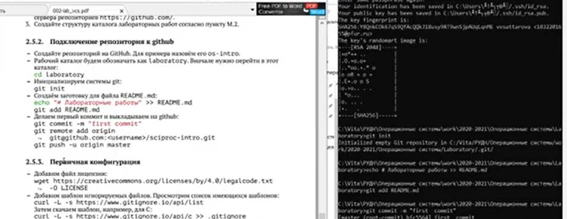
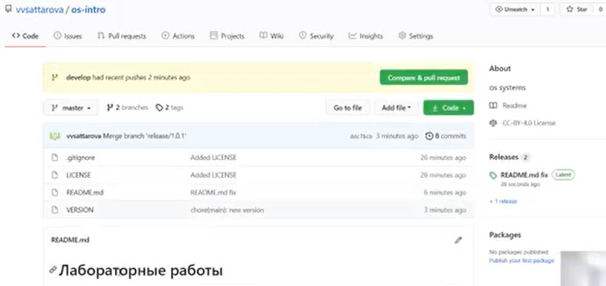

---
## Front matter
lang: ru-RU
title: Лабораторная работа №2 "Системы контроля версий" 
author: |
	Саттарова Вита Викторовна\inst{1}
institute: |
	\inst{1}РУДН, Москва, Россия
date: 2021, Май

## Formatting
toc: false
slide_level: 2
theme: metropolis
mainfont: PT Serif
romanfont: PT Serif
sansfont: PT Sans
monofont: PT Mono
header-includes: 
 - \metroset{progressbar=frametitle,sectionpage=progressbar,numbering=fraction}
 - '\makeatletter'
 - '\beamer@ignorenonframefalse'
 - '\makeatother'
aspectratio: 43
section-titles: true
---

# Лабораторная работа №2 "Системы контроля версий"

## Прагматика

Работа выполнена для того чтобы научиться устанавливать необходимое ПО, разобраться с теорией и с системами контроля версий, создать и настроить свой репозиторий на Github, чтобы использовать его для дальнейшей работы.

## Цели

Изучить идеологию и применение средств контроля версий. 

## Задачи

- Установить необходимое ПО
- Изучить информацию о системе контроля версий
- Настроить репозиторий на Github

## Работа (1)

{ #fig:001 width=100% }

## Работа (2)

{ #fig:002 width=100% }

## Результаты

Изучена информация, касающаяся контроля версий, настроен свой репозиторий на Гитхаб, создан первый релиз. 

## Заключение

В результате работы была изучена идеология и применение средств контроля версий, настроен репозиторий на Github, с которым возможно продолжать дальнейшую работу.