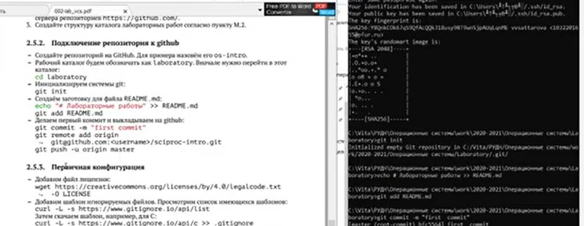
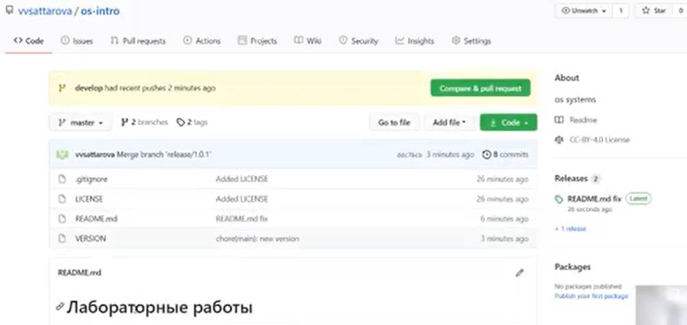

# Лабораторная работа 2 

### Саттарова Вита Викторовна, НФИбд-02-20

---

## Прагматика

Работа выполнена для того чтобы научиться устанавливать необходимое ПО, разобраться с теорией и системах контроля версий, создать и настроить свой репозиторий на Github, чтобы использовать его для дальнейшей работы.

---

## Цели

Изучить идеологию и применение средств контроля версий. 

---

## Задачи

- Установить необходимое ПО
- Изучить информацию о системе контроля версий
- Настроить репозиторий на Github

---

## Работа

---

## Результаты

Изучена информация, касающаяся контроля версий, настроен свой репозиторий на Гитхаб, создан первый релиз. 

---

## Заключение

В результате работы была изучена идеология и применение средств контроля версий, настроен репозиторий на Github, с которым возможно продолжать дальнейшую работу.

