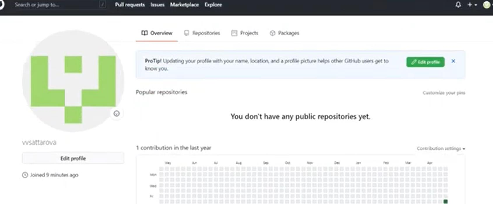
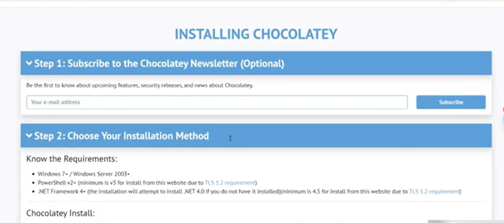
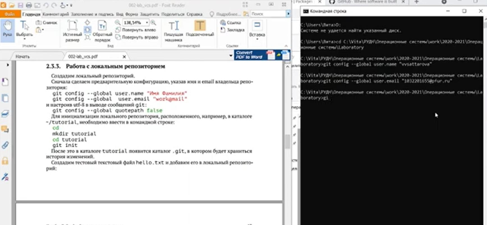
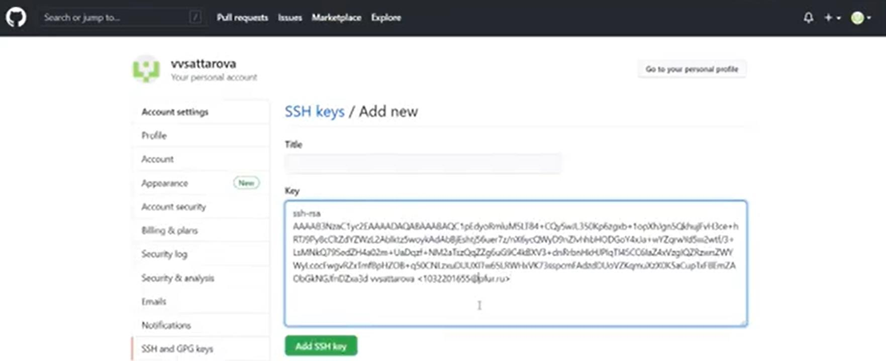
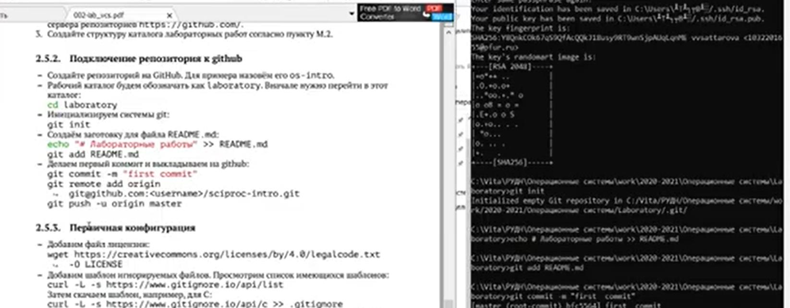
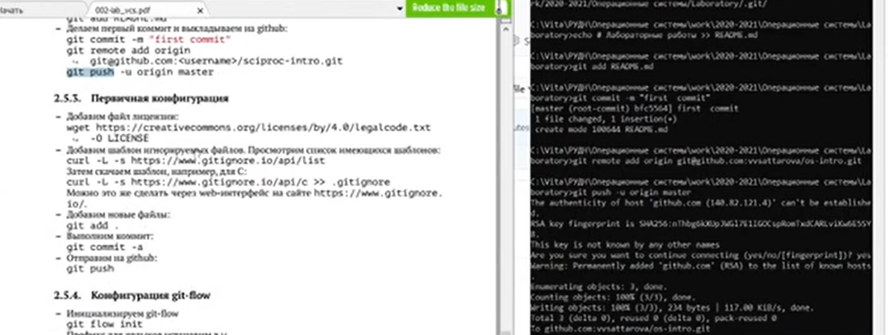
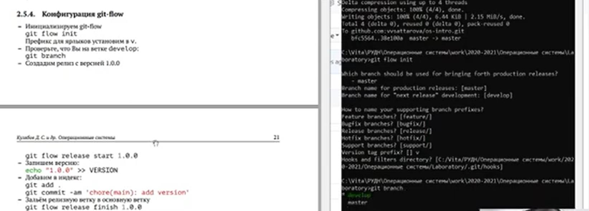
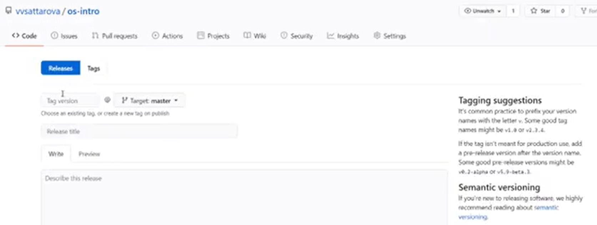
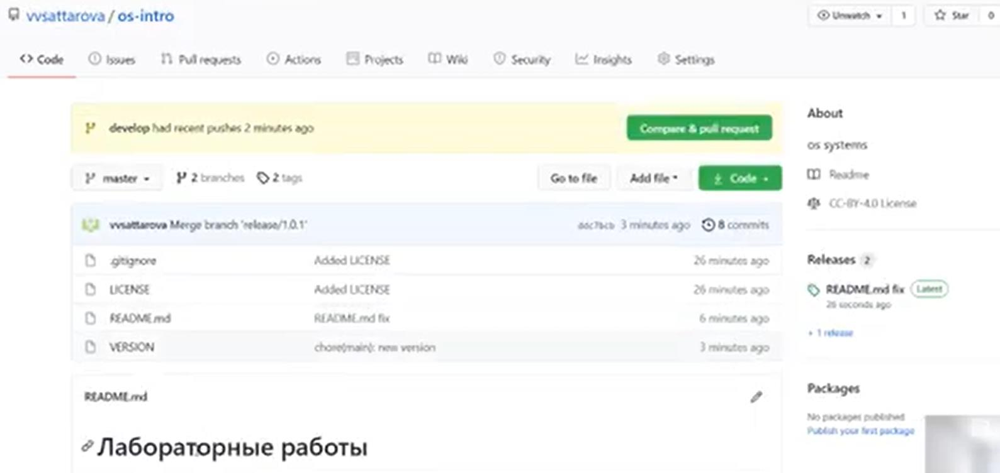

---
# Front matter
lang: ru-RU
title: "Лабораторная работа 3"
subtitle: "Операционные системы"
author: "Саттарова Вита Викторовна"
year: "2021"

# Formatting
toc-title: "Содержание"
toc: true # Table of contents
toc_depth: 2
lof: true # List of figures
lot: false # List of tables
fontsize: 12pt
linestretch: 1.5
papersize: a4paper
documentclass: scrreprt
polyglossia-lang: russian
polyglossia-otherlangs: english
mainfont: PT Serif
romanfont: PT Serif
sansfont: PT Sans
monofont: PT Mono
mainfontoptions: Ligatures=TeX
romanfontoptions: Ligatures=TeX
sansfontoptions: Ligatures=TeX,Scale=MatchLowercase
monofontoptions: Scale=MatchLowercase
indent: true
pdf-engine: lualatex
header-includes:
  - \linepenalty=10 # the penalty added to the badness of each line within a paragraph (no associated penalty node) Increasing the value makes tex try to have fewer lines in the paragraph.
  - \interlinepenalty=0 # value of the penalty (node) added after each line of a paragraph.
  - \hyphenpenalty=50 # the penalty for line breaking at an automatically inserted hyphen
  - \exhyphenpenalty=50 # the penalty for line breaking at an explicit hyphen
  - \binoppenalty=700 # the penalty for breaking a line at a binary operator
  - \relpenalty=500 # the penalty for breaking a line at a relation
  - \clubpenalty=150 # extra penalty for breaking after first line of a paragraph
  - \widowpenalty=150 # extra penalty for breaking before last line of a paragraph
  - \displaywidowpenalty=50 # extra penalty for breaking before last line before a display math
  - \brokenpenalty=100 # extra penalty for page breaking after a hyphenated line
  - \predisplaypenalty=10000 # penalty for breaking before a display
  - \postdisplaypenalty=0 # penalty for breaking after a display
  - \floatingpenalty = 20000 # penalty for splitting an insertion (can only be split footnote in standard LaTeX)
  - \raggedbottom # or \flushbottom
  - \usepackage{float} # keep figures where there are in the text
  - \floatplacement{figure}{H} # keep figures where there are in the text
---

# Лабораторная работа №3

## Операционные системы

### Саттарова Вита Викторовна

### 2021

#### Цели и задачи

Изучить идеологию и применение средств контроля версий. 

1.	Установить необходимое ПО
2.	Изучить информацию о системе контроля версий
3.	Настроить репозиторий на Github

#### Объект и предмет исследования

Объект исследования – системы контроля версий, Github.
Предмет исследования – изучение особенностей систем контроля версий и работы с ними. 

#### Условные обозначения и термины

Условные обозначения и термины отсутствуют

#### Теоретические вводные данные

Системы контроля версий (Version Control System, VCS) применяются при работе нескольких человек над одним проектом.Обычно основное дерево проекта хранится в локальном или удалённом репозитории, к которому настроен доступ для участников проекта. При внесении изменений в содержание проекта система контроля версий позволяет их фиксировать, совмещать изменения, произведённые разными участниками проекта, производить откат к любой более ранней версии проекта, если это требуется. 
В классических системах контроля версий используется централизованная модель, предполагающая наличие единого репозитория для хранения файлов. Выполнение большинства функций по управлению версиями осуществляется специальным сервером. Участник проекта (пользователь) перед началом работы посредством определённых команд получает нужную ему версию файлов. После внесения изменений, пользователь размещает новую версию в хранилище. При этом предыдущие версии не удаляются из центрального хранилища и к ним можно вернуться в любой момент. Сервер может сохранять не полную версию изменённых файлов, а производить так называемую дельтакомпрессию — сохранять только изменения между последовательными версиями, что позволяет уменьшить объём хранимых данных. Системы контроля версий поддерживают возможность отслеживания и разрешения конфликтов, которые могут возникнуть при работе нескольких человек над одним файлом. Можно объединить (слить) изменения, сделанные разными участниками (автоматически или вручную), вручную выбрать нужную версию, отменить изменения вовсе или заблокировать файлы для изменения. В зависимости от настроек блокировка не позволяет другим пользователям получить рабочую копию или препятствует изменению рабочей копии файла средствами файловой системы ОС, обеспечивая таким образом, привилегированный доступ только одному пользователю, работающему с файлом. Системы контроля версий также могут обеспечивать дополнительные, более гибкие функциональные возможности. Например, они могут поддерживать работу с несколькими версиями одного файла, сохраняя общую историю изменений до точки ветвления версий и собственные истории изменений каждой ветви. Кроме того, обычно доступна информация о том, кто из участников, когда и какие изменения вносил. Обычно такого рода информация хранится в журнале изменений, доступ к которому можно ограничить. В отличие от классических, в распределённых системах контроля версий центральный репозиторий не является обязательным. Среди классических VCS наиболее известны CVS, Subversion, а среди распределённых — Git, Bazaar, Mercurial. Принципы их работы схожи, отличаются они в основном синтаксисом используемых в работе команд.

#### Техническое оснащение и выбранные методы проведения работы

Техническое оснащение: персональный компьютер, интернет.
Методы: анализ предложенной информации, выполнение работы по указанному алгоритму, получение дополнительной информации из интернета.

#### Выполнение лабораторной работы

1.	Создала аккаунт на Github и ознакомилась с текстом работы. (рис. -@fig:001) 

{ #fig:001 width=70% }

1.	Установила пакет Chocolately, с помощью которого установила пакет Git. (рис. -@fig:002)

{ #fig:002 width=70% }

1.	Начала настройку Гитхаба, установила имя пользователя, электронную почту, добавила публичный ключ. (рис. -@fig:003) (рис. -@fig:004)

{ #fig:003 width=70% }

{ #fig:004 width=70% }

1.	Создала файл README.md, первый коммит, сделала первую публикацию на Гитхабе и настроила работу с ним через командную строку. (рис. -@fig:005) 

{ #fig:005 width=70% }

1.	Добавила лицензию и игнорируемые файлы. (рис. -@fig:006)

{ #fig:006 width=70% }

1.	Изучила git flow, создала две ветки master и develop, провела первый релиз и создала файл с версией. (рис. -@fig:007)

{ #fig:007 width=70% }

1.	Окончательно выпустила первый релиз при помощи тага. (рис. -@fig:008)

{ #fig:008 width=70% }

1.	Исправила ошибку, связанную с неправильной кодировкой  и получила корректно отображающийся README. (рис. -@fig:009)

{ #fig:009 width=70% }

#### Полученные результаты

Изучена информация, касающаяся контроля версий, настроен свой репозиторий на Гитхаб, создан первый релиз. 

#### Анализ результатов

Работу получилось выполнить по инструкции, Гитхаб работает корректно, файлы отображаются правильно.

#### Заключение и выводы

В результате работы была изучена идеология и применение средств контроля версий, настроен репозиторий на Github, с которым возможно продолжать дальнейшую работу.
