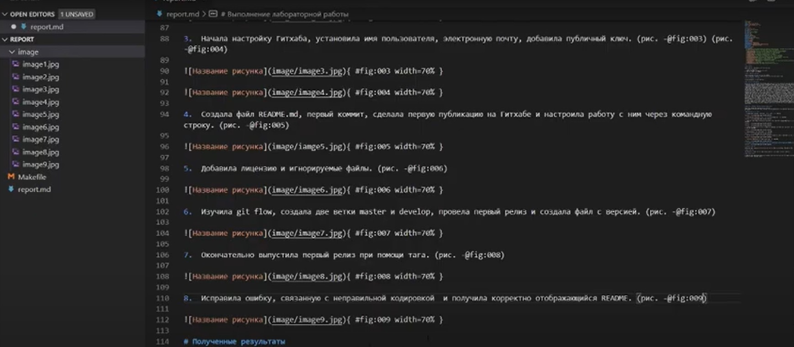

---
## Front matter
lang: ru-RU
title: Лабораторная работа №3 "Markdown" 
author: |
	Саттарова Вита Викторовна\inst{1}
institute: |
	\inst{1}РУДН, Москва, Россия
date: 2021, Май

## Formatting
toc: false
slide_level: 2
theme: metropolis
mainfont: PT Serif
romanfont: PT Serif
sansfont: PT Sans
monofont: PT Mono
header-includes: 
 - \metroset{progressbar=frametitle,sectionpage=progressbar,numbering=fraction}
 - '\makeatletter'
 - '\beamer@ignorenonframefalse'
 - '\makeatother'
aspectratio: 43
section-titles: true
---

# Лабораторная работа №3 "Markdown"

## Прагматика

Работа выполнена для того чтобы научиться использовать и работать с языком легковесной разметки Markdown, разобраться с теорией написания файлов в Markdown, научиться писать отчёты к работам с использованием Markdown и конвертировать их в другие форматы, чтобы использовать полученные знания для дальнейшей работы.

## Цели

Научиться оформлять отчёты с помощью легковесного языка разметки Markdown.

## Задачи

- Установить необходимое ПО
- Изучить информацию о легковесном языке разметки Markdown
- Создать файл отчёта .md с помощью Markdown
- Конвертировать файлы отчётов из Markdown в форматы .docx и .pdf

## Работа (1)

{ #fig:001 width=100% }

## Работа (2)

{ #fig:002 width=100% }

## Результаты

Изучена информация, касающаяся легковесного языка разметки Markdown, создан файл отчёта в формате .md, получены конвертированные файлы отчёта .docx, .pdf.  

## Заключение

В результате работы был изучен язык легковесной разметки Markdown, были приобретены навыки оформления отчётов с помощью легковесного языка разметки Markdown, которые можно применять для дальнейшей работы.