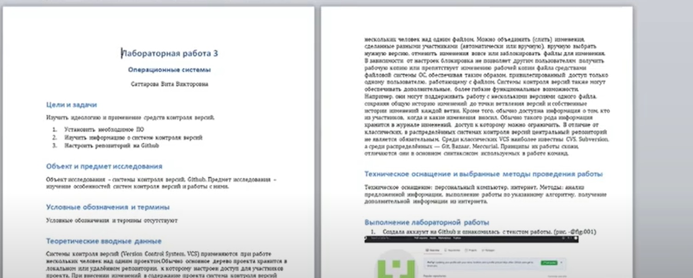

# Лабораторная работа 3 

### Саттарова Вита Викторовна, НФИбд-02-20

#### 2021

---

# Markdown

---

## Прагматика

Работа выполнена для того чтобы научиться использовать и работать с языком легковесной разметки Markdown, разобраться с теорией написания файлов в Markdown, научиться писать отчёты к работам с использованием Markdown и конвертировать их в другие форматы, чтобы использовать полученные знания для дальнейшей работы.

---

## Цели

Научиться оформлять отчёты с помощью легковесного языка разметки Markdown.

---

## Задачи

- Установить необходимое ПО
- Изучить информацию о легковесном языке разметки Markdown
- Создать файл отчёта .md с помощью Markdown
- Конвертировать файлы отчётов из Markdown в форматы .docx и .pdf

---

## Работа

---

## Результаты

Изучена информация, касающаяся легковесного языка разметки Markdown, создан файл отчёта в формате .md, получены конвертированные файлы отчёта .docx, .pdf.  

---

## Заключение

В результате работы был изучен язык легковесной разметки Markdown, были приобретены навыки оформления отчётов с помощью легковесного языка разметки Markdown, которые можно применять для дальнейшей работы.

