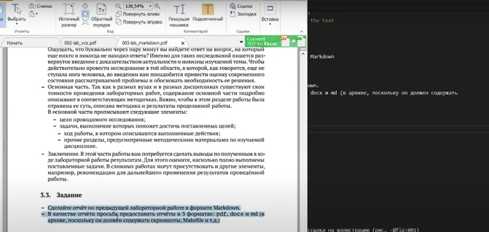
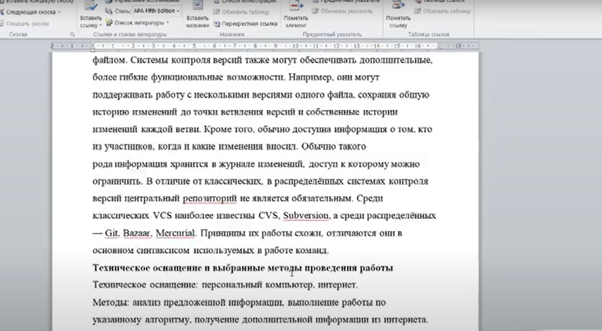
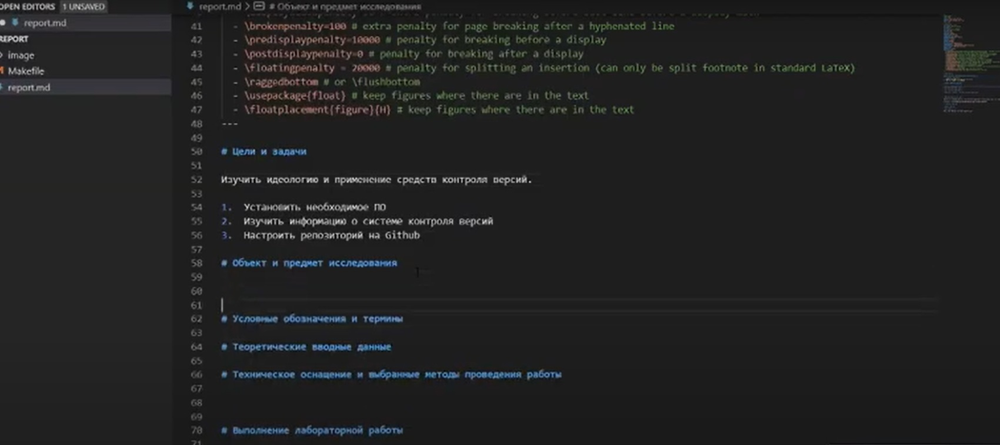
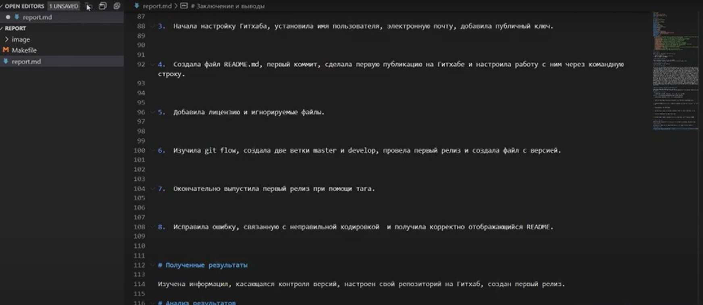
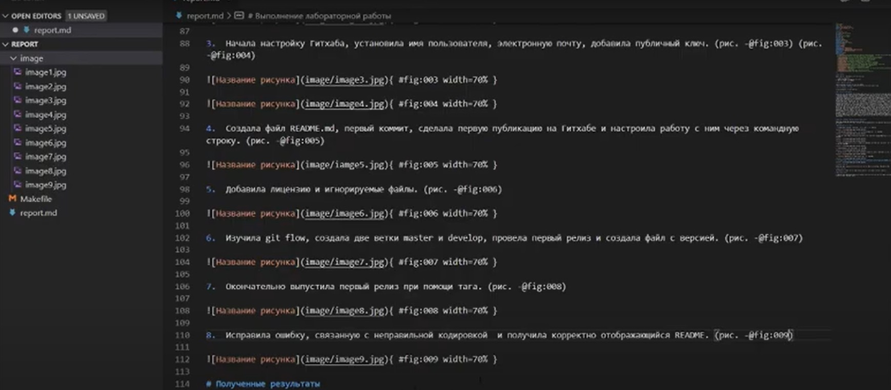
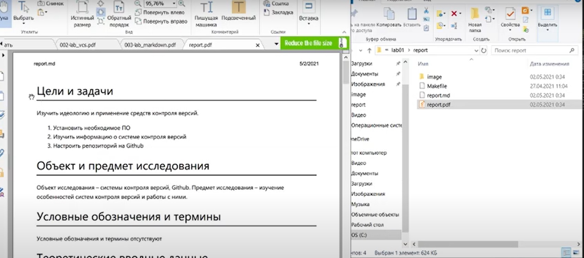
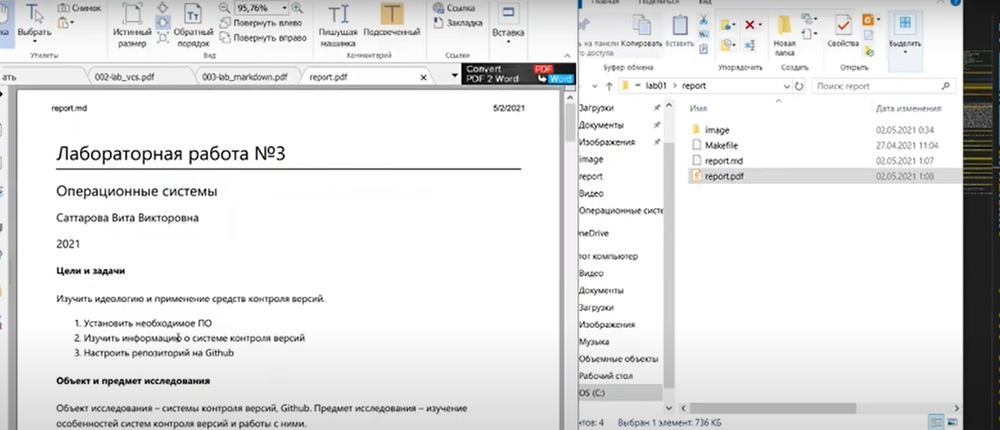
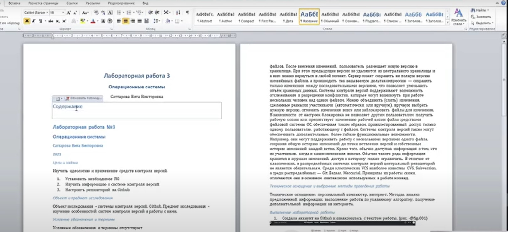
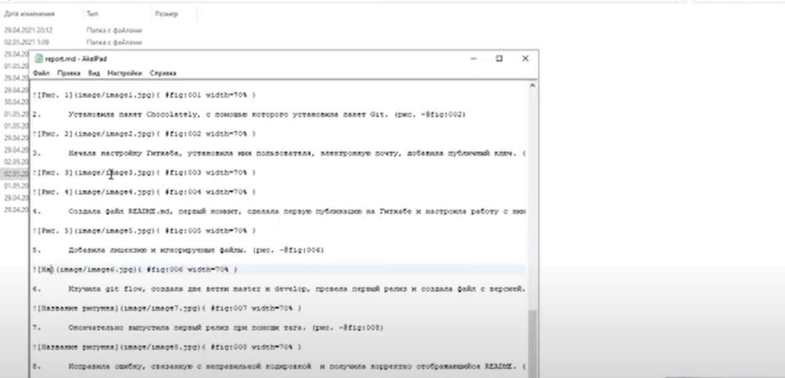
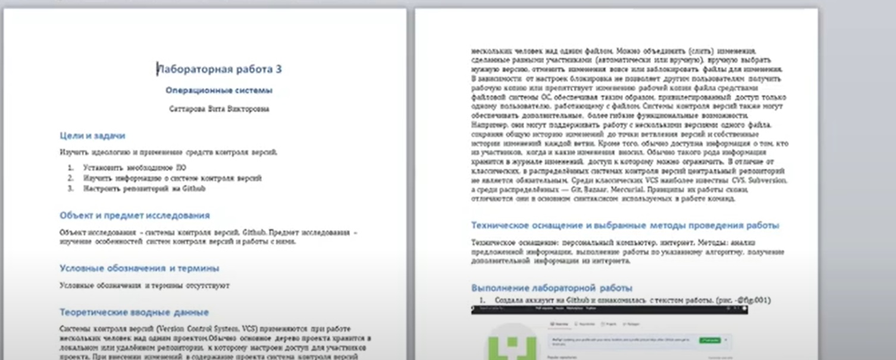

---
# Front matter
lang: ru-RU
title: "Лабораторная работа №3"
subtitle: "Операционные системы"
author: "Саттарова Вита Викторовна"

# Formatting
toc-title: "Содержание"
toc: true # Table of contents
toc_depth: 2
lof: true # List of figures
lot: false # List of tables
fontsize: 12pt
linestretch: 1.5
papersize: a4paper
documentclass: scrreprt
polyglossia-lang: russian
polyglossia-otherlangs: english
mainfont: PT Serif
romanfont: PT Serif
sansfont: PT Sans
monofont: PT Mono
mainfontoptions: Ligatures=TeX
romanfontoptions: Ligatures=TeX
sansfontoptions: Ligatures=TeX,Scale=MatchLowercase
monofontoptions: Scale=MatchLowercase
indent: true
pdf-engine: lualatex
header-includes:
  - \linepenalty=10 # the penalty added to the badness of each line within a paragraph (no associated penalty node) Increasing the value makes tex try to have fewer lines in the paragraph.
  - \interlinepenalty=0 # value of the penalty (node) added after each line of a paragraph.
  - \hyphenpenalty=50 # the penalty for line breaking at an automatically inserted hyphen
  - \exhyphenpenalty=50 # the penalty for line breaking at an explicit hyphen
  - \binoppenalty=700 # the penalty for breaking a line at a binary operator
  - \relpenalty=500 # the penalty for breaking a line at a relation
  - \clubpenalty=150 # extra penalty for breaking after first line of a paragraph
  - \widowpenalty=150 # extra penalty for breaking before last line of a paragraph
  - \displaywidowpenalty=50 # extra penalty for breaking before last line before a display math
  - \brokenpenalty=100 # extra penalty for page breaking after a hyphenated line
  - \predisplaypenalty=10000 # penalty for breaking before a display
  - \postdisplaypenalty=0 # penalty for breaking after a display
  - \floatingpenalty = 20000 # penalty for splitting an insertion (can only be split footnote in standard LaTeX)
  - \raggedbottom # or \flushbottom
  - \usepackage{float} # keep figures where there are in the text
  - \floatplacement{figure}{H} # keep figures where there are in the text
---

# Цели и задачи

## Цель

Научиться оформлять отчёты с помощью легковесного языка разметки Markdown.

## Задачи

1.	Установить необходимое ПО
2.	Изучить информацию о легковесном языке разметки Markdown
3.	Создать файл отчёта .md с помощью Markdown
4.  Конвертировать файлы отчётов из Markdown в форматы .docx и .pdf

# Объект и предмет исследования

## Объект исследования

Легковесный язык разметки Markdown

## Предмет исследования

Изучение особенностей языка разметки Markdown, его применения на практике при создании отчётов. 

# Условные обозначения и термины

Условные обозначения и термины отсутствуют

# Теоретические вводные данные

Markdown (произносится маркда́ун) — облегчённый язык разметки, созданный с целью обозначения форматирования в простом тексте, с максимальным сохранением его читаемости человеком, и пригодный для машинного преобразования в языки для продвинутых публикаций (HTML, Rich Text и других). С помощью Markdown можно быстро и удобно оформить заголовки, списки, формулы, вставить в текст картинки при помощи ссылкок и так далее. Есть много различных способов конвертировать файлы Markdown в другие форматы. Файлы в формате Markdown имеют расширение .md.

# Техническое оснащение и выбранные методы проведения работы

## Техническое оснащение

Персональный компьютер, интернет.

## Методы

Анализ предложенной информации, загрузка необходимых для выполнения программ, выполнение работы по указанному алгоритму, получение дополнительной информации из интернета.

# Выполнение лабораторной работы

1.	Изучила информацию о лабораторной работе. Открыла отчёт прошлой лабораторной работы в формате .docx. (рис. -@fig:001) (рис. -@fig:002)

{ #fig:001 width=100% }

{ #fig:002 width=100% }

2.	Подготовила оформление для файла. (рис. -@fig:003)

{ #fig:003 width=100% }

3.	Перенесла информацию из файла отчёта в файл Markdown. (рис. -@fig:004)

{ #fig:004 width=100% }

4.	Подготовила папку с картинками и создала в тексте отчёта ссылки на картинки. (рис. -@fig:005) 

{ #fig:005 width=100% }

5.	Закончила работу с файлом, посмотрела как файл будет выглядеть. (рис. -@fig:006)

{ #fig:006 width=100% }

6.	Сделала последние исправления и конвертировала файл .md в формате .pdf. Посмотрела результат. (рис. -@fig:007)

{ #fig:007 width=100% }

7.	Конвертировала файл .docx. Посмотрела результат. Исправила ошибки оформления при конвертации и конвертировала итоговый вариант. (рис. -@fig:008) (рис. -@fig:009) (рис. -@fig:010)

{ #fig:008 width=100% }

{ #fig:009 width=100% }

{ #fig:010 width=100% }

# Полученные результаты

Изучена информация, касающаяся легковесного языка разметки Markdown, создан файл отчёта в формате .md, получены конвертированные файлы отчёта .docx, .pdf. 

# Анализ результатов

Работу получилось выполнить по инструкции, не получилось использовать предложенный способ конвертации документов из .md в .pdf, поэтому был найден другой способ это сделать, файлы отображаются корректно. Позже получилось установить необходимое ПО и выполнить конвертацию с помощью Makefile.

# Заключение и выводы

В результате работы был изучен язык легковесной разметки Markdown, были приобретены навыки оформления отчётов с помощью легковесного языка разметки Markdown, которые можно применять для дальнейшей работы.
