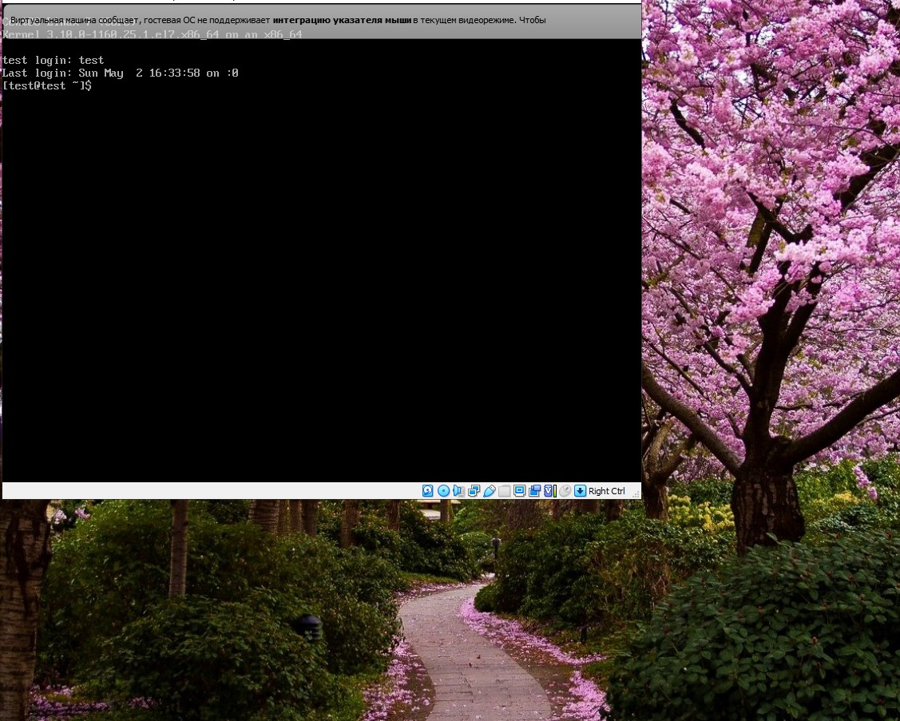

---
## Front matter
lang: ru-RU
title: Лабораторная работа №4 "Знакомство с операционной системой Linux" 
author: |
	Саттарова Вита Викторовна\inst{1}
institute: |
	\inst{1}РУДН, Москва, Россия
date: 2021, Май

## Formatting
toc: false
slide_level: 2
theme: metropolis
mainfont: PT Serif
romanfont: PT Serif
sansfont: PT Sans
monofont: PT Mono
header-includes: 
 - \metroset{progressbar=frametitle,sectionpage=progressbar,numbering=fraction}
 - '\makeatletter'
 - '\beamer@ignorenonframefalse'
 - '\makeatother'
aspectratio: 43
section-titles: true
---

# Лабораторная работа №4 "Знакомство с операционной системой Linux" 

## Прагматика

Работа выполнена для того чтобы научиться основам использования операционной системы Linux, разобраться с теорией, касающейся пользователей системы, текстовых консолей и графических сред, научиться перемещаться между текстовыми консолями и графическими средами, чтобы использовать полученные знания для дальнейшей работы.

## Цели

Познакомиться с операционной системой Linux, получить практические навыки работы с консолью и некоторыми графическими менеджерами рабочих столов операционной системы.

## Задачи

- Установить необходимое ПО
- Изучить информацию об учётных записях, текстовых консолях и графических интерфейсах
- Научиться работать с текстовыми консолями (включать, заходить под именем пользователя, выходить)
- Научиться работать с разными графическими средами и перемещаться между ними (Gnome, KDE, Xfce)
- Рассмотреть установленные по умолчанию приложения в разных графических средах

## Работа (1)

{ #fig:001 width=100% }

## Работа (2)

{ #fig:002 width=100% }

## Результаты

Изучена информация, касающаяся пользователей системы, текстовых консолей, графических сред, были рассмотрены текстовые консоли и 3 графических среды. Между тектсовыми консолями и графическими средами было возможно переключение. 

## Заключение

В результате работы я познакомилась с операционной системой Linux, получила практические навыки работы с консолью и некоторыми графическими средами операционной системы.