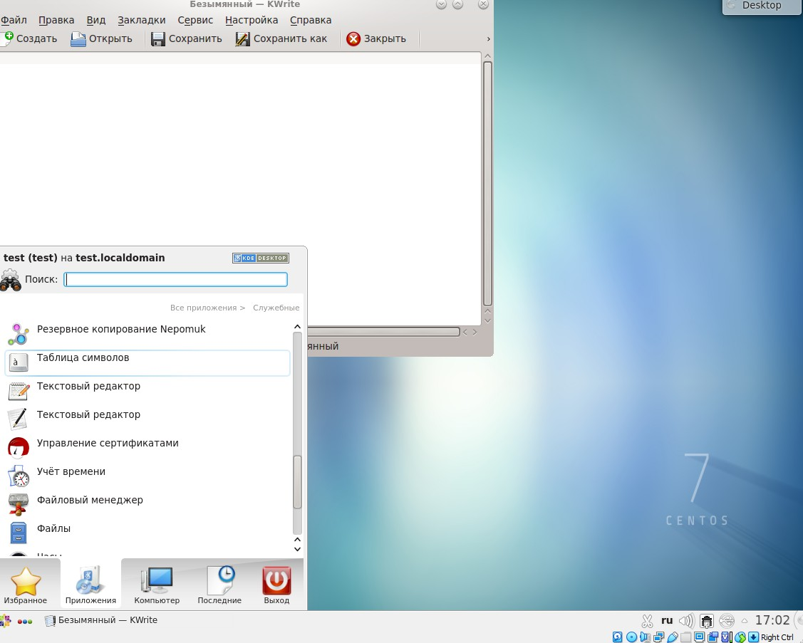

# Лабораторная работа 4 

### Саттарова Вита Викторовна, НФИбд-02-20

#### 2021

---

# Знакомство с операционной системой Linux

---

## Прагматика

Работа выполнена для того чтобы научиться основам использования операционной системы Linux, разобраться с теорией, касающейся пользователей системы, текстовых консолей и графических сред, научиться перемещаться между текстовыми консолями и графическими средами, чтобы использовать полученные знания для дальнейшей работы.

---

## Цели

Познакомиться с операционной системой Linux, получить практические навыки работы с консолью и некоторыми графическими менеджерами рабочих столов операционной системы.

---

## Задачи

- Установить необходимое ПО
- Изучить информацию об учётных записях, текстовых консолях и графических интерфейсах
- Научиться работать с текстовыми консолями (включать, заходить под именем пользователя, выходить)
- Научиться работать с разными графическими средами и перемещаться между ними (Gnome, KDE, Xfce)
- Рассмотреть установленные по умолчанию приложения в разных графических средах

---

## Работа (1)

---

### Работа (2)

---

## Результаты

Изучена информация, касающаяся пользователей системы, текстовых консолей, графических сред, были рассмотрены текстовые консоли и 3 графических среды. Между тектсовыми консолями и графическими средами было возможно переключение. 

---

## Заключение

В результате работы я познакомилась с операционной системой Linux, получила практические навыки работы с консолью и некоторыми графическими средами операционной системы.

