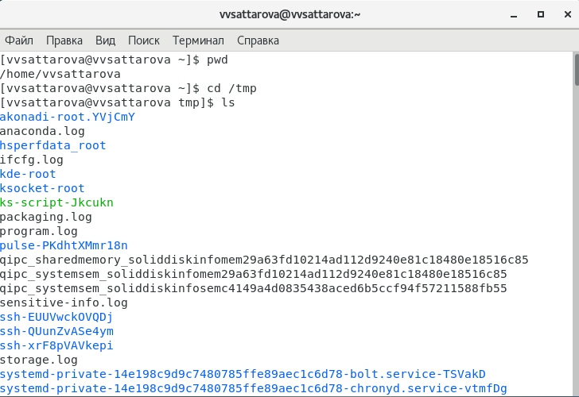
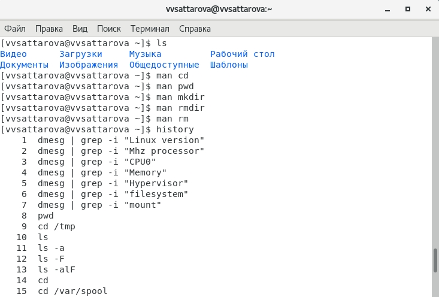

---
## Front matter
lang: ru-RU
title: Лабораторная работа №5 "Основы интерфейса взаимодействия пользователя с системой Unix на уровне командной строки" 
author: |
	Саттарова Вита Викторовна\inst{1}
institute: |
	\inst{1}РУДН, Москва, Россия
date: 2021, Май

## Formatting
toc: false
slide_level: 2
theme: metropolis
mainfont: PT Serif
romanfont: PT Serif
sansfont: PT Sans
monofont: PT Mono
header-includes: 
 - \metroset{progressbar=frametitle,sectionpage=progressbar,numbering=fraction}
 - '\makeatletter'
 - '\beamer@ignorenonframefalse'
 - '\makeatother'
aspectratio: 43
section-titles: true
---

# Лабораторная работа №5 "Основы интерфейса взаимодействия пользователя с системой Unix на уровне командной строки" 

## Прагматика

Работа выполнена для того чтобы научиться основам интерфейса взаимодействия пользователя с системой Unix на уровне командной строки, научиться получать информацию о файлах и каталогах, создавать и удалять их, использовать несколько команд в одной строке и быстро использовать уже введённые команды, чтобы использовать полученные знания для дальнейшей работы.

## Цели

Приобретение практических навыков взаимодействия пользователя с системой посредством командной строки.

## Задачи

- Изучить основные команды Linux
- Научиться получать необходимую информацию через терминал, используя команды
- Научиться работать с каталогами и файлами

## Работа (1)

{ #fig:001 width=100% }

## Работа (2)

{ #fig:002 width=100% }

## Результаты

Изучена информация, касающаяся основных команд терминала, были рассмотрены команды pwd, ls, mkdir, rm, cd и др. Освоены основные команды терминала. 

## Заключение

Приобретены практические навыки взаимодействия пользователя с системой посредством командной строки.