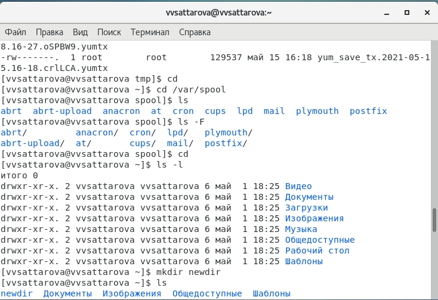

---
# Front matter
lang: ru-RU
title: "Лабораторная работа №5"
subtitle: "Операционные системы"
author: "Саттарова Вита Викторовна"

# Formatting
toc-title: "Содержание"
toc: true # Table of contents
toc_depth: 2
lof: true # Список рисунков
lot: false # List of tables
fontsize: 12pt
linestretch: 1.5
papersize: a4paper
documentclass: scrreprt
polyglossia-lang: russian
polyglossia-otherlangs: english
mainfont: PT Serif
romanfont: PT Serif
sansfont: PT Sans
monofont: PT Mono
mainfontoptions: Ligatures=TeX
romanfontoptions: Ligatures=TeX
sansfontoptions: Ligatures=TeX,Scale=MatchLowercase
monofontoptions: Scale=MatchLowercase
indent: true
pdf-engine: lualatex
header-includes:
  - \linepenalty=10 # the penalty added to the badness of each line within a paragraph (no associated penalty node) Increasing the value makes tex try to have fewer lines in the paragraph.
  - \interlinepenalty=0 # value of the penalty (node) added after each line of a paragraph.
  - \hyphenpenalty=50 # the penalty for line breaking at an automatically inserted hyphen
  - \exhyphenpenalty=50 # the penalty for line breaking at an explicit hyphen
  - \binoppenalty=700 # the penalty for breaking a line at a binary operator
  - \relpenalty=500 # the penalty for breaking a line at a relation
  - \clubpenalty=150 # extra penalty for breaking after first line of a paragraph
  - \widowpenalty=150 # extra penalty for breaking before last line of a paragraph
  - \displaywidowpenalty=50 # extra penalty for breaking before last line before a display math
  - \brokenpenalty=100 # extra penalty for page breaking after a hyphenated line
  - \predisplaypenalty=10000 # penalty for breaking before a display
  - \postdisplaypenalty=0 # penalty for breaking after a display
  - \floatingpenalty = 20000 # penalty for splitting an insertion (can only be split footnote in standard LaTeX)
  - \raggedbottom # or \flushbottom
  - \usepackage{float} # keep figures where there are in the text
  - \floatplacement{figure}{H} # keep figures where there are in the text
---

# Цели и задачи

## Цель

Приобретение практических навыков взаимодействия пользователя с системой через командную строку.

## Задачи

1.	Изучить основные команды Linux
2.	Научиться получать необходимую информацию через терминал, используя команды
3.	Научиться работать с каталогами и файлами

# Объект и предмет исследования

## Объект исследования

Терминал и его основные программы.

## Предмет исследования

Изучение особенностей работы с основными командами терминала, файлами и каталогами, получение знаний о командах терминала.

# Условные обозначения и термины

Условные обозначения и термины отсутствуют

# Теоретические вводные данные

**Формат команды** Командой в операционной системе называется записанный по специальным правилам текст (возможно с аргументами), представляющий собой указание на выполнение какой-либо функций (или действий) в операционной системе. Обычно первым словом идёт имя команды, остальной текст — аргументы или опции, конкретизирующие действие.
Общий формат команд можно представить следующим образом: <имя_команды><разделитель><аргументы>.
**Команда man.** Команда man используется для просмотра (оперативная помощь) в диалоговом режиме руководства (manual) по основным командам операционной системы типа Linux.
Формат команды: man <команда>.
**Команда cd.** Команда cd используется для перемещения по файловой системе операционной системы типа Linux.
*Замечание 3.* Файловая система ОС типа Linux — иерархическая система каталогов, подкаталогов и файлов, которые обычно организованы и сгруппированы по функциональному признаку. Самый верхний каталог в иерархии называется корневым и обозначается символом /. Корневой каталог содержит системные файлы и другие каталоги.
Формат команды: cd [путь_к_каталогу].
**Команда pwd.** Для определения абсолютного пути к текущему каталогу используется команда pwd (print working directory).
**Команда ls.** Команда ls используется для просмотра содержимого каталога.
Формат команды: ls 	[-опции]. 
**Команда mkdir.** Команда mkdir используется для создания каталогов.
Формат команды: mkdir имя_каталога1 [имя_каталога2...].
**Команда rm.** Команда rm используется для удаления файлов и/или каталогов.
Формат команды: rm [-опции] [файл].
**Команда history.** Для вывода на экран списка ранее выполненных команд используется команда history. Выводимые на экран команды в списке нумеруются. К любой команде из выведенного на экран списка можно обратиться по её номеру в списке, воспользовавшись конструкцией !<номер_команды>.

# Техническое оснащение и выбранные методы проведения работы

## Техническое оснащение

Персональный компьютер, интернет, виртуальная машина.

## Методы

Анализ предложенной информации, выполнение работы по указанному алгоритму, получение дополнительной информации из интернета.

# Выполнение лабораторной работы

1.	Ознакомилась с теоретическим материалом, подготовила компьютер для выполнения лабораторной работы, открыла вирутальную машину, подготовленную для работы. (рис. -@fig:001) 

{ #fig:001 width=100% }

2.    Определила полное имя домашнего каталога (pwd). Далее относительно этого каталога выполняла последующие упражнения. Перешла в каталог /tmp (cd /tmp). Выведите на экран содержимое каталога /tmp (ls). (рис. -@fig:002) 

{ #fig:002 width=100% }

2.	Использовала команду ls с различными опциями. Пояснила разницу в выводимой на экран информации (ls -a, ls -F, ls -alF). (рис. -@fig:003) (рис. -@fig:004) (рис. -@fig:005)

{ #fig:003 width=100% }

{ #fig:004 width=100% }

{ #fig:005 width=100% }

3.	Определила, есть ли в каталоге /var/spool подкаталог с именем cron (cd /var/spool, ls). Перешла в домашний каталог и вывела на экран его содержимое. Определила, кто является владельцем файлов и подкаталогов (cd, ls -l). В домашнем каталоге создала новый каталог с именем newdir (mkdir newdir). (рис. -@fig:006)

{ #fig:006 width=100% }

4.	В каталоге ~/newdir создала новый каталог с именем morefun (mkdir morefun). В домашнем каталоге создала одной командой три новых каталога с именами letters, memos, misk (mkdir letters memos misk). Затем удалила эти каталоги одной командой (rm -r letters memos misk). Попробовала удалить ранее созданный каталог ~/newdir командой rm (rm newdir). Проверила, был ли каталог удалён. Каталог не был удалён. Удалила каталог ~/newdir/morefun из домашнего каталога (rm -r newdir). Проверила, был ли каталог удалён. Каталог был удалён. (рис. -@fig:007) 

{ #fig:007 width=100% }

5.	С помощью команды man определила, какую опцию команды ls нужно использовать для просмотра содержимого не только указанного каталога, но и подкаталогов, входящих в него (ls -R). (рис. -@fig:008)

{ #fig:008 width=100% }

6.	С помощью команды man определила набор опций команды ls, позволяющий отсортировать по времени последнего изменения выводимый список содержимого каталога с развёрнутым описанием файлов (ls -tl). (рис. -@fig:09)

{ #fig:09 width=100% }

7.	Использовала команду man для просмотра описания следующих команд: cd, pwd, mkdir, rmdir, rm. Пояснила основные опции этих команд. Используя информацию, полученную при помощи команды history, выполнила модификацию и исполнение нескольких команд из буфера команд. (рис. -@fig:010) (рис. -@fig:011) 

{ #fig:010 width=100% }

{ #fig:011 width=100% }

Подробное пояснение хода работы можно увидеть на видео.

# Полученные результаты

Изучена информация, касающаяся основных команд терминала, были рассмотрены команды pwd, ls, mkdir, rm, cd и др. Освоены основные команды терминала. 

# Анализ результатов

Работу получилось выполнить по инструкции, проблем с использованием команд не возникло.

# Заключение и выводы

Приобретены практические навыки взаимодействия пользователя с системой через командную строку.

# Контрольные вопросы

1. Что такое командная строка?
2. При помощи какой команды можно определить абсолютный путь текущего каталога? Приведите пример.
3. При помощи какой команды и каких опций можно определить только тип файлов и их имена в текущем каталоге? Приведите примеры.
4. Какие файлы считаются скрытыми? Как получить информацию о скрытых файлах? Приведите примеры.
5. При помощи каких команд можно удалить файл и каталог? Можно ли это сделать одной и той же командой? Приведите примеры.
6. Как определить, какие команды выполнил пользователь в сеансе работы?
7. Каким образом можно исправить и запустить на выполнение команду, которую пользователь уже использовал в сеансе работы? Приведите примеры.
8. Можно ли в одной строке записать несколько команд? Если да, то как? Приведите примеры.
9. Что такое символ экранирования? Приведите примеры использования этого символа.
10. Какая информация выводится на экран о файлах и каталогах, если используется опция l в команде ls?
11. Что такое относительный путь к файлу? Приведите примеры использования относительного и абсолютного пути при выполнении какой-либо команды.
12. Как получить информацию об интересующей вас команде?
13. Какая клавиша или комбинация клавиш служит для автоматического дополнения вводимых команд?

# Ответы на контрольные вопросы

1. Интерфейс командной строки - управление программами с помощью команд. Команды состоят из букв, цифр, символов, набираются построчно, выполняются после нажатия клавиши Enter. Основной инструмент здесь клавиатура. Данный интерфейс встроен в ядро системы, он будет доступен, даже если графический интерфейс не запустится. Добраться до командной строки можно двумя способами: через консоль или терминал.
2. При помощи команды realpath можно определить абсолютный путь текущего каталога. Например, если вбить realpath var на экран выведется /home/<username>/var.
3. При помощи команды ls -F можно определить только тип файлов и их имена в текущем каталоге.
4. Файл (или директория) считается скрытым, если его название начинается с символа точка «.». Например, «.myfile». Обычно такие файлы используются приложениями для хранения настроек, конфигураций и другой информации, которую нужно скрыть от пользователя. Зачастую пользователю требуется отредактировать соответствующий конфигурационный скрытый файл, чтобы настроить какую-нибудь программу, и пользователи сталкиваются с тем, что не знают, как их вообще просмотреть. По умолчанию файловые менеджеры обычно не отображают такие файлы.
Для просмотра списка файлов в командной строке используется команда ls. Чтобы по команде ls также выводились скрытые файлы, существует опция -a.
5. При помощи команд rm и rmdir можно удалить файл и каталог. Это нельзя сделать одной и той же командой. rmdir используется, чтобы удалить файлы, которые должны быть пустые. rm используется, чтобы удалить непустые файлы или целые деревья каталогов.
6. Определить какие команды выполнил пользователь в сеансе работы можно с помощь команды history.
7. Исправить и запустить на выполнение команду, которую пользователь уже использовал в сеансе работы, можно с помощью команды: !<номер_команды>:s/<что_меняем>/<на_что_меняем> Например,
history
.
.
3 ls -a
.
.
!3:s/a/F
ls -F
8. В одной строке можно записать несколько команд. Если требуется выполнить последовательно несколько команд, записанный в одной строке, то для этого используется символ точка с запятой. Пример: cd; ls.
9.Экранирование — это способ заключения в кавычки одиночного символа. Экранирующий символ (\) сообщает интерпретатору, что следующий за ним символ должен восприниматься как обычный символ. Пример:
echo "Привет"                    # Привет
echo "Он сказал: \"Привет\"."    # Он сказал: "Привет".
10. Если используется опция l в команде ls, то на экран выводится подробный список, в котором будет отображаться владелец, группа, дата создания, размер и другая информация о файлах и каталогах.
11. Относительный путь – это путь к файлу относительно текущей папки. При использовании команды pwd на экран выведется относительный путь текущей директории, а при использовании команды realpath на экран выведется абсолютный путь текущей директории.
12. Получить информацию об интересующей вас команде можно с помощью команды man. Например, команда man ls выведет все опции команды ls.
13. Клавиша Tab служит для автоматического дополнения вводимых команд.
