---
# Front matter
lang: ru-RU
title: "Лабораторная работа №6"
subtitle: "Операционные системы"
author: "Саттарова Вита Викторовна"

# Formatting
toc-title: "Содержание"
toc: true # Table of contents
toc_depth: 2
lof: true # Список рисунков
lot: false # List of tables
fontsize: 12pt
linestretch: 1.5
papersize: a4paper
documentclass: scrreprt
polyglossia-lang: russian
polyglossia-otherlangs: english
mainfont: PT Serif
romanfont: PT Serif
sansfont: PT Sans
monofont: PT Mono
mainfontoptions: Ligatures=TeX
romanfontoptions: Ligatures=TeX
sansfontoptions: Ligatures=TeX,Scale=MatchLowercase
monofontoptions: Scale=MatchLowercase
indent: true
pdf-engine: lualatex
header-includes:
  - \linepenalty=10 # the penalty added to the badness of each line within a paragraph (no associated penalty node) Increasing the value makes tex try to have fewer lines in the paragraph.
  - \interlinepenalty=0 # value of the penalty (node) added after each line of a paragraph.
  - \hyphenpenalty=50 # the penalty for line breaking at an automatically inserted hyphen
  - \exhyphenpenalty=50 # the penalty for line breaking at an explicit hyphen
  - \binoppenalty=700 # the penalty for breaking a line at a binary operator
  - \relpenalty=500 # the penalty for breaking a line at a relation
  - \clubpenalty=150 # extra penalty for breaking after first line of a paragraph
  - \widowpenalty=150 # extra penalty for breaking before last line of a paragraph
  - \displaywidowpenalty=50 # extra penalty for breaking before last line before a display math
  - \brokenpenalty=100 # extra penalty for page breaking after a hyphenated line
  - \predisplaypenalty=10000 # penalty for breaking before a display
  - \postdisplaypenalty=0 # penalty for breaking after a display
  - \floatingpenalty = 20000 # penalty for splitting an insertion (can only be split footnote in standard LaTeX)
  - \raggedbottom # or \flushbottom
  - \usepackage{float} # keep figures where there are in the text
  - \floatplacement{figure}{H} # keep figures where there are in the text
---

# Цели и задачи

## Цель

Ознакомление с файловой системой Linux, её структурой, именами и содержанием каталогов. Приобретение практических навыков по применению команд для работы с файлами и каталогами, по управлению процессами (и работами), по проверке использования диска и обслуживанию файловой системы.

## Задачи

1.	Научиться работать с файлами, используя терминал
2.	Изучить информацию, связанную с командами копирования и перемещения, и научиться их использовать
3.	Изучить информацию и правах доступа пользователей, научиться их изменять
4.  Изучить монтирование файловых систем и применяемые для этого команды

# Объект и предмет исследования

## Объект исследования

Файлы, команда копирования, команда перемещения, права доступа пользователей, монтирование файловых систем.

## Предмет исследования

Изучение особенностей работы с файлами, изучение команд копирования и перемещения, получение информации, связанной с правами доступа пользователей и монтированием файловых систем.

# Условные обозначения и термины

Условные обозначения и термины отсутствуют

# Теоретические вводные данные

Для создания текстового файла удобно воспользоваться командой **touch**. Формат команды: touch имя-файла.
Для просмотра небольших файлов удобно пользоваться командой **cat**. Формат команды: cat имя-файла.
Для просмотра больших файлов можно использовать команду **less** — она позволяет осуществлять постраничный просмотр файлов (длина страницы соответствует размеру экрана). Формат команды: less имя-файла.
Для управления процессом просмотра можно использовать следующие управляющие клавиши:
- Space — переход на следующую страницу,
- ENTER — сдвиг вперёд на одну строку,
- b — возврат на предыдущую страницу,
- h — обращение за подсказкой,
- q — выход в режим командной строки.
Для просмотра начала файла можно воспользоваться командой **head**. По умолчанию она выводит первые 10 строк файла. Формат команды: head [-n] имя-файла, где n — количество выводимых строк.
Команда **tail** выводит несколько (по умолчанию 10) последних строк файла. Формат команды: tail [-n] имя-файла, где n — количество выводимых строк.
Копирование файлов и каталогов осуществляется при помощи команды **cp**. Формат команды: cp [-опции] исходный_файл целевой_файл.
Опция i в команде cp выведет на экран запрос подтверждения о перезаписи файла, если на место целевого файла вы поставите имя уже существующего файла. Команда cp с опцией r (recursive) позволяет копировать каталоги вместе с входящими в них файлами и каталогами.
Команды **mv** и **mvdir** предназначены для перемещения и переименования файлов и каталогов. Формат команды mv: mv [-опции] старый_файл новый_файл.
Каждый файл или каталог имеет права доступа.
В сведениях о файле или каталоге указываются:
- тип файла ((-) — файл, (d) — каталог);
- права для владельца файла: 
- права для членов группы;
- права для всех остальных;
(r — чтение, w — запись, x — выполнение, - — право доступа отсутствует).
Права доступа к файлу или каталогу можно изменить, воспользовавшись командой **chmod**. Сделать это может владелец файла (или каталога) или пользователь с правами администратора. Формат команды: chmod режим имя_файла.
Файловая система в Linux состоит из фалов и каталогов. Каждому физическому носителю соответствует своя файловая система.
Существует несколько типов файловых систем. Перечислим наиболее часто встречающиеся типы:
- ext2fs (second extended filesystem);
- ext2fs (third extended file system);
- ext4 (fourth extended file system);
- ReiserFS;
- xfs;
- fat (file allocation table);
- ntfs (new technology file system).
Для просмотра используемых в операционной системе файловых систем можно воспользоваться командой mount без параметров. 
Команда выводит имена устройств, названия соответствующих им точек монтирования (путь), тип файловой системы и параметры монтирования.
В контексте команды **mount** устройство — специальный файл устройства, с помощью которого операционная система получает доступ к аппаратному устройству.
Файлы устройств обычно располагаются в каталоге /dev, имеют сокращённые имена.
Точка монтирования — каталог (путь к каталогу), к которому присоединяются файлы устройств.
Другой способ определения смонтированных в операционной системе файловых систем — просмотр файла/etc/fstab. 
В каждой строке этого файла указано:
- имя устройство;
- точка монтирования;
- тип файловой системы;
- опции монтирования;
- специальные флаги для утилиты dump;
- порядок проверки целостности файловой системы с помощью утилиты **fsck**.
Для определения объёма свободного пространства на файловой системе можно воспользоваться командой **df**, которая выведет на экран список всех файловых систем в соответствии с именами устройств, с указанием размера и точки монтирования. 
С помощью команды fsck можно проверить (а в ряде случаев восстановить) целостность файловой системы. Формат команды: fsck имя_устройства.

# Техническое оснащение и выбранные методы проведения работы

## Техническое оснащение

Персональный компьютер, интернет, виртуальная машина.

## Методы

Анализ предложенной информации, выполнение работы по указанному алгоритму, получение дополнительной информации из интернета.

# Выполнение лабораторной работы

1.	Ознакомилась с теоретическим материалом, подготовила компьютер для выполнения лабораторной работы, открыла вирутальную машину, подготовленную для работы. 

2.	Выполнила все примеры, приведённые в первой части описания лабораторной работы. Начала выполнять следующую часть лабораторной работы. Проверила наличие файла io.h. (рис. -@fig:001) (рис. -@fig:002) (рис. -@fig:003) (рис. -@fig:004)

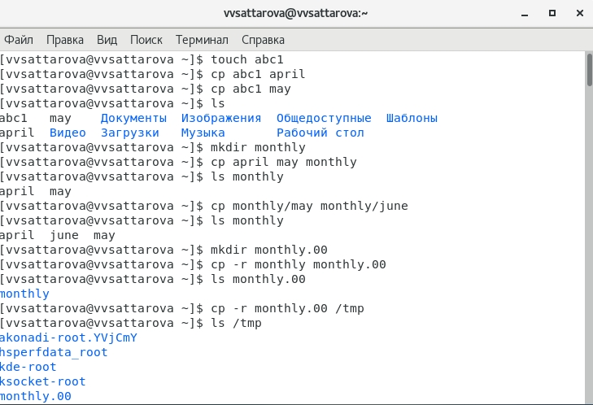{ #fig:001 width=100% }

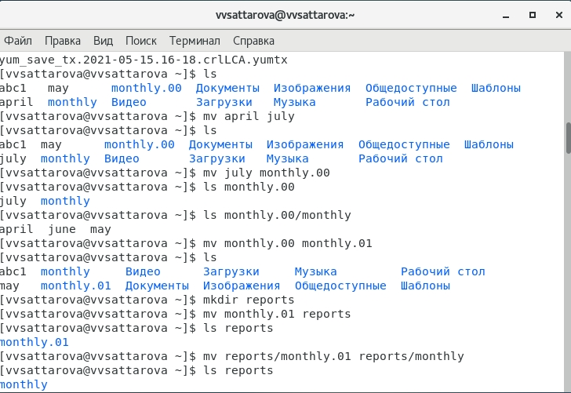{ #fig:002 width=100% }

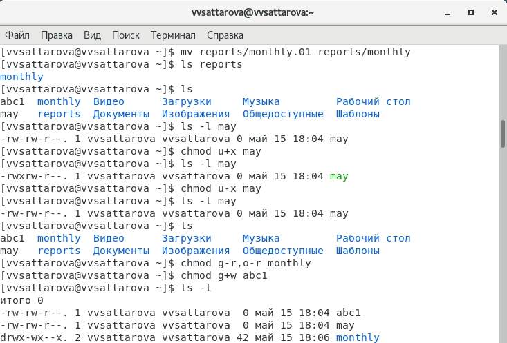{ #fig:003 width=100% }

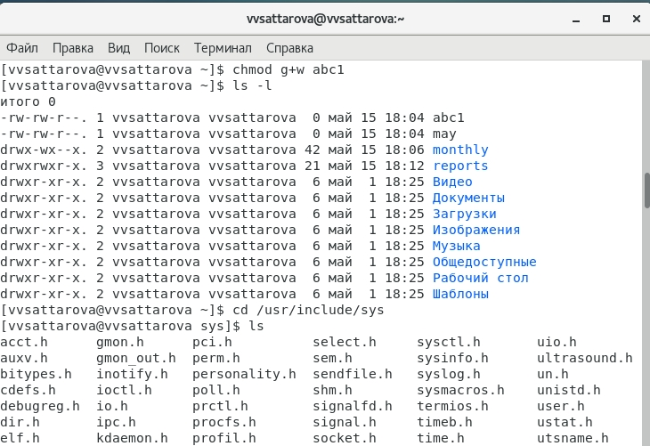{ #fig:004 width=100% }

3.	 Скопировала файл /usr/include/sys/io.h в домашний каталог и назвала его equipment. В домашнем каталоге создала директорию ~/ski.plases. Переместила файл equipment в каталог ~/ski.plases. Переименовала файл ~/ski.plases/equipment в
~/ski.plases/equiplist.  (рис. -@fig:005) 

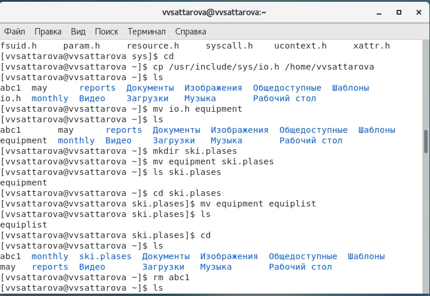{ #fig:005 width=100% }

4.	Создала в домашнем каталоге файл abc1 и скопировала его в каталог ~/ski.plases, назвала его equiplist2. Создала каталог с именем equipment в каталоге ~/ski.plases. Переместила файлы ~/ski.plases/equiplist и equiplist2 в каталог ~/ski.plases/equipment. Создала и переместила каталог ~/newdir в каталог ~/ski.plases. (рис. -@fig:006)

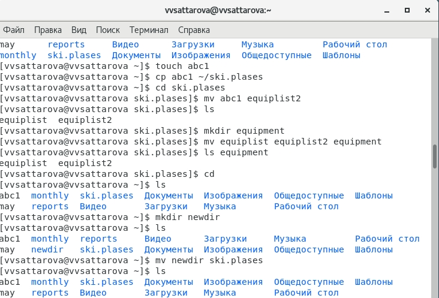{ #fig:006 width=100% }

5.	Переименовала каталог ~/newdir в каталог plans. Определите опции команды chmod, необходимые для того, чтобы присвоить определённым файлам выделенные права доступа, считая, что в начале таких прав нет (подробно объясняла в видео). Приступила к следующей части лабораторной работы. (рис. -@fig:007)

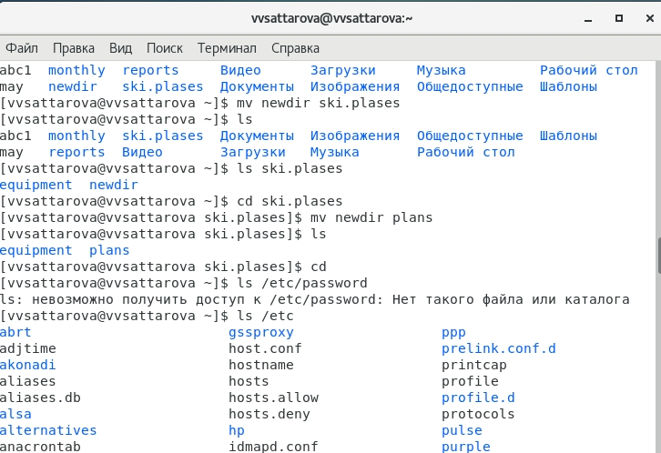{ #fig:007 width=100% }

6.	Нашла файл passwd и просмотрела содержимое файла /etc/passwd (файла password у меня не было). (рис. -@fig:008) 

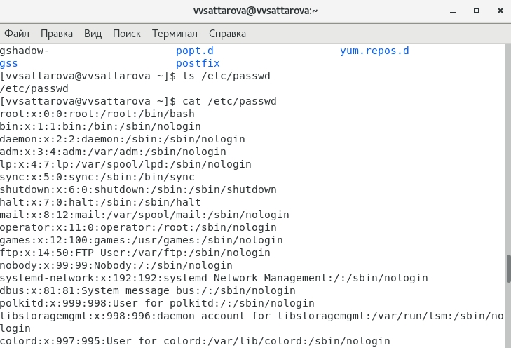{ #fig:008 width=100% }

7.	Скопировала файл ~/feathers в файл ~/file.old. Переместила файл ~/file.old в каталог ~/play. (рис. -@fig:009)

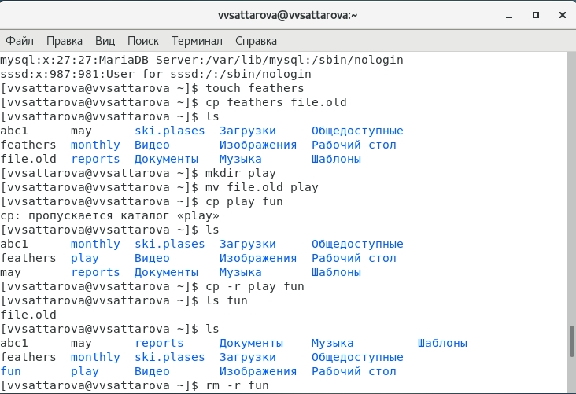{ #fig:009 width=100% }

8.  Переместила каталог ~/fun в каталог ~/play. (рис. -@fig:010)

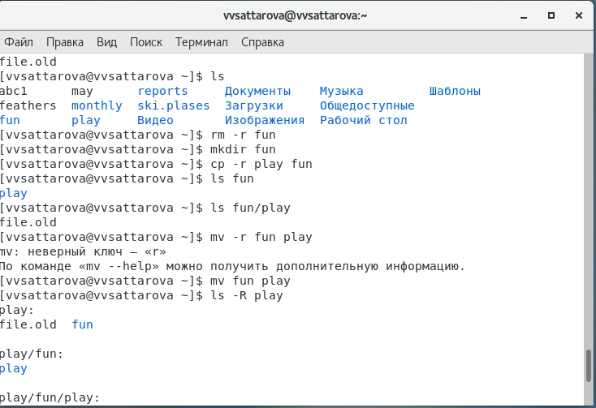{ #fig:010 width=100% }

9.  Назвала его games, лишила владельца файла ~/feathers права на чтение. Если попытаться просмотреть файл ~/feathers командой cat, то выйдет ошибка доступа. Если попытаться скопировать файл ~/feathers, то выйдет ошибка доступа. Дала владельцу файла ~/feathers право на чтение. Лишила владельца каталога ~/play права на выполнение. Перешла в каталог ~/play. Получила ошибку доступа. Дала владельцу каталога ~/play право на выполнение. (рис. -@fig:011) 

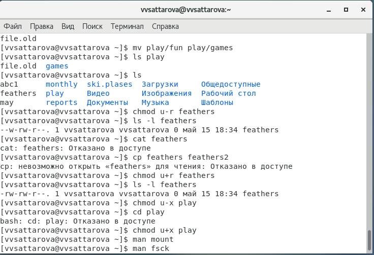{ #fig:011 width=100% }

10.  Прочитала man по командам mount, fsck, mkfs, kill и кратко их охарактеризовала, приведя примеры. (рис. -@fig:012) 

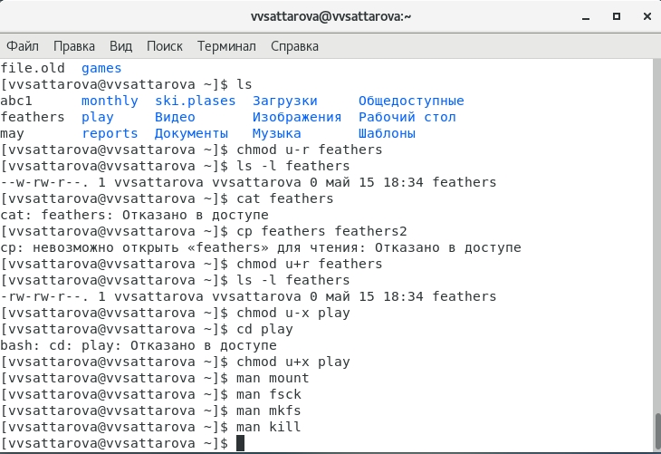{ #fig:012 width=100% }

Подробное пояснение по каждому из рабочих столов можно увидеть на видео.

# Полученные результаты

Изучена информация, касающаяся работы с файлами, комадами копирования, перемещения файлов, изменекния прав доступа, файловых систем, были использованы команды копирования и перемещения, а также смены доступа.

# Анализ результатов

Работу получилось выполнить по инструкции, проблем с использованием команд не возникло.

# Заключение и выводы

В результате работы я познакомилась с файловой системой Linux, её структурой, именами и содержанием каталогов. Приобрела практических навыков по применению команд для работы с файлами и каталогами, по управлению процессами (и работами), по проверке использования диска и обслуживанию файловой системы.

# Контрольные вопросы

1. Дайте характеристику каждой файловой системе, существующей на жёстком диске компьютера, на котором вы выполняли лабораторную работу.
2. Приведите общую структуру файловой системы и дайте характеристику каждой директории первого уровня этой структуры.
3. Какая операция должна быть выполнена, чтобы содержимое некоторой файловой системы было доступно операционной системе?
4. Назовите основные причины нарушения целостности файловой системы. Как устранить повреждения файловой системы?
5. Как создаётся файловая система?
6. Дайте характеристику командам, которые позволяют просмотреть текстовые файлы.
7. Приведите основные возможности команды cp в Linux.
8. Назовите и дайте характеристику командам перемещения и переименования файлов и каталогов.
9. Что такое права доступа? Как они могут быть изменены?

# Ответы на контрольные вопросы

1. Характеристика файловой системы, которая использовалась в данной лабораторной работе:
Файлы: abc1, april, may, june, july, isdv4.h, equipment, equiplist, equiplist2, my_os, feathers, file.old.
Каталоги: monthly, monthly.00, tmp, monthly.01, reports, usr, include, xorg, ski.plases, equipment, newdir, plans, australia, play, etc, fun, games.
2. Пример общей структуры файловой системы: /home/pdarzhankina/monthly/april, где /home/pdarzhankina – домашний каталог, /monthly – каталог, находящийся в домашнем и содержащий файл, /аpril – файл, находящийся в каталоге.
3. Чтобы содержимое некоторой файловой системы было доступно операционной системе должно быть выполнено монтирование тома.
4. Основные причины нарушения целостности файловой системы:
- Один блок адресуется несколькими mode (принадлежит нескольким файлам).
- Блок помечен как свободный, но в то же время занят (на него ссылается onode).
- Блок помечен как занятый, но в то же время свободен (ни один inode на него не ссылается).
- Неправильное число ссылок в inode (недостаток или избыток ссылающихся записей в каталогах).
- Несовпадение между размером файла и суммарным размером адресуемых inode блоков.
- Недопустимые адресуемые блоки (например, расположенные за пределами файловой системы).
- "Потерянные" файлы (правильные inode, на которые не ссылаются записи каталогов).
- Недопустимые или неразмещенные номера inode в записях каталогов.
Чтобы устранить повреждения файловой системы используется команда fsck.
5. Команда mkfs создаёт новую файловую систему.
6. Характеристика команд, которые позволяют просмотреть текстовые файлы:
- для просмотра небольших файлов удобно пользоваться командой cat.
- для просмотра больших файлов используйте команду less — она позволяет осуществлять постраничный просмотр файлов.
- для просмотра начала файла можно воспользоваться командой head, по умолчанию она выводит первые 10 строк файла.
- команда tail выводит несколько (по умолчанию 10) последних строк файла.
7. Основные возможности команды cp:
- копирование файла в текущем каталоге.
- копирование нескольких файлов в каталог.
- копирование файлов в произвольном каталоге.
Опция i в команде cp выведет на экран запрос подтверждения о перезаписи файла, если на место целевого файла вы поставите имя уже существующего файла.
Команда cp с опцией r (recursive) позволяет копировать каталоги вместе с входящими в них файлами и каталогами.
8. Характеристика команд перемещения и переименования файлов и каталогов:
- переименование файлов в текущем каталоге.
mv <старое_название_файла> <новое_название_файла> 
- перемещение файлов в другой каталог.
mv <название_файла> <название_каталога> 
Если необходим запрос подтверждения о перезаписи файла, то нужно использовать опцию i.
- переименование каталогов в текущем каталоге.
mv <старое_название_каталога> <новое_название_каталога> 
- перемещение каталога в другой каталог.
mv <старый_каталога> <новый_каталог> 
- переименование каталога, не являющегося текущим.
mv <каталог/старое_название_каталога> < каталог/новое_название_каталога> 
9. Каждый файл или каталог имеет права доступа: чтение (разрешены просмотр и копирование файла, разрешён просмотр списка входящих в каталог файлов), запись (разрешены изменение и переименование файла, разрешены создание и удаление файлов каталога, выполнение (разрешено выполнение файла, разрешён доступ в каталог и есть возможность сделать его текущим). Они могу быть изменены командой chmod.
