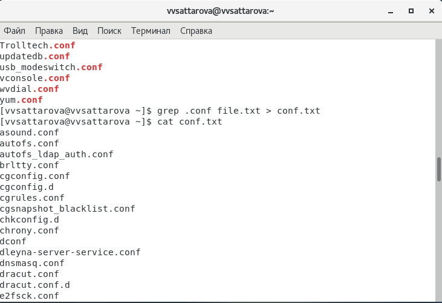
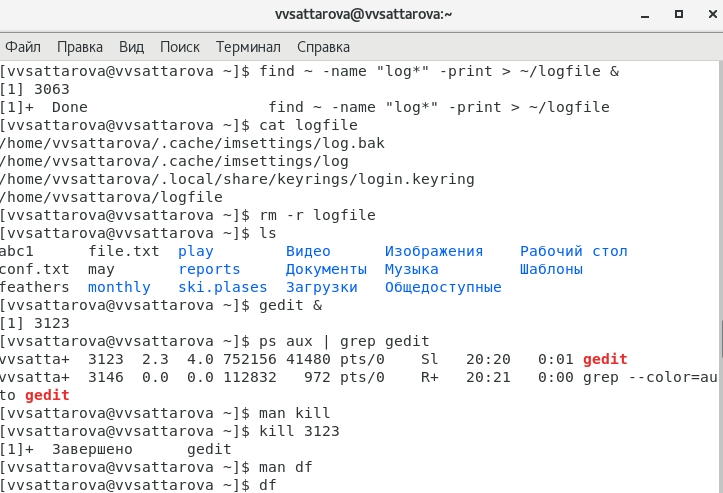

---
## Front matter
lang: ru-RU
title: Лабораторная работа №7 "Поиск файлов. Перенаправление ввода-вывода. Просмотр запущенных процессов" 
author: |
	Саттарова Вита Викторовна\inst{1}
institute: |
	\inst{1}РУДН, Москва, Россия
date: 2021, Май

## Formatting
toc: false
slide_level: 2
theme: metropolis
mainfont: PT Serif
romanfont: PT Serif
sansfont: PT Sans
monofont: PT Mono
header-includes: 
 - \metroset{progressbar=frametitle,sectionpage=progressbar,numbering=fraction}
 - '\makeatletter'
 - '\beamer@ignorenonframefalse'
 - '\makeatother'
aspectratio: 43
section-titles: true
---

# Лабораторная работа №7 "Поиск файлов. Перенаправление ввода-вывода. Просмотр запущенных процессов" 

## Прагматика

Работа выполнена для того чтобы научиться перенаправлять ввод-вывод, научиться искать файлы и фильтрировать текстовые данные, работать с задачами и процессами, освоить новые команды, чтобы использовать полученные знания для дальнейшей работы.

## Цели

Ознакомление с инструментами поиска файлов и фильтрации текстовых данных. Приобретение практических навыков: по управлению процессами (и заданиями), по проверке использования диска и обслуживанию файловых систем.

## Задачи

-  Научиться перенаправлять ввод и вывод
-  Научиться объединять команды конвейером и использовать его
-  Изучить способы поиска файлов и фильтрации текстовых данных
-  Изучить информацию о проверке использования диска, освоить необходимые для этого команды 
-  Научиться управлять задачами и процессами, а также получать информацию о них

## Работа (1)

{ #fig:001 width=100% }

## Работа (2)

{ #fig:002 width=100% }

## Результаты

Изучена информация, касающаяся перенаправления ввода и вывода, изучены способы поиска файлов и фильтрации текстовых данных, изучена информация о проверке использования диска, освоены необходимые для этого команды, получена информация об управлении задачами и процессами, которая была применена на практике. 

## Заключение

В результате работы я познакомилась с инструментами поиска файлов и фильтрации текстовых данных. Приобрела практические навыки: по управлению процессами (и заданиями), по проверке использования диска и обслуживанию файловых систем.