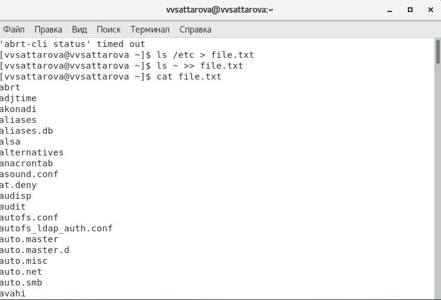
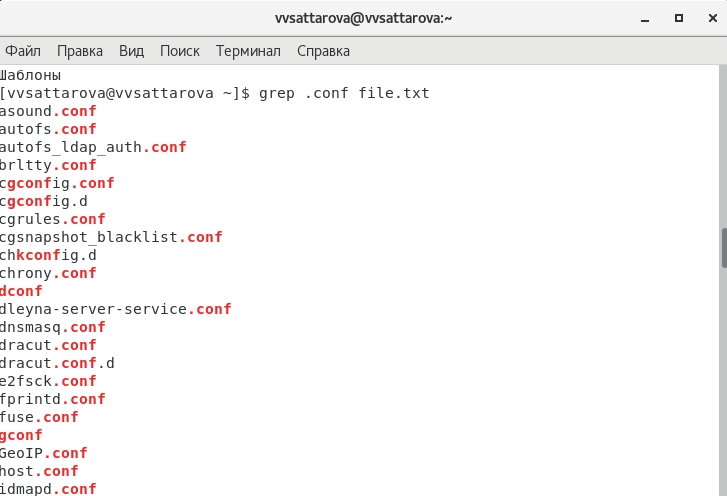
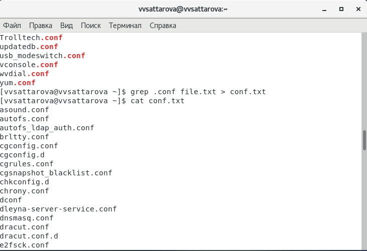
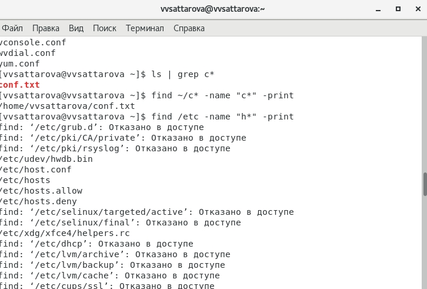
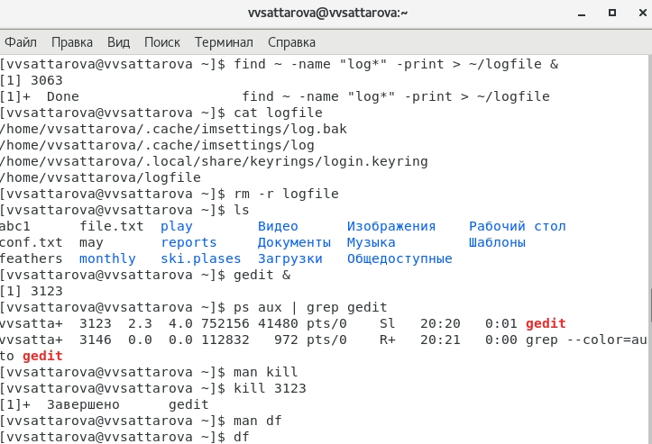
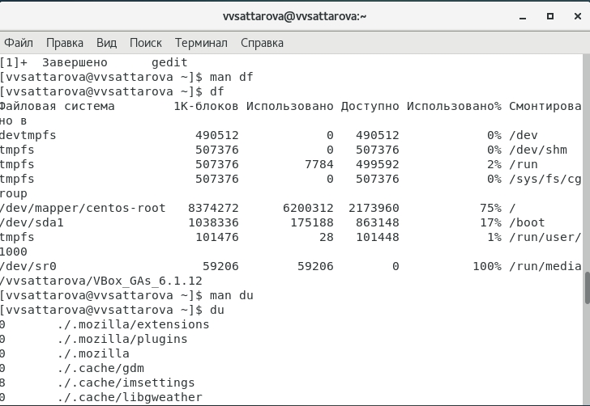
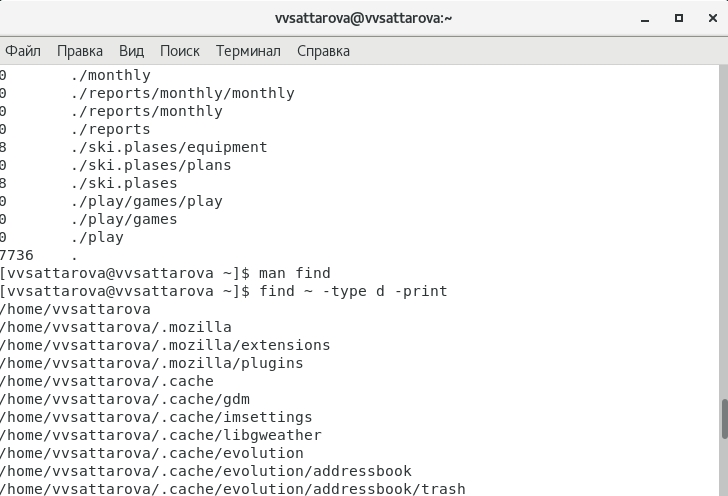

---
# Front matter
lang: ru-RU
title: "Лабораторная работа №7"
subtitle: "Операционные системы"
author: "Саттарова Вита Викторовна"

# Formatting
toc-title: "Содержание"
toc: true # Table of contents
toc_depth: 2
lof: true # Список рисунков
lot: false # List of tables
fontsize: 12pt
linestretch: 1.5
papersize: a4paper
documentclass: scrreprt
polyglossia-lang: russian
polyglossia-otherlangs: english
mainfont: PT Serif
romanfont: PT Serif
sansfont: PT Sans
monofont: PT Mono
mainfontoptions: Ligatures=TeX
romanfontoptions: Ligatures=TeX
sansfontoptions: Ligatures=TeX,Scale=MatchLowercase
monofontoptions: Scale=MatchLowercase
indent: true
pdf-engine: lualatex
header-includes:
  - \linepenalty=10 # the penalty added to the badness of each line within a paragraph (no associated penalty node) Increasing the value makes tex try to have fewer lines in the paragraph.
  - \interlinepenalty=0 # value of the penalty (node) added after each line of a paragraph.
  - \hyphenpenalty=50 # the penalty for line breaking at an automatically inserted hyphen
  - \exhyphenpenalty=50 # the penalty for line breaking at an explicit hyphen
  - \binoppenalty=700 # the penalty for breaking a line at a binary operator
  - \relpenalty=500 # the penalty for breaking a line at a relation
  - \clubpenalty=150 # extra penalty for breaking after first line of a paragraph
  - \widowpenalty=150 # extra penalty for breaking before last line of a paragraph
  - \displaywidowpenalty=50 # extra penalty for breaking before last line before a display math
  - \brokenpenalty=100 # extra penalty for page breaking after a hyphenated line
  - \predisplaypenalty=10000 # penalty for breaking before a display
  - \postdisplaypenalty=0 # penalty for breaking after a display
  - \floatingpenalty = 20000 # penalty for splitting an insertion (can only be split footnote in standard LaTeX)
  - \raggedbottom # or \flushbottom
  - \usepackage{float} # keep figures where there are in the text
  - \floatplacement{figure}{H} # keep figures where there are in the text
---

# Цели и задачи

## Цель

Ознакомление с инструментами поиска файлов и фильтрации текстовых данных. Приобретение практических навыков: по управлению процессами (и заданиями), по проверке использования диска и обслуживанию файловых систем.

## Задачи

1.	Научиться перенаправлять ввод и вывод
2.	Научиться объединять команды конвейером и использовать его
3.	Изучить способы поиска файлов и фильтрации текстовых данных
4.  Изучить информацию о проверке использования диска, освоить необходимые для этого команды 
5.  Научиться управлять задачами и процессами, а также получать информацию о них

# Объект и предмет исследования

## Объект исследования

Файлы, команды, связанные с вводом и выводом, поиском файлов и фильтрацией текстовых данных, использование диска. задачи и процессы.

## Предмет исследования

Изучение особенностей перенаправления ввода и вывода, поиска файлов и фильтрации текстовых данных, получение знаний об использовании диска, задачах и процессах, а также взаимодействию с ними.

# Условные обозначения и термины

Условные обозначения и термины отсутствуют

# Теоретические вводные данные

**Перенаправление ввода-вывода**
В системе по умолчанию открыто три специальных потока:
- stdin — стандартный поток ввода (по умолчанию: клавиатура), файловый дескриптор 0;
- stdout — стандартный поток вывода (по умолчанию: консоль), файловый дескриптор 1;
- stderr — стандартный поток вывод сообщений об ошибках (по умолчанию: консоль), файловый дескриптор 2.
Большинство используемых в консоли команд и программ записывают результаты своей работы в стандартный поток вывода stdout. 
Потоки вывода и ввода можно перенаправлять на другие файлы или устройства. Проще всего это делается с помощью символов >, >>, <, <<. 
**Конвейер**
Конвейер (pipe) служит для объединения простых команд или утилит в цепочки, в которых результат работы предыдущей команды передаётся последующей. Синтаксис следующий: команда 1 | команда 2. Конвейеры можно группировать в цепочки.
**Поиск файла**
Команда find используется для поиска и отображения имён файлов, соответствующих заданной строке символов. Формат команды:
find путь [-опции]. Путь определяет каталог, начиная с которого по всем подкаталогам будет вестись
поиск.
**Фильтрация текста**
Найти в текстовом файле указанную строку символов позволяет команда grep. Формат команды: grep строка имя_файла. Кроме того, команда grep способна обрабатывать стандартный вывод других команд (любой текст). Для этого следует использовать конвейер, связав вывод команды с вводом grep.
**Проверка использования диска**
Команда df показывает размер каждого смонтированного раздела диска. Формат команды: df [-опции] [файловая_система].
Команда du показывает число килобайт, используемое каждым файлом или каталогом. Формат команды: du [-опции] [имя_файла...].
На afs можно посмотреть использованное пространство командой: fs quota.
**Управление задачами**
Любую выполняющуюся в консоли команду или внешнюю программу можно запустить в фоновом режиме. Для этого следует в конце имени команды указать знак амперсанда &. Программа запускается в фоновом режиме, консоль при этом не будет заблокирована.
Запущенные фоном программы называются задачами (jobs). Ими можно управлять с помощью команды jobs, которая выводит список запущенных в данный момент задач. Для завершения задачи необходимо выполнить команду kill %номер задачи.
**Управление процессами**
Любой команде, выполняемой в системе, присваивается идентификатор процесса (process ID). Получить информацию о процессе и управлять им, пользуясь идентификатором процесса, можно из любого окна командного интерпретатора.
**Получение информации о процессах**
Команда ps используется для получения информации о процессах. Формат команды: ps [-опции].
Для получения информации о процессах, управляемых вами и запущенных (работающих или остановленных) на вашем терминале, используйте опцию aux. Для запуска команды в фоновом режиме необходимо в конце командной строки указать знак & (амперсанд).

# Техническое оснащение и выбранные методы проведения работы

## Техническое оснащение

Персональный компьютер, интернет, виртуальная машина.

## Методы

Анализ предложенной информации, выполнение работы по указанному алгоритму, получение дополнительной информации из интернета.

# Выполнение лабораторной работы

1.	Ознакомилась с теоретическим материалом, подготовила компьютер для выполнения лабораторной работы, открыла вирутальную машину, подготовленную для работы, осуществила вход в систему, используя соответствующее имя пользователя.  

2.	Записала в файл file.txt названия файлов, содержащихся в каталоге /etc. Затем дописала в этот же файл названия файлов, содержащихся в вашем домашнем каталоге. (рис. -@fig:001)

{ #fig:001 width=100% }

3.	Вывела имена всех файлов из file.txt, имеющих расширение .conf, после чего записала их в новый текстовый файл conf.txt (рис. -@fig:002) (рис. -@fig:003)

{ #fig:002 width=100% }

{ #fig:003 width=100% }

4.	Определила, какие файлы в моём домашнем каталоге имеют имена, начинавшиеся с символа c. Предложила два варианта, как это сделать. Вывела на экран (по странично) имена файлов из каталога /etc, начинающиеся с символа h. (рис. -@fig:004)

{ #fig:004 width=100% }

5.	 Запустила в фоновом режиме процесс, который будет записывать в файл ~/logfile файлы, имена которых начинаются с log. Удалила файл ~/logfile. Запустила из консоли в фоновом режиме редактор gedit. Определила идентификатор процесса gedit, используя команду ps, конвейер и фильтр grep. Этот идентификатор более простым способом определить нельзя. Прочитала справку (man) команды kill, после чего использовала её для завершения процесса gedit. (рис. -@fig:005)

{ #fig:005 width=100% }

6.	Выполнила команды df и du, предварительно получив более подробную информацию об этих командах, с помощью команды man. (рис. -@fig:006)

{ #fig:006 width=100% }

7.	Воспользовавшись справкой команды find, вывела имена всех директорий, имеющихся в моём домашнем каталоге. (рис. -@fig:007)

{ #fig:007 width=100% }

Подробное пояснение по каждому из рабочих столов можно увидеть на видео.

# Полученные результаты

Изучена информация, касающаяся перенаправления ввода и вывода, изучены способы поиска файлов и фильтрации текстовых данных, изучена информация о проверке использования диска, освоены необходимые для этого команды, получена информация об управлении задачами и процессами, которая была применена на практике. 

# Анализ результатов

Работу получилось выполнить по инструкции, проблем, свяханных с использованием команд не возникло.

# Заключение и выводы

В результате работы я познакомилась с инструментами поиска файлов и фильтрации текстовых данных. Приобрела практические навыки: по управлению процессами (и заданиями), по проверке использования диска и обслуживанию файловых систем.

# Контрольные вопросы

1. Какие потоки ввода вывода вы знаете?
2. Объясните разницу между операцией > и >>.
3. Что такое конвейер?
4. Что такое процесс? Чем это понятие отличается от программы?
5. Что такое PID и GID?
6. Что такое задачи и какая команда позволяет ими управлять?
7. Найдите информацию об утилитах top и htop. Каковы их функции?
8. Назовите и дайте характеристику команде поиска файлов. Приведите примеры использования этой команды.
9. Можно ли по контексту (содержанию) найти файл? Если да, то как?
10. Как определить объем свободной памяти на жёстком диске?
11. Как определить объем вашего домашнего каталога?
12. Как удалить зависший процесс?

# Ответы на контрольные вопросы

1. В системе по умолчанию открыто три специальных потока:
– stdin — стандартный поток ввода (по умолчанию: клавиатура), файловый дескриптор 0;
– stdout — стандартный поток вывода (по умолчанию: консоль), файловый дескриптор 1;
– stderr — стандартный поток вывод сообщений об ошибках (по умолчанию: консоль), файловый дескриптор 2. 2. > - перенаправление stdout (вывода) в файл. Если файл отсутствовал, то он создаётся, иначе - перезаписывается. >> - перенаправление stdout (вывода) в файл. Если файл отсутствовал, то он создаётся, иначе - добавляется. 3. Конвейер (pipe) служит для объединения простых команд или утилит в цепочки, в которых результат работы предыдущей команды передаётся последующей.
2. > - перенаправление stdout (вывода) в файл. Если файл отсутствовал, то он создаётся, иначе - перезаписывается. >> - перенаправление stdout (вывода) в файл. Если файл отсутствовал, то он создаётся, иначе - добавляется. 
3. Конвейер (pipe) служит для объединения простых команд или утилит в цепочки,
в которых результат работы предыдущей команды передаётся последующей.
4. Процесс это - совокупность программного кода и данных, загруженных в память ЭВМ. Любой команде, выполняемой в системе, присваивается идентификатор процесса (process ID). Получить информацию о процессе и управлять им, пользуясь идентификатором процесса, можно из любого окна командного интерпретатора. Процессом называют выполняющуюся программу и все её элементы: адресное пространство, глобальные переменные, регистры, стек, открытые файлы и так далее.
5. PID — уникальный номер (идентификатор) процесса в многозадачной ОС. GID – идентификатор группы.
6. Любую выполняющуюся в консоли команду или внешнюю программу можно запустить в фоновом режиме. Запущенные фоном программы называются задачами (jobs). Ими можно управлять с помощью команды jobs, которая выводит список запущенных в данный момент задач. Для завершения задачи необходимо выполнить команду kill %номер задачи.
7. Команда top в Linux системах позволяет вывести в виде таблицы перечень запущенных процессов и оценить, какой объем ресурсов они потребляют, т.е., какую нагрузку создают на сервер и дисковую подсистему.
Команда htop — продвинутый монитор процессов, показывает динамический список системных процессов, список обычно выравнивается по использованию ЦПУ. В отличие от top, htop показывает все процессы в системе. Также показывает время непрерывной работы, использование процессоров и памяти. htop часто применяется в тех случаях, когда информации даваемой утилитой top недостаточно, например при поиске утечек памяти в процессах.
8. Команда find используется для поиска и отображения имён файлов, соответствующих заданной строке символов. Формат команды: find путь [-опции]. Путь определяет каталог, начиная с которого по всем подкаталогам будет вестись поиск. Примеры:
- вывести на экран имена файлов из вашего домашнего каталога и его подкаталогов, начинающихся на f: find ~ -name "f*" -print
- вывести на экран имена файлов в каталоге /etc, начинающихся с символа p:
find /etc -name "p*" -print
- найти в вашем домашнем каталоге файлы, имена которых заканчиваются символом и удалить их: find ~ -name "*~" -exec rm "{}" \;
9. Найти файл по контексту (содержанию) позволяет команда grep. Формат команды: grep строка имя_файла.
Примеры:
- показать строки во всех файлах в вашем домашнем каталоге с именами, начинающимися на f, в которых есть слово begin: grep begin f*
- найти в текущем каталоге все файлы, в имени которых есть буквосочетание «лаб»: 
ls -l | grep лаб
10. Определить объем свободной памяти на жёстком диске позволяет команда df.
11. Определить объем домашнего каталога позволяет команда df /home/<user_name>.
12. Удалить зависший процесс можно командой kill %номер задачи.
