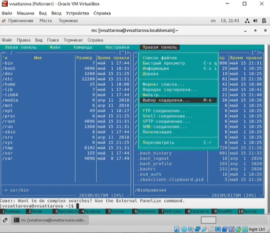
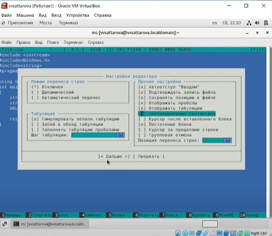

---
## Front matter
lang: ru-RU
title: Лабораторная работа №8 "Командная оболочка Midnight Commander" 
author: |
	Саттарова Вита Викторовна\inst{1}
institute: |
	\inst{1}РУДН, Москва, Россия
date: 2021, Май

## Formatting
toc: false
slide_level: 2
theme: metropolis
mainfont: PT Serif
romanfont: PT Serif
sansfont: PT Sans
monofont: PT Mono
header-includes: 
 - \metroset{progressbar=frametitle,sectionpage=progressbar,numbering=fraction}
 - '\makeatletter'
 - '\beamer@ignorenonframefalse'
 - '\makeatother'
aspectratio: 43
section-titles: true
---

# Лабораторная работа №8 "Командная оболочка Midnight Commander" 

## Прагматика

Работа выполнена для того, чтобы изучить основные возможности Midnight Commander, научиться пользоваться Midnight Commander, чтобы использовать полученные знания для дальнейшей работы.

## Цели

Освоение основных возможностей командной оболочки Midnight Commander. Приобретение навыков практической работы по просмотру каталогов и файлов; манипуляций с ними.

## Задачи

-	Изучить основные возможности Midnight Commander.
-	Приобрести навыки практической работы в Midnight Commander.

## Работа (1)

{ #fig:001 width=100% }

## Работа (2)

{ #fig:002 width=100% }

## Результаты

Изучена информация, касающаяся Midnight Commander, были рассмотрены различные панели, освоены основные возможности MC и базовые горячие клавиши. 

## Заключение

Освоение основных возможностей командной оболочки Midnight Commander. Приобретение навыков практической работы по просмотру каталогов и файлов; манипуляций с ними.