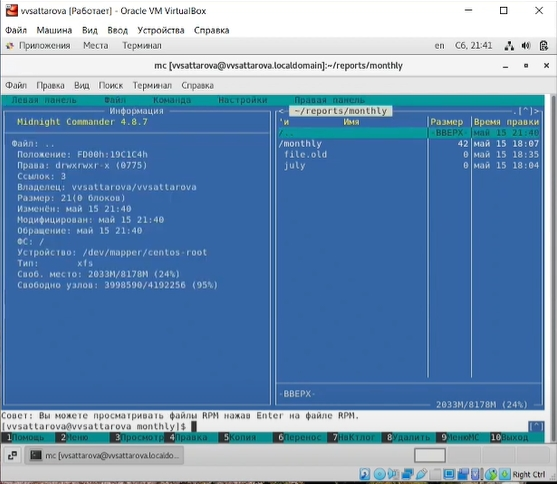
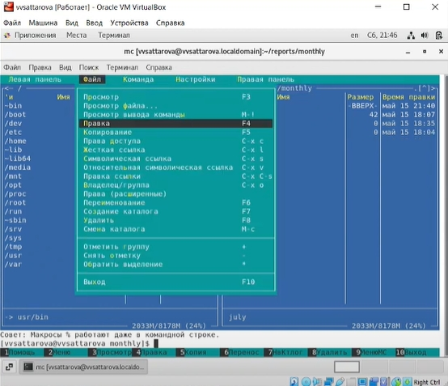
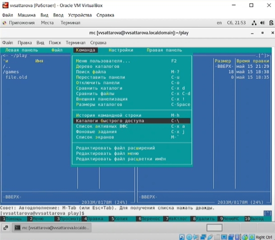

---
# Front matter
lang: ru-RU
title: "Лабораторная работа №8"
subtitle: "Операционные системы"
author: "Саттарова Вита Викторовна"

# Formatting
toc-title: "Содержание"
toc: true # Table of contents
toc_depth: 2
lof: true # Список рисунков
lot: false # List of tables
fontsize: 12pt
linestretch: 1.5
papersize: a4paper
documentclass: scrreprt
polyglossia-lang: russian
polyglossia-otherlangs: english
mainfont: PT Serif
romanfont: PT Serif
sansfont: PT Sans
monofont: PT Mono
mainfontoptions: Ligatures=TeX
romanfontoptions: Ligatures=TeX
sansfontoptions: Ligatures=TeX,Scale=MatchLowercase
monofontoptions: Scale=MatchLowercase
indent: true
pdf-engine: lualatex
header-includes:
  - \linepenalty=10 # the penalty added to the badness of each line within a paragraph (no associated penalty node) Increasing the value makes tex try to have fewer lines in the paragraph.
  - \interlinepenalty=0 # value of the penalty (node) added after each line of a paragraph.
  - \hyphenpenalty=50 # the penalty for line breaking at an automatically inserted hyphen
  - \exhyphenpenalty=50 # the penalty for line breaking at an explicit hyphen
  - \binoppenalty=700 # the penalty for breaking a line at a binary operator
  - \relpenalty=500 # the penalty for breaking a line at a relation
  - \clubpenalty=150 # extra penalty for breaking after first line of a paragraph
  - \widowpenalty=150 # extra penalty for breaking before last line of a paragraph
  - \displaywidowpenalty=50 # extra penalty for breaking before last line before a display math
  - \brokenpenalty=100 # extra penalty for page breaking after a hyphenated line
  - \predisplaypenalty=10000 # penalty for breaking before a display
  - \postdisplaypenalty=0 # penalty for breaking after a display
  - \floatingpenalty = 20000 # penalty for splitting an insertion (can only be split footnote in standard LaTeX)
  - \raggedbottom # or \flushbottom
  - \usepackage{float} # keep figures where there are in the text
  - \floatplacement{figure}{H} # keep figures where there are in the text
---

# Цели и задачи

## Цель

Освоение основных возможностей командной оболочки Midnight Commander. Приобретение навыков практической работы по просмотру каталогов и файлов; манипуляций с ними.

## Задачи

1.	Изучить основные возможности Midnight Commander.
2.	Приобрести навыки практической работы в Midnight Commander.

# Объект и предмет исследования

## Объект исследования

Midnight Commander.

## Предмет исследования

Изучение возможностей Midnight Commander, получение знаний о командах и их применении.

# Условные обозначения и термины

Условные обозначения и термины отсутствуют

# Теоретические вводные данные

**Командная оболочка** — интерфейс взаимодействия пользователя с операционной системой и программным обеспечением посредством команд.
*Midnight Commander* (или mc) — псевдографическая командная оболочка для UNIX/Linux систем. Для запуска mc необходимо в командной строке набрать mc и нажать Enter.
Рабочее пространство mc имеет две панели, отображающие по умолчанию списки файлов двух каталогов.
Над панелями располагается меню, доступ к которому осуществляется с помощью клавиши F9 . Под панелями внизу расположены управляющие экранные кнопки, ассоциированные с функциональными клавишами F1 – F10. Над ними располагается командная строка, предназначенная для ввода команд.
Панель в mc отображает список файлов текущего каталога. Абсолютный путь к этому каталогу отображается в заголовке панели. У активной панели заголовок и одна из её строк подсвечиваются. Управление панелями осуществляется с помощью
определённых комбинаций клавиш или пунктов меню mc. Панели можно поменять местами. Для этого и используется комбинация клавиш Ctrl-u или команда меню mc Переставить панели. Также можно временно убрать отображение панелей (отключить их) с помощью комбинации клавиш Ctrl-o или команды меню mc Отключить панели. Это может быть полезно, например, если необходимо увидеть вывод какой-то информации на экран после выполнения какой-либо команды shell.
Панели могут дополнительно быть переведены в один из двух режимов: Информация или Дерево.
В меню каждой (левой или правой) панели можно выбрать Формат списка:
- стандартный — выводит список файлов и каталогов с указанием размера и времени правки;
- ускоренный — позволяет задать число столбцов, на которые разбивается панель
при выводе списка имён файлов или каталогов без дополнительной информации;
- расширенный — помимо названия файла или каталога выводит сведения о правах доступа, владельце, группе, размере, времени правки;
- определённый пользователем — позволяет вывести те сведения о файле или каталоге, которые задаст сам пользователь.
Подпункт меню Порядок сортировки позволяет задать критерии сортировки при выводе списка файлов и каталогов: без сортировки, по имени, расширенный, время правки, время доступа, время изменения атрибута, размер, узел.
В меню Файл содержит перечень команд, которые могут быть применены к одному или нескольким файлам или каталогам.
В меню Команда содержатся более общие команды для работы с mc.
Меню Настройки содержит ряд дополнительных опций по внешнему виду и функциональности mc.
Встроенный в mc редактор вызывается с помощью функциональной клавиши F4. В нём удобно использовать различные комбинации клавиш при редактировании содержимого (как правило текстового) файла.

# Техническое оснащение и выбранные методы проведения работы

## Техническое оснащение

Персональный компьютер, интернет, виртуальная машина.

## Методы

Анализ предложенной информации, скачивание и установка дополнитльного ПО, выполнение работы по указанному алгоритму, получение дополнительной информации из интернета.

# Выполнение лабораторной работы

1.	Изучила информацию о mc, вызвав в командной строке man mc. (рис. -@fig:001) 

{ #fig:001 width=100% }

2.   Запустила из командной строки mc, изучила его структуру и меню. Выполнила несколько операций в mc, используя управляющие клавиши (операции с панелями; выделение/отмена выделения файлов, копирование/перемещение файлов, получение информации о размере и правах доступа на файлы и/или каталоги и т.п.) (рис. -@fig:002) (рис. -@fig:003)

{ #fig:002 width=100% }

{ #fig:003 width=100% }

2.	Выполнила основные команды меню левой (или правой) панели. Оценила степень подробности вывода информации о файлах - высокая. (рис. -@fig:004) (рис. -@fig:005)

{ #fig:004 width=100% }

{ #fig:005 width=100% }

3.	Используя возможности подменю Файл, я выполнила: просмотр содержимого текстового файла, редактирование содержимого текстового файла (без сохранения результатов редактирования), создание каталога, копирование в файлов в созданный каталог т другие команды. (рис. -@fig:006)

{ #fig:006 width=100% }

4.	С помощью соответствующих средств подменю Команда я осуществила: поиск в файловой системе файла с заданными условиями (например, файла с расширением .c или .cpp, содержащего строку main), выбор и повторение одной из предыдущих команд, переход в домашний каталог, анализ файла меню и файла расширений. (рис. -@fig:007) 

{ #fig:007 width=100% }

5.	Вызвала подменю Настройки. Освоила операции, определяющие структуру экрана mc (Full screen, Double Width, Show Hidden Files и т.д.) (рис. -@fig:008)

{ #fig:008 width=100% }

6.	Создала текстовый файл text.txt. Открыла этот файл с помощью встроенного в mc редактора. Вставила в открытый файл небольшой фрагмент текста, скопированный файла прошлой лабораторной работы. (рис. -@fig:09)

{ #fig:09 width=100% }

7.	Проделала с текстом следующие манипуляции, используя горячие клавиши: удаляла строки текста, выделила фрагмент текста и скопировала его на новую строку. Выделила фрагмент текста и перенесла его на новую строку. Сохранила файл. Отменила последнее действие. Перешла в конец файла (нажав комбинацию клавиш) и написала несвязанные символы. Перешла в начало файла (нажав комбинацию клавиш) и аналогично написала несвязанные символы. Затем, сохранила и закрыла файл. (рис. -@fig:010)  

{ #fig:010 width=100% }

7.	Открыла файл с исходным текстом на языке программирования С++. Используя меню редактора, выключила подсветку синтаксиса, так как она была по умолчанию включена.(рис. -@fig:011)

{ #fig:011 width=100% }

Подробное пояснение хода работы можно увидеть на видео.

# Полученные результаты

Изучена информация, касающаяся Midnight Commander, были рассмотрены различные панели, освоены основные возможности MC и базовые горячие клавиши. 

# Анализ результатов

Работу получилось выполнить по инструкции, проблем с использованием команд не возникло.

# Заключение и выводы

Освоение основных возможностей командной оболочки Midnight Commander. Приобретение навыков практической работы по просмотру каталогов и файлов; манипуляций с ними.

# Контрольные вопросы

1. Какие режимы работы есть в mc. Охарактеризуйте их.
2. Какие операции с файлами можно выполнить как с помощью команд shell, так и с помощью меню (комбинаций клавиш) mc? Приведите несколько примеров.
3. Опишите структура меню левой (или правой) панели mc, дайте характеристику командам.
4. Опишите структура меню Файл mc, дайте характеристику командам.
5. Опишите структура меню Команда mc, дайте характеристику командам.
6. Опишите структура меню Настройки mc, дайте характеристику командам.
7. Назовите и дайте характеристику встроенным командам mc.
8. Назовите и дайте характеристику командам встроенного редактора mc.
9. Дайте характеристику средствам mc, которые позволяют создавать меню, определяемые пользователем.
10. Дайте характеристику средствам mc, которые позволяют выполнять действия, определяемые пользователем, над текущим файлом 

# Ответы на контрольные вопросы

1. Экран MC делится на четыре части. Почти весь зкран занят двумя панелями. По умолчанию, вторая строка снизу является командной, а в самой нижней отображается назначение функциональных клавиш. Самая верхняя строка - строка меню. Она может быть не видна, но при нажатии клавиши F9 или при щелчке мыши эта строка отображается в верхней части экрана. MC позволяет одновременно наблюдать содержимое двух каталогов. Одна из панелей является текущей (в этой панели находится выделитель). Практически все команды оперируют над текущей панелью. Хотя некоторые файловые операции, такие как Rename или Copy, по умолчанию используют каталог неактивной панели в качестве каталога назначения (при выполнении подобных команд всегда появляется запрос на подтверждение).
2. Операции с файлами можно выполнить как с помощью команд shell, так и с помощью меню (комбинаций клавиш) mc. Например, создание каталогов, копирование файлов, вывод информации о файле.
3. Структура меню левой (или правой) панели mc, характеристика команд:
- список файлов (этот режим используется для просмотра списка файлов).
- быстрый просмотр (в этом режиме панель переключается в режим вьюера, который показывает содержимое текущего файла; если выбрать эту панель (нажав клавишу Tab или при помощи мыши), то здесь можно пользоваться стандартными командами вьюера).
- информация (в этом режиме отображается информация, связанная с текущим файлом и, по возможности, информация о текущей файловой системе).
- дерево (этот режим идентичен функции отображения дерева каталогов). 
- порядок сортировки (существует восемь типов сортировки файлов: по имени, по расширению, по времени последней модификации файла, по времени последнего доступа к файлу, по времени модификации индексного дескриптора, по размеру, по значению индексного деакриптора и без порядка. В диалоговом окне Sort order можно выбрать тип сортировки, а также указать, что сортировку следует производить в обратном порядке).
- фильтр (эта команда позволяет указать шаблон для файлов, которые должны отображаться; вне зависимости от шаблона, каталоги и ссылки к каталогам отображаются всегда).
4. Структура меню Файл mc, характеристика команд:
- просмотр — позволяет посмотреть содержимое текущего (или выделенного) файла без возможности редактирования.
- просмотр вывода команды — функция запроса команды с параметрами (аргумент к текущему выбранному файлу).
- правка — открывает текущий (или выделенный) файл для его редактирования.
- копирование — осуществляет копирование одного или нескольких файлов
или каталогов в указанное пользователем во всплывающем окне место.
- права доступа — позволяет указать (изменить) права доступа к одному или нескольким файлам или каталогам.
- жёсткая ссылка — позволяет создать жёсткую ссылку к текущему
(или выделенному) файлу1.
- символическая ссылка — позволяет создать символическую ссылку
к текущему (или выделенному) файлу2.
- владелец/группа — позволяет задать (изменить) владельца и имя
группы для одного или нескольких файлов или каталогов.
- права (расширенные) — позволяет изменить права доступа и владения для одного или нескольких файлов или каталогов.
- переименование — позволяет переименовать (или переместить) один или
несколько файлов или каталогов.
- создание каталога — позволяет создать каталог.
- удалить — позволяет удалить один или несколько файлов или каталогов.
- выход — завершает работу mc.
5. Структура меню Команда mc, характеристика команд:
- дерево каталогов — отображает структуру каталогов системы.
- поиск файла — выполняет поиск файлов по заданным параметрам.
- переставить панели — меняет местами левую и правую панели.
- сравнить каталоги — сравнивает содержимое двух каталогов.
- размеры каталогов — отображает размер и время изменения каталога (по умолчанию в mc размер каталога корректно не отображается).
- история командной строки — выводит на экран список ранее выполненных в
оболочке команд.
- каталоги быстрого доступа — при вызове выполняется быстрая смена текущего каталога на один из заданного списка.
- восстановление файлов — позволяет восстановить файлы на файловых системах ext2 и ext3.
- редактировать файл расширений — позволяет задать с помощью определённого
синтаксиса действия при запуске файлов с определённым расширением (например, какое программного обеспечение запускать для открытия или редактирования файлов с расширением doc или docx).
- редактировать файл меню — позволяет отредактировать контекстное меню пользователя, вызываемое по клавише F2.
- редактировать файл расцветки имён — позволяет подобрать оптимальную для
пользователя расцветку имён файлов в зависимости от их типа.
6. Структура меню Настройки mc, характеристика команд:
 конфигурация — позволяет скорректировать настройки работы с панелями.
- внешний вид и настройки панелей — определяет элементы (строка меню, командная строка, подсказки и прочее), отображаемые при вызове mc, а также геометрию расположения панелей и цветовыделение.
- биты символов — задаёт формат обработки информации локальным терминалом.
- подтверждение — позволяет установить или убрать вывод окна с запросом подтверждения действий при операциях удаления и перезаписи файлов, а также при
выходе из программы.
- распознание клавиш — диалоговое окно используется для тестирования функциональных клавиш, клавиш управления курсором и прочее.
- виртуальные ФС –– настройки виртуальной файловой системы: тайм-аут, пароль
и прочее.
7. Характеристика встроенных команд mc.
- F1 Вызов контекстно-зависимой подсказки
- F2 Вызов пользовательского меню с возможностью создания и/или дополнения дополнительных функций
- F3 Просмотр содержимого файла, на который указывает подсветка в
активной панели (без возможности редактирования)
- F4 Вызов встроенного в mc редактора для изменения содержания файла, на который указывает подсветка в активной панели
- F5 Копирование одного или нескольких файлов, отмеченных в первой
(активной) панели, в каталог, отображаемый на второй панели
- F6 Перенос одного или нескольких файлов, отмеченных в первой (активной) панели, в каталог, отображаемый на второй панели
- F7 Создание подкаталога в каталоге, отображаемом в активной панели
- F8 Удаление одного или нескольких файлов (каталогов), отмеченных
в первой (активной) панели файлов
- F9 Вызов меню mc
- F10 Выход из mc
8. Характеристика команд встроенного редактора mc.
M-Enter копирует подсвеченное имя файла или каталога в командную строку.
C-Enter то же самое, что M-Enter, но работает только на консоли Linux.
M-Tab пытается выполнить операцию завершение ввода (completion) имени файла, названия команды, переменной, имени пользователя или имени машины (в зависимости от того, что вы начали набирать и какой элемент команды вводите).
C-x t, C-x C-t копирует в командную строку имена помеченных файлов (или подсвеченное имя, если нет помеченных) из активной панели (C-x t) или пассивной панели (C-x C-T).
C-x p, C-x C-p первая комбинация клавиш копирует в командную строку имя текущего каталога, а вторая - имя каталога, отображаемого в пассивной панели.
C-q эта команда (the quote command) используется для того, чтобы вставить символы, которые каким-то образом интерпретируются самим Midnight Commander-ом (например, символ '+').
M-p, M-n эти комбинации используются для перемещения по истории команд. M-p вызывает перемещение на команду назад по списку ранее запускавшихся команд, а M-n - перемещение на одну команду вперед.
M-h выводит историю текущей строки ввода (для командной строки - историю команд).
9. Характеристика средств mc, которые позволяют создавать меню, определяемых пользователем.
Перейти в строку меню панелей mc можно с помощью функциональной клавиши F9. В строке меню имеются пять меню: Левая панель, Файл, Команда, Настройки
и Правая панель. Подпункт меню Быстрый просмотр позволяет выполнить быстрый просмотр содержимого панели. Подпункт меню Информация позволяет посмотреть информацию о файле или каталоге.
В меню каждой (левой или правой) панели можно выбрать Формат списка:
- стандартный — выводит список файлов и каталогов с указанием размера и времени правки;
- ускоренный — позволяет задать число столбцов, на которые разбивается панель
при выводе списка имён файлов или каталогов без дополнительной информации;
- расширенный — помимо названия файла или каталога выводит сведения о правах доступа, владельце, группе, размере, времени правки;
- определённый пользователем — позволяет вывести те сведения о файле или каталоге, которые задаст сам пользователь.
Подпункт меню Порядок сортировки позволяет задать критерии сортировки при
выводе списка файлов и каталогов: без сортировки, по имени, расширенный, время
правки, время доступа, время изменения атрибута, размер, узел.
10. Средств mc, которые позволяют выполнять действия, определяемые пользователем, над текущим файлом: все команды, содержащиеся в меню в левой(правой) панели, файле, команде, настройках.
