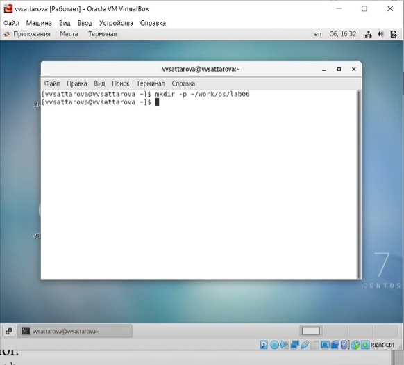

---
# Front matter
lang: ru-RU
title: "Лабораторная работа №9"
subtitle: "Операционные системы"
author: "Саттарова Вита Викторовна"

# Formatting
toc-title: "Содержание"
toc: true # Table of contents
toc_depth: 2
lof: true # Список рисунков
lot: false # List of tables
fontsize: 12pt
linestretch: 1.5
papersize: a4paper
documentclass: scrreprt
polyglossia-lang: russian
polyglossia-otherlangs: english
mainfont: PT Serif
romanfont: PT Serif
sansfont: PT Sans
monofont: PT Mono
mainfontoptions: Ligatures=TeX
romanfontoptions: Ligatures=TeX
sansfontoptions: Ligatures=TeX,Scale=MatchLowercase
monofontoptions: Scale=MatchLowercase
indent: true
pdf-engine: lualatex
header-includes:
  - \linepenalty=10 # the penalty added to the badness of each line within a paragraph (no associated penalty node) Increasing the value makes tex try to have fewer lines in the paragraph.
  - \interlinepenalty=0 # value of the penalty (node) added after each line of a paragraph.
  - \hyphenpenalty=50 # the penalty for line breaking at an automatically inserted hyphen
  - \exhyphenpenalty=50 # the penalty for line breaking at an explicit hyphen
  - \binoppenalty=700 # the penalty for breaking a line at a binary operator
  - \relpenalty=500 # the penalty for breaking a line at a relation
  - \clubpenalty=150 # extra penalty for breaking after first line of a paragraph
  - \widowpenalty=150 # extra penalty for breaking before last line of a paragraph
  - \displaywidowpenalty=50 # extra penalty for breaking before last line before a display math
  - \brokenpenalty=100 # extra penalty for page breaking after a hyphenated line
  - \predisplaypenalty=10000 # penalty for breaking before a display
  - \postdisplaypenalty=0 # penalty for breaking after a display
  - \floatingpenalty = 20000 # penalty for splitting an insertion (can only be split footnote in standard LaTeX)
  - \raggedbottom # or \flushbottom
  - \usepackage{float} # keep figures where there are in the text
  - \floatplacement{figure}{H} # keep figures where there are in the text
---

# Цели и задачи

## Цель

Вспомнить основы работы с операционной системой Linux. Получить практические навыки работы с редактором vi, установленным по умолчанию практически во всех дистрибутивах.

## Задачи

1.	Вспомнить основные команды для работы с операционной системой Linux.
2.  Познакомиться с текстовым редактором vi.
3.  Изучить основные команды текстового редактора vi.
4.	Приобрести навыки практической работы в текстовом редакторе vi.

# Объект и предмет исследования

## Объект исследования

Текстовый редактор vi.

## Предмет исследования

Изучение возможностей текстового редактора vi, получение знаний о командах редактора и их применении.

# Условные обозначения и термины

Условные обозначения и термины отсутствуют

# Теоретические вводные данные

В большинстве дистрибутивов Linux в качестве текстового редактора по умолчанию устанавливается интерактивный экранный редактор vi (**Visual display editor**).
Редактор vi имеет три режима работы:
- командный режим — предназначен для ввода команд редактирования и навигации по редактируемому файлу;
- режим вставки — предназначен для ввода содержания редактируемого файла;
- режим последней (или командной) строки — используется для записи изменений в файл и выхода из редактора.
Для вызова редактора vi необходимо указать команду vi и имя редактируемого файла:
```
vi <имя_файла>
```
При этом в случае отсутствия файла с указанным именем будет создан такой файл.
Переход в командный режим осуществляется нажатием клавиши Esc . Для выхода из редактора vi необходимо перейти в режим последней строки: находясь в командном режиме, нажать Shift-;, затем:
- набрать символы wq, если перед выходом из редактора требуется записать изменения в файл;
- набрать символ q (или q!), если требуется выйти из редактора без сохранения.
Замечание. Следует помнить, что vi различает прописные и строчные буквы при наборе (восприятии) команд.
Опции редактора vi позволяют настроить рабочую среду. Для задания опций используется команда set (в режиме последней строки):
- : set all — вывести полный список опций;
- : set nu — вывести номера строк;
- : set list — вывести невидимые символы;
- : set ic — не учитывать при поиске, является ли символ прописным или строчным.
Если вы хотите отказаться от использования опции, то в команде set перед именем опции надо поставить no.

# Техническое оснащение и выбранные методы проведения работы

## Техническое оснащение

Персональный компьютер, интернет, виртуальная машина.

## Методы

Анализ и изучение предложенной информации, выполнение работы по указанному алгоритму, получение дополнительной информации из интернета.

# Выполнение лабораторной работы

## Задание 1. Создание нового файла с использованием vi

1.	Создала каталог с именем ~/work/os/lab06. (рис. -@fig:001) 

{ #fig:001 width=100% }

2.   Перешла во вновь созданный каталог. (рис. -@fig:002) 

{ #fig:002 width=100% }

3.  Вызвала vi и создала файл hello.sh (vi hello.sh). (рис. -@fig:003)

{ #fig:003 width=100% }

4.	Нажала клавишу i и ввела следующий текст:

``` bash
#!/bin/bash
HELL=Hello
function hello {
LOCAL HELLO=World
echo $HELLO
}
echo $HELLO
hello
```

(рис. -@fig:004) 

{ #fig:004 width=100% }

5.  Нажала клавишу Esc для перехода в командный режим после завершения ввода текста. (рис. -@fig:005)

{ #fig:005 width=100% }

6.	Нажала : для перехода в режим последней строки и внизу экрана появилось приглашение в виде двоеточия. (рис. -@fig:006)

{ #fig:006 width=100% }

7.	Нажала w (записать) и q (выйти), а затем нажала клавишу Enter для сохранения текста и завершения работы. (рис. -@fig:007) 

{ #fig:007 width=100% }

8.	Сделала файл исполняемым (chmod +x hello.sh). (рис. -@fig:008)

{ #fig:008 width=100% }

## Задание 2. Редактирование существующего файла

1.	Вызвала vi на редактирование файла (vi ~/work/os/lab06/hello.sh). (рис. -@fig:009) 

{ #fig:009 width=100% }

2.   Установила курсор в конец слова HELL второй строки. (рис. -@fig:010) 

{ #fig:010 width=100% }

3.  Перешла в режим вставки и заменила слово на HELLO. Нажала Esc для возврата в командный режим. (рис. -@fig:011)

{ #fig:011 width=100% }

4.	Установила курсор на четвертую строку и удалила слово LOCAL. (рис. -@fig:012) 

{ #fig:012 width=100% }

5.  Перешла в режим вставки и набрала следующий текст: local, нажала Esc для возврата в командный режим. (рис. -@fig:013)

{ #fig:013 width=100% }

6.	Установила курсор на последней строке файла. Вставила после неё строку, содержащую следующий текст: echo $HELLO. (рис. -@fig:014)

{ #fig:014 width=100% }

7.	Нажала Esc для перехода в командный режим. (рис. -@fig:015) 

{ #fig:015 width=100% }

8.	Удалила последнюю строку. (рис. -@fig:016)

{ #fig:016 width=100% }

9.	Ввела команду отмены изменений u для отмены последней команды. (рис. -@fig:017)

{ #fig:017 width=100% }

10.	Ввела символ : для перехода в режим последней строки. Записала произведённые изменения и вышла из vi. (рис. -@fig:018)  

{ #fig:018 width=100% }

Подробное пояснение хода работы можно увидеть на видео.

# Полученные результаты

Изучена информация, касающаяся текстового редактора vi, было рассмотрено создание нового файла и редактирование существующего файла в текстовом редакторе, освоены основные возможности редактора и основные команды. 

# Анализ результатов

Работу получилось выполнить по инструкции, проблем с использованием команд не возникло. Был создан текстовый файл и отредактирован.

# Заключение и выводы

В ходе работы я вспомнила основы работы с операционной системой Linux и получила практические навыки работы с редактором vi, установленным по умолчанию практически во всех дистрибутивах.

# Контрольные вопросы

1. Дайте краткую характеристику режимам работы редактора vi.
2. Как выйти из редактора, не сохраняя произведённые изменения?
3. Назовите и дайте краткую характеристику командам позиционирования.
4. Что для редактора vi является словом?
5. Каким образом из любого места редактируемого файла перейти в начало (конец) файла?
6. Назовите и дайте краткую характеристику основным группам команд редактирования.
7. Необходимо заполнить строку символами $. Каковы ваши действия?
8. Как отменить некорректное действие, связанное с процессом редактирования?
9. Назовите и дайте характеристику основным группам команд режима последней строки.
10. Как определить, не перемещая курсора, позицию, в которой заканчивается строка?
11. Выполните анализ опций редактора vi (сколько их, как узнать их назначение и т.д.).
12. Как определить режим работы редактора vi?
13. Постройте граф взаимосвязи режимов работы редактора vi.

# Ответы на контрольные вопросы

1. Краткая характеристика режимов работы редактора vi:
- командный режим — предназначен для ввода команд редактирования и навигации по редактируемому файлу;
- режим вставки — предназначен для ввода содержания редактируемого файла;
- режим последней (или командной) строки — используется для записи изменений в файл и выхода из редактора.
2. Выйти из редактора, не сохраняя произведённые изменения, можно используя клавиши «:q!» в командном режиме.
3. Краткую характеристика команд позиционирования:
- 0 (ноль) — переход в начало строки;
- $ — переход в конец строки;
- G — переход в конец файла;
– nG — переход на строку с номером n.
4. Для редактора vi словом является: символ; буквы, находящиеся между двумя символами.
5. Из любого места редактируемого файла перейти в конец файла можно с помощью клавишы G и курсора вниз, а в начало – курсора вверх.
6. Краткая характеристика основных групп команд редактирования:
**Вставка текста**
- а — вставить текст после курсора;
- А — вставить текст в конец строки;
- i — вставить текст перед курсором;
- ni — вставить текст n раз;
- I — вставить текст в начало строки.
**Вставка строки**
- о — вставить строку под курсором;
- О — вставить строку над курсором.  Удаление текста
- x — удалить один символ в буфер;
- dw — удалить одно слово в буфер;
- d$ — удалить в буфер текст от курсора до конца строки;
- d0 — удалить в буфер текст от начала строки до позиции курсора;
- dd — удалить в буфер одну строку;
- ndd — удалить в буфер n строк.  
**Отмена и повтор произведённых изменений**
- u — отменить последнее изменение;
- . — повторить последнее изменение.
**Копирование текста в буфер**
- Y — скопировать строку в буфер;
- nY — скопировать n строк в буфер;
- yw — скопировать слово в буфер.
**Вставка текста из буфера**
- p — вставить текст из буфера после курсора;
- P — вставить текст из буфера перед курсором.  
**Замена текста**
- cw — заменить слово;
- ncw — заменить n слов;
- c$ — заменить текст от курсора до конца строки;
- r — заменить слово;
- R — заменить текст.
**Поиск текста**
- / текст — произвести поиск вперёд по тексту указанной строки символов текст;
- ? текст — произвести поиск назад по тексту указанной строки символов текст. 7. Чтобы заполнить строку символами $ можно использовать клавиши ni(вставить текст n раз).
8. Отменить некорректное действие, связанное с процессом редактирования, можно с помощью клавиши «.».
9. Характеристика основных групп команд режима последней строки:
**Копирование и перемещение текста**
- :n,md — удалить строки с n по m;
- :i,jmk — переместить строки с i по j, начиная со строки k;
- :i,jtk — копировать строки с i по j в строку k;
- :i,jw имя-файла — записать строки с i по j в файл с именем имя-файла.
**Запись в файл и выход из редактора**
- :w — записать изменённый текст в файл, не выходя из vi;
- :w имя-файла — записать изменённый текст в новый файл с именем имяфайла;
- :w! имя-файла — записать изменённый текст в файл с именем имяфайла;
- :wq — записать изменения в файл и выйти из vi;
- :q — выйти из редактора vi;
- :q! — выйти из редактора без записи;
- :e! — вернуться в командный режим, отменив все изменения, произведённые со времени последней записи.
10. Определить, не перемещая курсора, позицию, в которой заканчивается строка, можно используя клавишу $ (переход в конец строки).
11. Опции редактора vi позволяют настроить рабочую среду. Для задания опций
используется команда set (в режиме последней строки):
- : set all — вывести полный список опций;
- : set nu — вывести номера строк;
- : set list — вывести невидимые символы;
- : set ic — не учитывать при поиске, является ли символ прописным или строчным.
Если вы хотите отказаться от использования опции, то в команде set перед именем опции надо поставить no.
12. Определить режим работы редактора vi можно по последней командной строке.
13. Взаимосвязь режимов работы редактора vi. (рис. -@fig:019)  

{ #fig:019 width=100% }