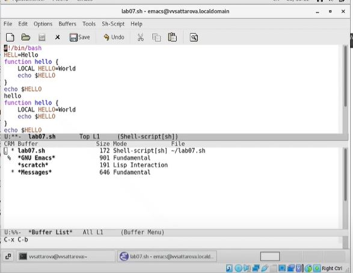
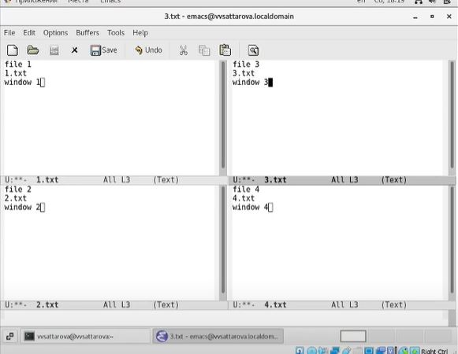

---
## Front matter
lang: ru-RU
title: Лабораторная работа №10 "Текстовый редактор emacs" 
author: |
	Саттарова Вита Викторовна\inst{1}
institute: |
	\inst{1}РУДН, Москва, Россия
date: 2021, Май

## Formatting
toc: false
slide_level: 2
theme: metropolis
mainfont: PT Serif
romanfont: PT Serif
sansfont: PT Sans
monofont: PT Mono
header-includes: 
 - \metroset{progressbar=frametitle,sectionpage=progressbar,numbering=fraction}
 - '\makeatletter'
 - '\beamer@ignorenonframefalse'
 - '\makeatother'
aspectratio: 43
section-titles: true
---

# Лабораторная работа №10 "Текстовый редактор emacs" 

## Прагматика

Работа выполнена для того, чтобы изучить основные возможности текстового редактора emacs, научиться пользоваться текстовым редактором emacs, чтобы использовать полученные знания для дальнейшей работы.

## Цели

Вспомнить основы работы с операционной системой Linux. Получить практические навыки работы с редактором Emacs.

## Задачи

-	Вспомнить основные команды для работы с операционной системой Linux.
-  Познакомиться с текстовым редактором emacs.
-  Изучить основные команды текстового редактора emacs.
-	Приобрести навыки практической работы в текстовом редакторе emacs.

## Работа (1)

{ #fig:001 width=100% }

## Работа (2)

{ #fig:002 width=100% }

## Результаты

Изучена информация, касающаяся текстового редактора emacs, освоены основные возможности редактора и основные команды, связанные с стандартными процедурами редактирования, с перемещением курсора, с управлением буферами и окнами, с режимом поиска. Работу получилось выполнить по инструкции, проблем с использованием команд не возникло. Был создан текстовый файл, с которым проводились различные операции с иcпользованием команд редактора.

## Заключение

В ходе работы я вспомнила основы работы с операционной системой Linux и получила практические навыки работы с редактором emacs, установленным по умолчанию практически во всех дистрибутивах.