---
# Front matter
lang: ru-RU
title: "Лабораторная работа №10"
subtitle: "Операционные системы"
author: "Саттарова Вита Викторовна"

# Formatting
toc-title: "Содержание"
toc: true # Table of contents
toc_depth: 2
lof: true # Список рисунков
lot: false # List of tables
fontsize: 12pt
linestretch: 1.5
papersize: a4paper
documentclass: scrreprt
polyglossia-lang: russian
polyglossia-otherlangs: english
mainfont: PT Serif
romanfont: PT Serif
sansfont: PT Sans
monofont: PT Mono
mainfontoptions: Ligatures=TeX
romanfontoptions: Ligatures=TeX
sansfontoptions: Ligatures=TeX,Scale=MatchLowercase
monofontoptions: Scale=MatchLowercase
indent: true
pdf-engine: lualatex
header-includes:
  - \linepenalty=10 # the penalty added to the badness of each line within a paragraph (no associated penalty node) Increasing the value makes tex try to have fewer lines in the paragraph.
  - \interlinepenalty=0 # value of the penalty (node) added after each line of a paragraph.
  - \hyphenpenalty=50 # the penalty for line breaking at an automatically inserted hyphen
  - \exhyphenpenalty=50 # the penalty for line breaking at an explicit hyphen
  - \binoppenalty=700 # the penalty for breaking a line at a binary operator
  - \relpenalty=500 # the penalty for breaking a line at a relation
  - \clubpenalty=150 # extra penalty for breaking after first line of a paragraph
  - \widowpenalty=150 # extra penalty for breaking before last line of a paragraph
  - \displaywidowpenalty=50 # extra penalty for breaking before last line before a display math
  - \brokenpenalty=100 # extra penalty for page breaking after a hyphenated line
  - \predisplaypenalty=10000 # penalty for breaking before a display
  - \postdisplaypenalty=0 # penalty for breaking after a display
  - \floatingpenalty = 20000 # penalty for splitting an insertion (can only be split footnote in standard LaTeX)
  - \raggedbottom # or \flushbottom
  - \usepackage{float} # keep figures where there are in the text
  - \floatplacement{figure}{H} # keep figures where there are in the text
---

# Цели и задачи

## Цель

Вспомнить основы работы с операционной системой Linux. Получить практические навыки работы с редактором Emacs.

## Задачи

1.	Вспомнить основные команды для работы с операционной системой Linux.
2.  Познакомиться с текстовым редактором emacs.
3.  Изучить основные команды текстового редактора emacs.
4.	Приобрести навыки практической работы в текстовом редакторе emacs.

# Объект и предмет исследования

## Объект исследования

Текстовый редактор emacs.

## Предмет исследования

Изучение возможностей текстового редактора emacs, получение знаний о командах редактора и их применении.

# Условные обозначения и термины

Условные обозначения и термины отсутствуют

# Теоретические вводные данные

Emacs представляет собой мощный экранный редактор текста, написанный на языке высокого уровня Elisp.
*Определение 8.* Буфер — объект, представляющий какой-либо текст.
Буфер может содержать что угодно, например, результаты компиляции программы или встроенные подсказки. Практически всё взаимодействие с пользователем, в том числе интерактивное, происходит посредством буферов.
*Определение 9.* Фрейм соответствует окну в обычном понимании этого слова. Каждый фрейм содержит область вывода и одно или несколько окон Emacs.
*Определение 10.* Окно — прямоугольная область фрейма, отображающая один из буферов.
Каждое окно имеет свою строку состояния, в которой выводится следующая информация: название буфера, его основной режим, изменялся ли текст буфера и как далеко вниз по буферу расположен курсор. Каждый буфер находится только в одном из возможных основных режимов. Существующие основные режимы включают режим Fundamental (наименее специализированный), режим Text, режим
Lisp, режим С, режим Texinfo и другие. Под второстепенными режимами понимается список режимов, которые включены в данный момент в буфере выбранного окна.
*Определение 11.* Область вывода — одна или несколько строк внизу фрейма, в которой Emacs выводит различные сообщения, а также запрашивает подтверждения и дополнительную информацию от пользователя.
*Определение 12.* Минибуфер используется для ввода дополнительной информации и всегда отображается в области вывода.
*Определение 13.* Точка вставки — место вставки (удаления) данных в буфере.

Для запуска Emacs необходимо в командной строке набрать emacs (или emacs & для работы в фоновом режиме относительно консоли).
Для работы с Emacs можно использовать как элементы меню, так и различные сочетания клавиш. Например, для выхода из Emacs можно воспользоваться меню File и выбрать пункт Quit, а можно нажать последовательно Ctrl-x Ctrl-c (в обозначениях Emacs: C-x C-c). Многие рутинные операции в Emacs удобнее производить с помощью клавиатуры, а не графического меню. Наиболее часто в командах Emacs используются сочетания c клавишами Ctrl и Meta (в обозначениях Emacs: C- и M-; клавиша Shift
в Emasc обозначается как S-). Так как на клавиатуре для IBM PC совместимых ПК клавиши Meta нет, то вместо неё можно использовать Alt или Esc. Для доступа к системе меню используйте клавишу F10.
Клавиши Ctrl, Meta и Shift принято называть префиксными. Например, запись M-x означает, что надо удерживая клавишу Meta (или Alt ), нажать на клавишу x.
Для открытия файла следует использовать команду C-x C-f (надо, удерживая клавишу Ctrl, нажать на клавишу x, затем отпустить обе клавиши и снова, удерживая клавишу Ctrl, нажать на клавишу f).
По назначению префиксные сочетания клавиш различаются следующим образом:
- C-x — префикс ввода основных команд редактора (например, открытия, закрытии, сохранения файла и т.д.);
- C-c — префикс вызова функций, зависящих от используемого режима.
*Определение 14.* Режим — пакет расширений, изменяющий поведение буфера Emacs при редактировании и просмотре текста (например, для редактирования исходного текста программ на языках С или Perl).

# Техническое оснащение и выбранные методы проведения работы

## Техническое оснащение

Персональный компьютер, интернет, виртуальная машина.

## Методы

Анализ предложенной информации, скачивание и установка дополнитльного ПО, выполнение работы по указанному алгоритму, получение дополнительной информации из интернета.

# Выполнение лабораторной работы

1. Ознакомилась с теоретическим материалом. 

1. Открыла emacs. (рис. -@fig:001) 

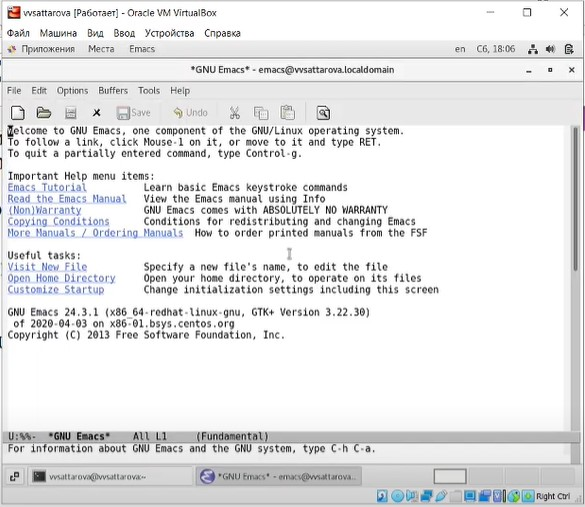{ #fig:001 width=100% }

1. Создала файл lab07.sh с помощью комбинации Ctrl-x Ctrl-f (C-x C-f). (рис. -@fig:002) 

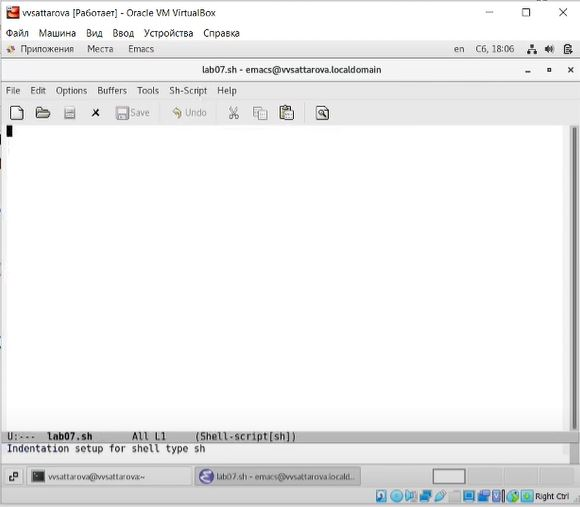{ #fig:002 width=100% }

1. Набрала текст:

```bash
#!/bin/bash
HELL=Hello
function hello {50 Лабораторная работа № 7. Текстовой редактор emacs
LOCAL HELLO=World
echo $HELLO
}
echo $HELLO
hello
```
(рис. -@fig:003) 

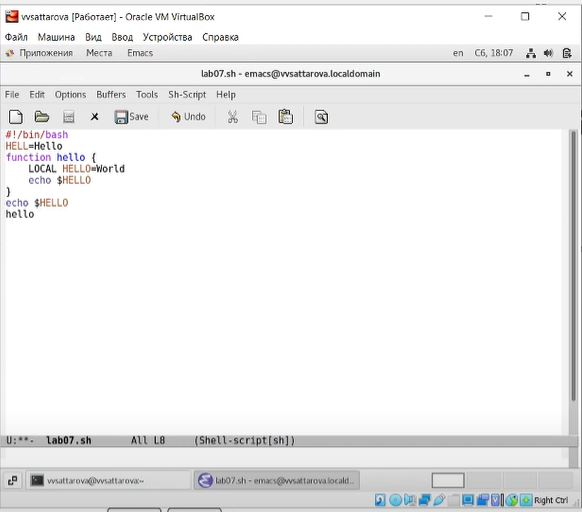{ #fig:003 width=100% }

1. Сохранила файл с помощью комбинации Ctrl-x Ctrl-s (C-x C-s). (рис. -@fig:004) 

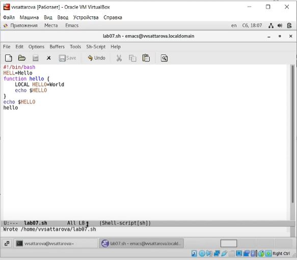{ #fig:004 width=100% }

1. Изучила стандартные процедуры редактирования текста, каждое действие осуществляла комбинацией клавиш.

    1. Вырезала одной командой целую строку (С-k). (рис. -@fig:005) 

    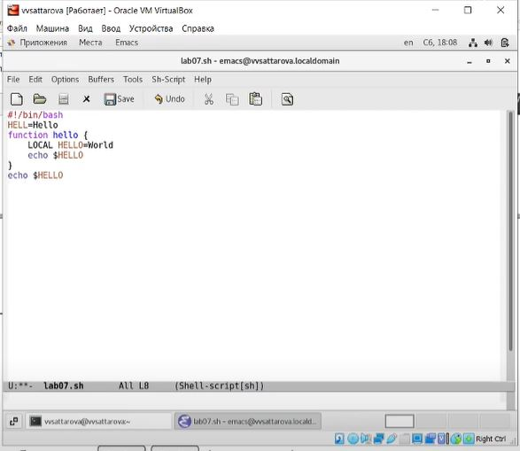{ #fig:005 width=100% }

    1. Вставила эту строку в конец файла (C-y). (рис. -@fig:006) 

    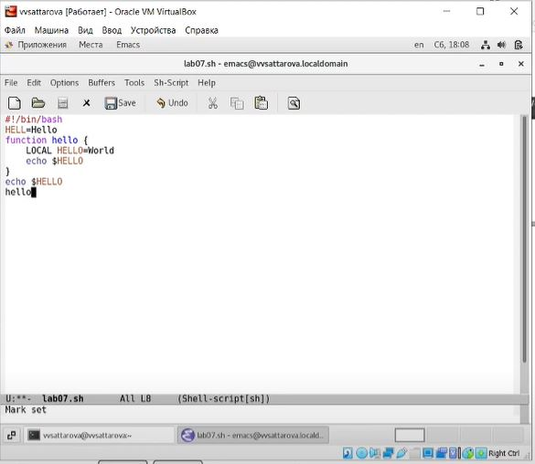{ #fig:006 width=100% }

    1. Выделила область текста (C-space). (рис. -@fig:007) 

    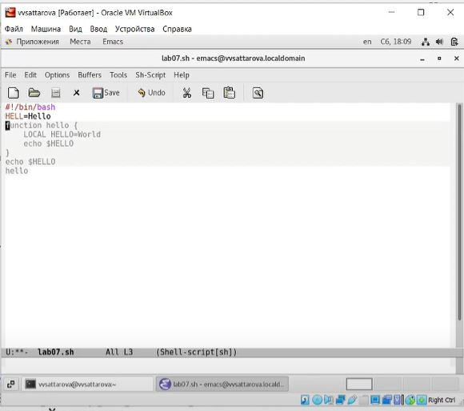{ #fig:007 width=100% }

    1. Скопировала область в буфер обмена (M-w). (рис. -@fig:008) 

    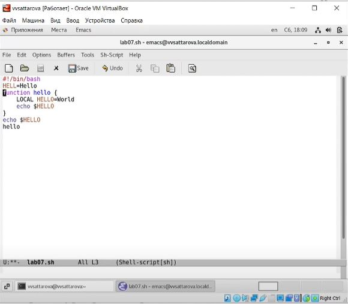{ #fig:008 width=100% }

    1. Вставила область в конец файла. (рис. -@fig:009) 

    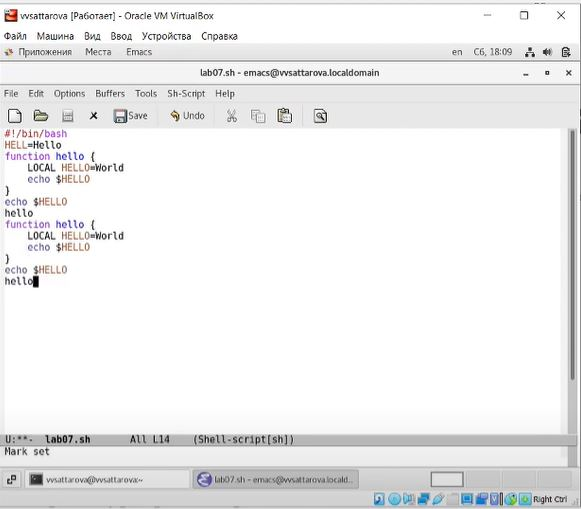{ #fig:009 width=100% }

    1. Повторно выделила эту область и на этот раз вырезала её (C-w). (рис. -@fig:010) (рис. -@fig:011)

    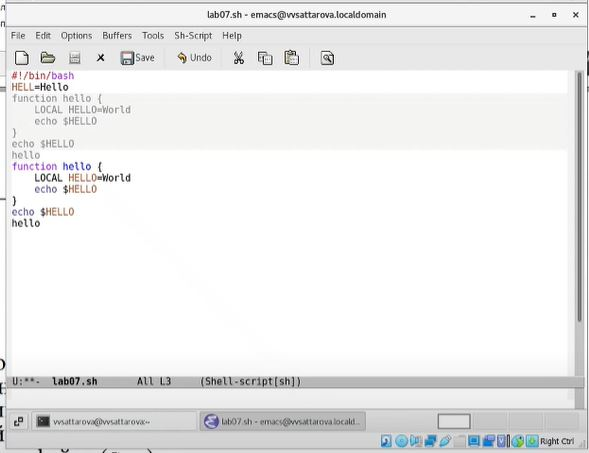{ #fig:010 width=100% }

    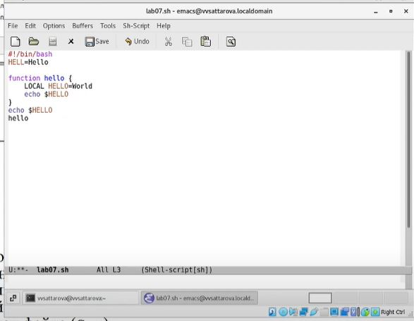{ #fig:011 width=100% }

    1. Отменила последнее действие (C-/). (рис. -@fig:012) 

    { #fig:012 width=100% }  

1. Научилась использовать команды по перемещению курсора.

    1. Переместила курсор в начало строки (C-a). (рис. -@fig:013) 

    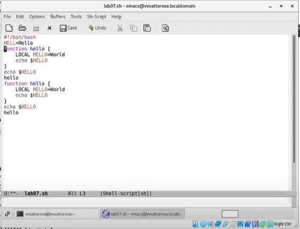{ #fig:013 width=100% }

    1. Переместила курсор в конец строки (C-e). (рис. -@fig:014) 

    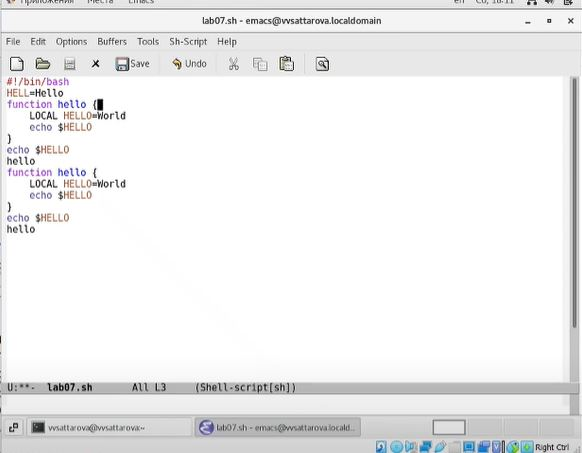{ #fig:014 width=100% }

    1. Переместила курсор в начало буфера (M-<). (рис. -@fig:015) 

    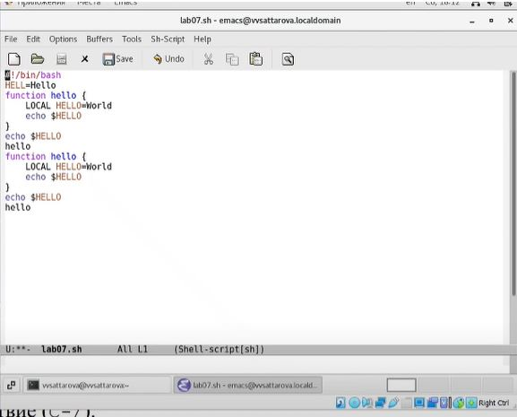{ #fig:015 width=100% }

    1. Переместила курсор в конец буфера (M->). (рис. -@fig:016) 

    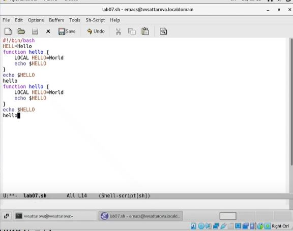{ #fig:016 width=100% }

1. Изучила управление буферами.

    1. Вывела список активных буферов на экран (C-x C-b). (рис. -@fig:017) 

    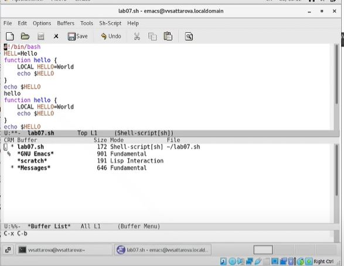{ #fig:017 width=100% }

    1. Переместилась во повторно открытое окно (C-x) o со списком открытых буферов и переключилась на другой буфер. (рис. -@fig:018) 

    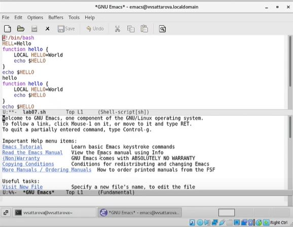{ #fig:018 width=100% }

    1. Закрыла это окно (C-x 0). (рис. -@fig:019) 

    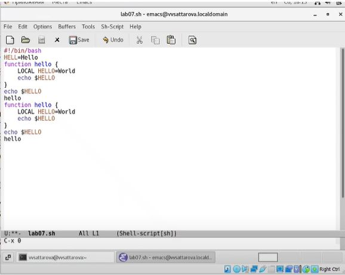{ #fig:019 width=100% }

    1. Затем повторно переключалась между буферами, но уже без вывода их списка на экран (C-x b). (рис. -@fig:020) 

    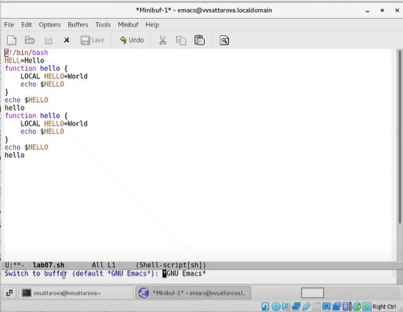{ #fig:020 width=100% }

1. Изучила управление окнами.

    1. Поделила фрейм на 4 части: разделила фрейм на два окна по вертикали (C-x 3), а затем каждое из этих окон на две части по горизонтали (C-x 2). (рис. -@fig:021) 

    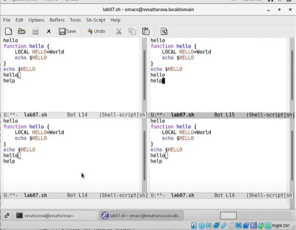{ #fig:021 width=100% }

    1. В каждом из четырёх созданных окон открыла новый буфер (файл) и ввела несколько строк текста. (рис. -@fig:022) 

    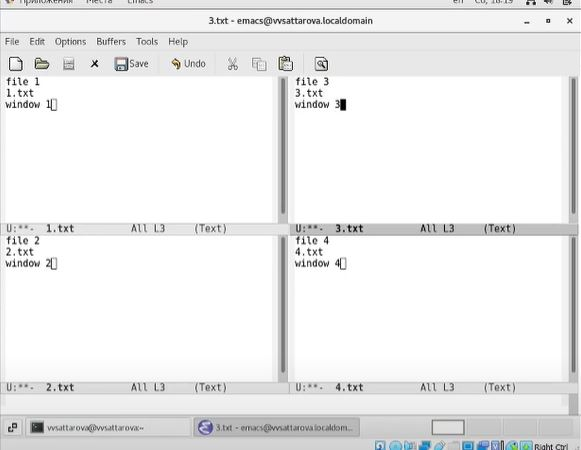{ #fig:022 width=100% }

1. Изучила режим поиска

    1. Переключилась в режим поиска (C-s) и нашла несколько слов, присутствующих в тексте. (рис. -@fig:023) 

    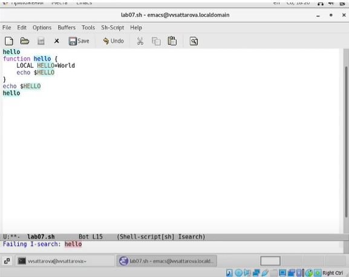{ #fig:023 width=100% }

    1. Переключалась между результатами поиска, нажимая C-s. (рис. -@fig:024) 

    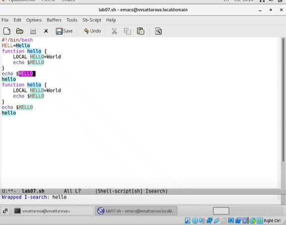{ #fig:024 width=100% }

    1. Вышла из режима поиска, нажав C-g. (рис. -@fig:025) 

    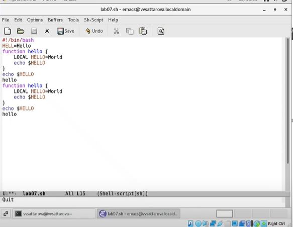{ #fig:025 width=100% }

    1. Перешла в режим поиска и замены (M-%), ввела текст, который следует найти и заменить, нажала Enter, затем ввела текст для замены. После того как появилась подсветка результатов поиска, нажала ! для подтверждения замены. (рис. -@fig:026) 

    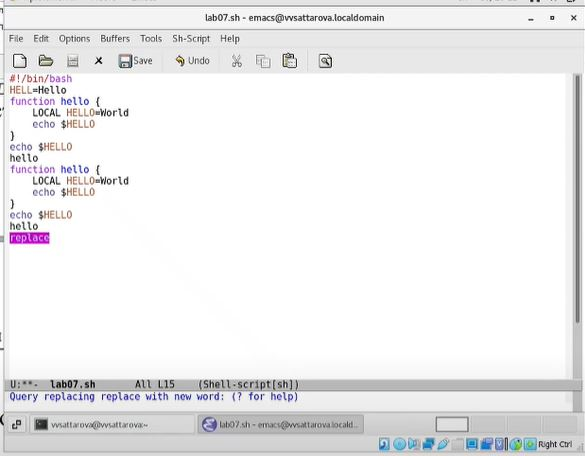{ #fig:026 width=100% }

    1. Попробовала другой режим поиска, нажав M-s o. Объяснила, чем он отличается от обычного режима - выдаёт списком в отдельном окне с нумерацией строк все строки, в которых найден нужный результат, выводит количество найденных результатов и где они были обнаружены. Другими словами, выводит подробную информацию, связанную с результатами поиска. (рис. -@fig:027) 

    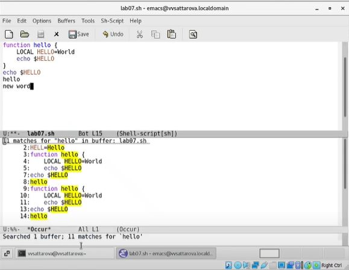{ #fig:027 width=100% }

Подробное пояснение хода работы можно увидеть на видео.

# Полученные результаты

Изучена информация, касающаяся текстового редактора emacs, освоены основные возможности редактора и основные команды, связанные с стандартными процедурами редактирования, с перемещением курсора, с управлением буферами и окнами, с режимом поиска. 

# Анализ результатов

Работу получилось выполнить по инструкции, проблем с использованием команд не возникло. Был создан текстовый файл, с которым проводились различные операции с иcпользованием команд редактора.

# Заключение и выводы

В ходе работы я вспомнила основы работы с операционной системой Linux и получила практические навыки работы с редактором emacs, установленным по умолчанию практически во всех дистрибутивах.

# Контрольные вопросы

1. Кратко охарактеризуйте редактор emacs.
2. Какие особенности данного редактора могут сделать его сложным для освоения новичком?
3. Своими словами опишите, что такое буфер и окно в терминологии emacs’а.
4. Можно ли открыть больше 10 буферов в одном окне?
5. Какие буферы создаются по умолчанию при запуске emacs?
6. Какие клавиши вы нажмёте, чтобы ввести следующую комбинацию C-c | и C-c C-|?
7. Как поделить текущее окно на две части?
8. В каком файле хранятся настройки редактора emacs?
9. Какую функцию выполняет клавиша и можно ли её переназначить?
10. Какой редактор вам показался удобнее в работе vi или emacs? Поясните почему.

# Ответы на контрольные вопросы

1. Emacs представляет собой мощный экранный редактор текста, написанный на языке высокого уровня Elisp.
2. Развитие Emacs в сторону его многогранности послужило причиной того, что и без того интуитивно непонятная программа стала чрезвычайно сложной в применении. В частности, управление осуществляется при помощи различных клавиатурных комбинаций запомнить которые будет непросто.
3. Буфер – что-то, состоящее из текста. Окно – область с одним из буферов.
4. В одном окне можно открыть больше 10 буферов.
5. После запуска emacs без каких-либо параметров в основном окне отображается буфер *scratch*, который используется для оценки выражений Emacs Lisp, а также для заметок, которые вы не хотите сохранять. Этот буфер не сохраняется автоматически.
6. Чтобы ввести следующую комбинацию C-c | я нажму клавиши: Control+c и Shift+\, и для C-c C-|: Control+c и Control+Shift+\.
7. Поделить текущее окно на две части можно двумя комбинациями клавиш: C-x 3 или C-x 2.
8. Настроить или расширить Emacs можно написав или изменив файл ~/.emacs.
9. Клавиша <- выполняет функцию перемещения курсора в открытом окне также, как и многие другие клавиши её можно переназначить.
10. Редактор emacs показался мне удобнее из-за различных возможностей, полезных для работы. Также в emacs возможно использовать кнопки меню с помощью курсора, что удобно, если плохо помнишь команды.
