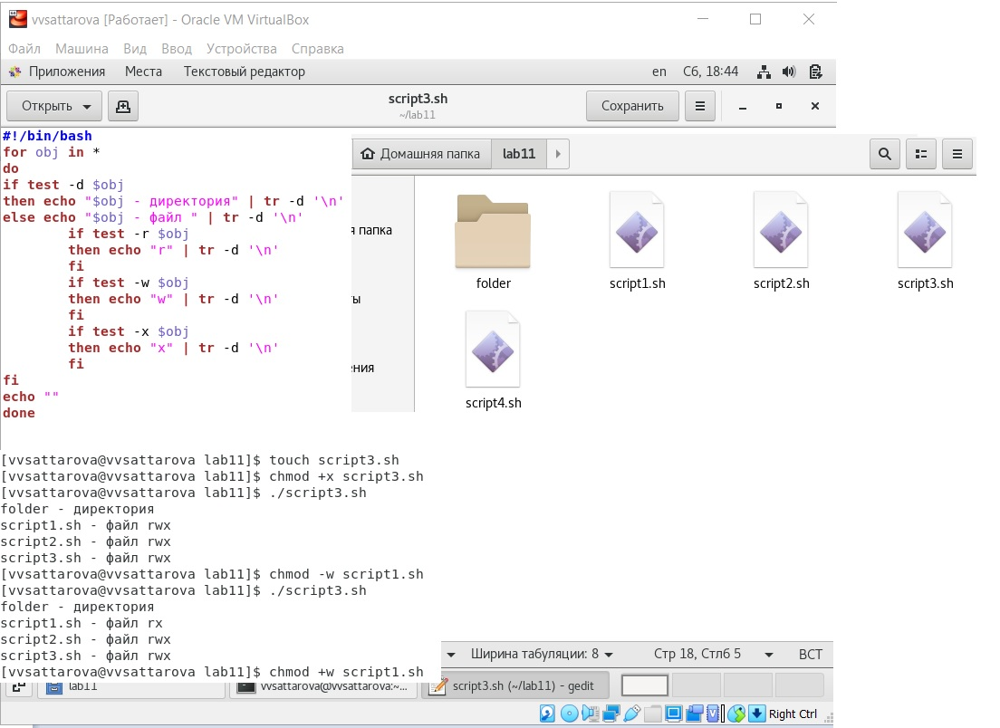
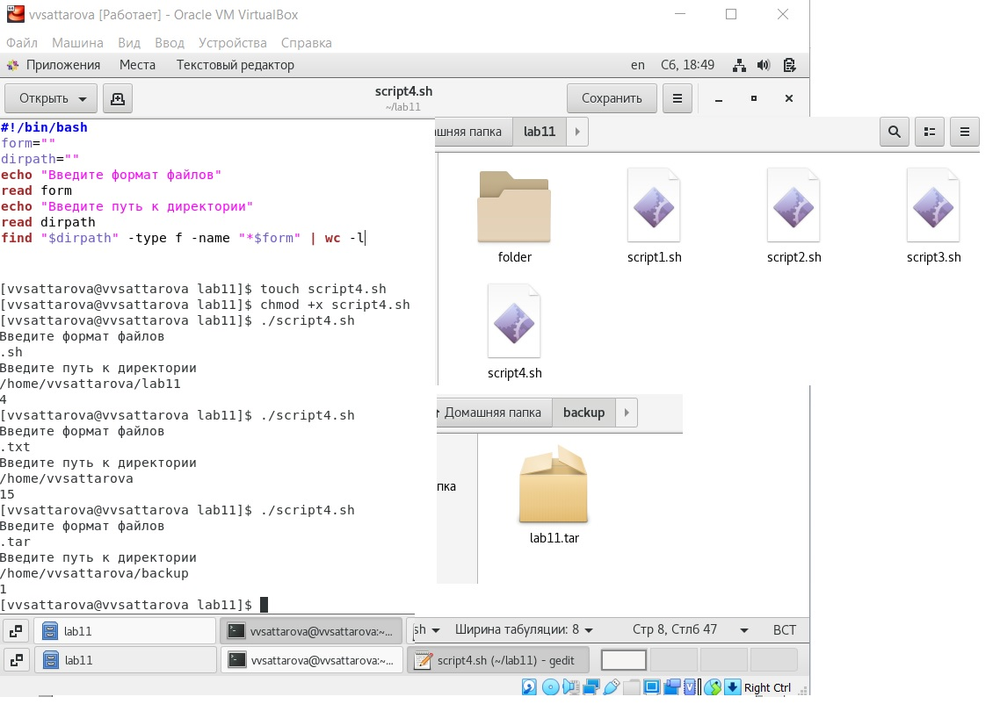

---
## Front matter
lang: ru-RU
title: Лабораторная работа №11 "Программирование в командном процессоре ОС UNIX. Командные файлы" 
author: |
	Саттарова Вита Викторовна\inst{1}
institute: |
	\inst{1}РУДН, Москва, Россия
date: 2021, Май

## Formatting
toc: false
slide_level: 2
theme: metropolis
mainfont: PT Serif
romanfont: PT Serif
sansfont: PT Sans
monofont: PT Mono
header-includes: 
 - \metroset{progressbar=frametitle,sectionpage=progressbar,numbering=fraction}
 - '\makeatletter'
 - '\beamer@ignorenonframefalse'
 - '\makeatother'
aspectratio: 43
section-titles: true
---

# Лабораторная работа №11 "Программирование в командном процессоре ОС UNIX. Командные файлы" 

## Прагматика

Работа выполнена для того, чтобы изучить основы написания командных файлов bash, чтобы использовать полученные знания для дальнейшей работы.

## Цели

Изучить основы программирования в оболочке ОС UNIX/Linux. Научиться писать небольшие командные файлы.

## Задачи

-	Изучить различные основные команды для написания командных файлов оболочки bash.
-	Приобрести навыки написания небольшиих командных файлов оболочки bash.

## Работа (1)

{ #fig:001 width=100% }

## Работа (2)

{ #fig:002 width=100% }

## Результаты

Изучена информация, касающаяся основных команды для написания командных файлов оболочки bash. Приобретены навыки написания небольшиих командных файлов оболочки bash. Работу получилось выполнить по инструкции, проблем с использованием команд и созданием командных файлов не возникло. Были созданы командные файлы, которые запускались и выполняли необходимую последовательность команд.

## Заключение

В ходе работы я изучить основы программирования в оболочке ОС UNIX/Linux и научилась писать небольшие командные файлы.