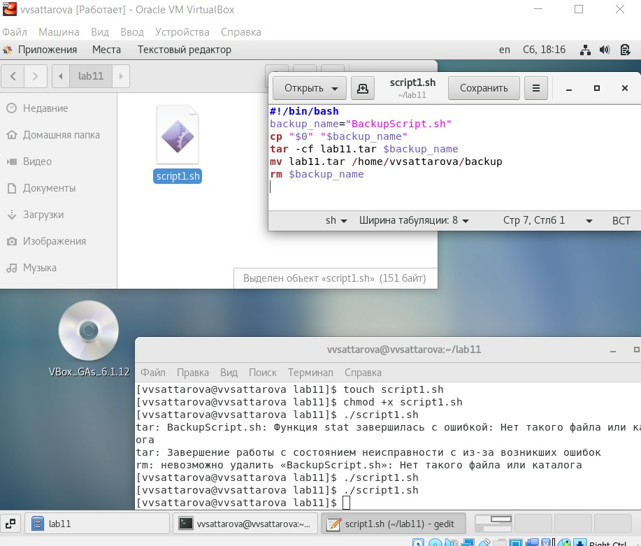
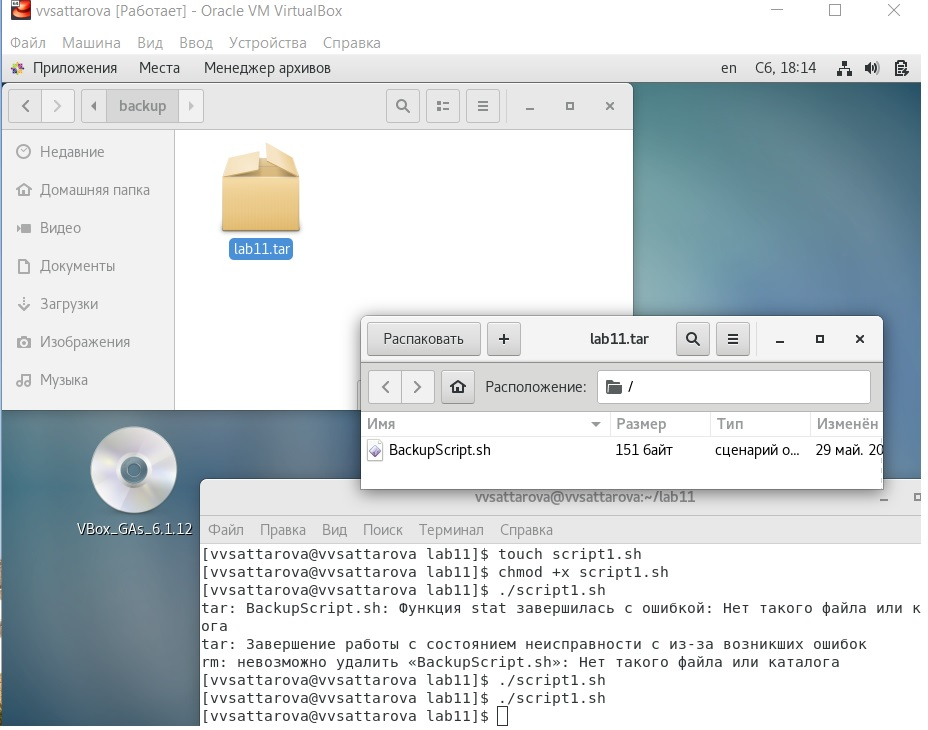
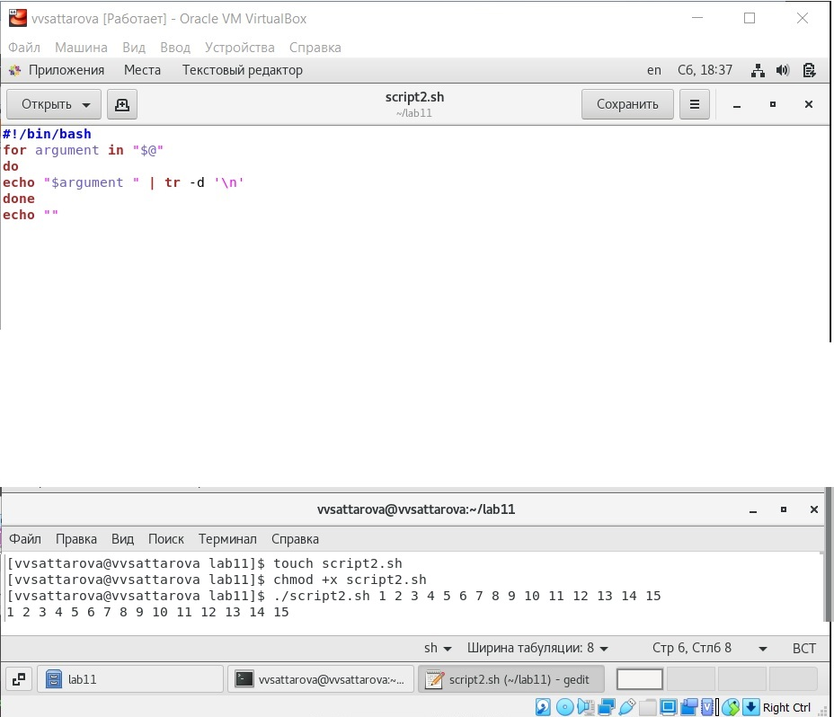
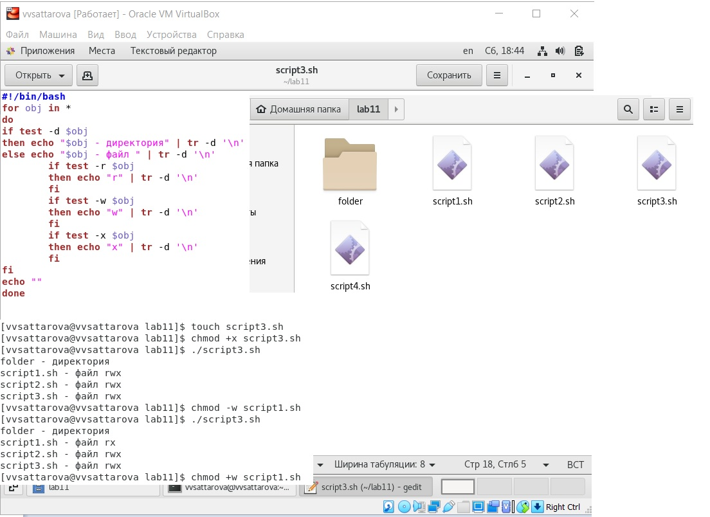
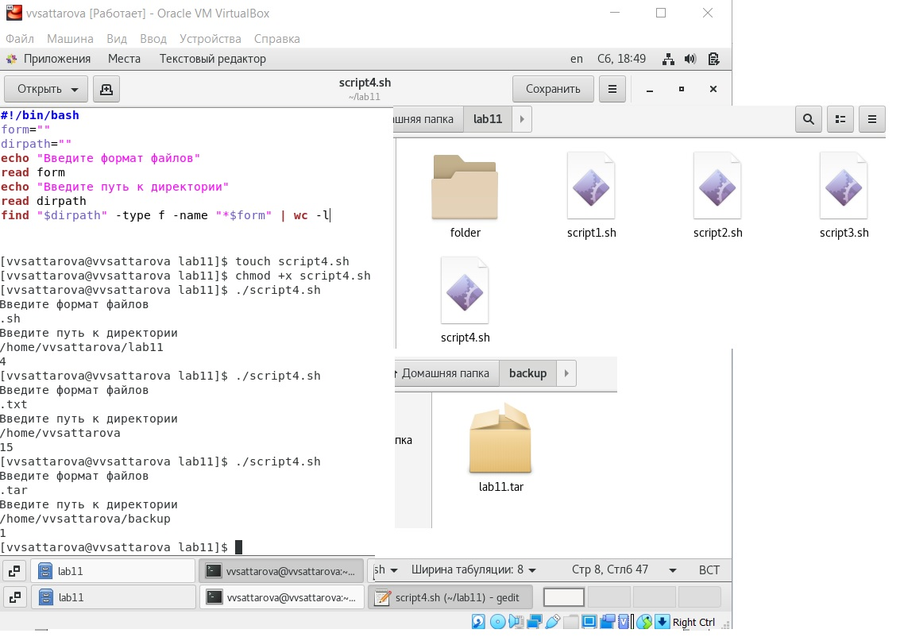

---
# Front matter
lang: ru-RU
title: "Лабораторная работа №11"
subtitle: "Операционные системы"
author: "Саттарова Вита Викторовна"

# Formatting
toc-title: "Содержание"
toc: true # Table of contents
toc_depth: 2
lof: true # Список рисунков
lot: false # List of tables
fontsize: 12pt
linestretch: 1.5
papersize: a4paper
documentclass: scrreprt
polyglossia-lang: russian
polyglossia-otherlangs: english
mainfont: PT Serif
romanfont: PT Serif
sansfont: PT Sans
monofont: PT Mono
mainfontoptions: Ligatures=TeX
romanfontoptions: Ligatures=TeX
sansfontoptions: Ligatures=TeX,Scale=MatchLowercase
monofontoptions: Scale=MatchLowercase
indent: true
pdf-engine: lualatex
header-includes:
  - \linepenalty=10 # the penalty added to the badness of each line within a paragraph (no associated penalty node) Increasing the value makes tex try to have fewer lines in the paragraph.
  - \interlinepenalty=0 # value of the penalty (node) added after each line of a paragraph.
  - \hyphenpenalty=50 # the penalty for line breaking at an automatically inserted hyphen
  - \exhyphenpenalty=50 # the penalty for line breaking at an explicit hyphen
  - \binoppenalty=700 # the penalty for breaking a line at a binary operator
  - \relpenalty=500 # the penalty for breaking a line at a relation
  - \clubpenalty=150 # extra penalty for breaking after first line of a paragraph
  - \widowpenalty=150 # extra penalty for breaking before last line of a paragraph
  - \displaywidowpenalty=50 # extra penalty for breaking before last line before a display math
  - \brokenpenalty=100 # extra penalty for page breaking after a hyphenated line
  - \predisplaypenalty=10000 # penalty for breaking before a display
  - \postdisplaypenalty=0 # penalty for breaking after a display
  - \floatingpenalty = 20000 # penalty for splitting an insertion (can only be split footnote in standard LaTeX)
  - \raggedbottom # or \flushbottom
  - \usepackage{float} # keep figures where there are in the text
  - \floatplacement{figure}{H} # keep figures where there are in the text
---

# Цели и задачи

## Цель

Изучить основы программирования в оболочке ОС UNIX/Linux. Научиться писать небольшие командные файлы.

## Задачи

1.	Изучить различные основные команды для написания командных файлов оболочки bash.
2.	Приобрести навыки написания небольшиих командных файлов оболочки bash.

# Объект и предмет исследования

## Объект исследования

Программирование в оболочке ОС UNIX/Linux.

## Предмет исследования

Изучение различных основные команды для написания командных файлов оболочки bash, написание небольшиих командных файлов оболочки bash.

# Условные обозначения и термины

Условные обозначения и термины отсутствуют

# Теоретические вводные данные

## shell

*Командный процессор (командная оболочка, интерпретатор команд shell)* — это программа, позволяющая пользователю взаимодействовать с операционной системой компьютера. В операционных системах типа UNIX/Linux наиболее часто
используются следующие реализации командных оболочек:
- оболочка Борна (Bourne shell или sh) — стандартная командная оболочка UNIX/Linux, содержащая базовый, но при этом полный набор функций;
- С-оболочка (или csh) — надстройка на оболочкой Борна, использующая Сподобный синтаксис команд с возможностью сохранения истории выполнения команд;
- оболочка Корна (или ksh) — напоминает оболочку С, но операторы управления программой совместимы с операторами оболочки Борна;
- BASH — сокращение от Bourne Again Shell (опять оболочка Борна), в основе своей совмещает свойства оболочек С и Корна (разработка компании Free Software Foundation).
POSIX (Portable Operating System Interface for Computer Environments) — набор стандартов описания интерфейсов взаимодействия операционной системы и прикладных программ.
Стандарты POSIX разработаны комитетом IEEE (Institute of Electrical and Electronics Engineers) для обеспечения совместимости различных UNIX/Linux подобных операционных систем и переносимости прикладных программ на уровне исходного кода. POSIX-совместимые оболочки разработаны на базе оболочки Корна.
Рассмотрим основные элементы программирования в оболочке bash. 
В других оболочках большинство команд будет совпадать.

## Переменные в языке программирования bash
Пользователь имеет возможность присвоить переменной значение некоторой строки символов.

``` bash
mark=/usr/andy/bin
```

Значение, присвоенное некоторой переменной, может быть впоследствии использовано.

``` bash
$имя_переменной 
${имя_переменной} 
```

Для создания массива используется команда set с флагом -A. 
За флагом следует имя переменной, а затем список значений, разделённых пробелами. 

``` bash
set -A states Delaware Michigan "New Jersey"
```

Далее можно сделать добавление в массив.

``` bash
states[49]=Alaska.
```

Индексация массивов начинается с нулевого элемента.

## Использование арифметических вычислений. Операторы let и read

Оболочка bash поддерживает встроенные арифметические функции. 
Команда let является показателем того, что последующие аргументы представляют собой выражение, подлежащее вычислению. 
Команда let берет два операнда и присваивает их переменной (для идентификации переменной ей не нужен знак доллара).

``` bash
let sum=x+7
```

Команда let также расширяет другие выражения let, если они заключены в двойные круглые скобки. 

Целые числа можно записывать как последовательность цифр или в любом базовом формате типа radix\#number, где radix (основание системы счисления) — любое число не более 26.

Можно присваивать результаты условных выражений переменным, также как и использовать результаты арифметических вычислений в качестве условий.

``` bash
$ let x=5
$ while
 (( x-=1 ))
 do
 something
 done
```

Если использовать typeset -i для объявления и присвоения переменной, то при последующем её применении она станет целой.
Команда read позволяет читать значения переменных со стандартного ввода:

``` bash
echo "Please enter Month and Day of Birth ?"
read mon day trash
```

В переменные mon и day будут считаны соответствующие значения, введённые с клавиатуры, а переменная trash нужна для того, чтобы отобрать всю избыточно введённую информацию и игнорировать её.
Изъять переменную из программы можно с помощью команды unset.
Имена некоторых переменных имеют для командного процессора специальный смысл (Например, РАТН). 

Значение всех переменных можно просмотреть с помощью команды set.

## Метасимволы и их экранирование

При перечислении имён файлов текущего каталога можно использовать следующие символы:
- * — соответствует произвольной, в том числе и пустой строке;
- ? — соответствует любому одинарному символу;
- [c1-c1] — соответствует любому символу, лексикографически находящемуся между символами c1 и с2.
- echo * — выведет имена всех файлов текущего каталога, что представляет собой простейший аналог команды ls;
- ls *.c — выведет все файлы с последними двумя символами, совпадающими с .c.
– echo prog.? — выведет все файлы, состоящие из пяти или шести символов, первыми пятью символами которых являются prog..
- [a-z]* — соответствует произвольному имени файла в текущем каталоге, начинающемуся с любой строчной буквы латинского алфавита.
Такие символы, как ' < > * ? | \ " &, являются метасимволами и имеют
для командного процессора специальный смысл. Снятие специального смысла с метасимвола называется экранированием метасимвола. Экранирование может быть осуществлено с помощью предшествующего метасимволу символа \, который, в свою очередь, является метасимволом.
Для экранирования группы метасимволов нужно заключить её в одинарные кавычки. 

``` bash
echo \* 
# выведет на экран символ *
```

``` bash
echo ab’*\|*’cd 
# выведет на экран строку ab*\|*cd
```

## Командные файлы и функции
Последовательность команд может быть помещена в текстовый файл. 
Такой файл называется командным. 
Далее этот файл можно выполнить по команде: bash командный_файл [аргументы].
Чтобы не вводить каждый раз последовательности символов bash, необходимо изменить код защиты этого командного файла, обеспечив доступ к этому файлу по выполнению. 
Теперь можно вызывать свой командный файл на выполнение, просто вводя его имя с терминала так, как-будто он является выполняемой программой. 

Группу команд можно объединить в функцию. Для этого существует ключевое слово function, после которого следует имя функции и список команд, заключённых в фигурные скобки. 
Удалить функцию можно с помощью команды unset c флагом -f.
Команда typeset имеет четыре опции для работы с функциями:
- -f — перечисляет определённые на текущий момент функции;
- -ft — при последующем вызове функции инициирует её трассировку;
- -fx — экспортирует все перечисленные функции в любые дочерние программы оболочек;
- -fu — обозначает указанные функции как автоматически загружаемые. 

## Передача параметров в командные файлы и специальные переменные
При вызове командного файла на выполнение параметры ему могут быть переданы точно таким же образом, как и выполняемой программе.
Символ $ является метасимволом командного процессора. 
Он используется, в частности, для ссылки на параметры, точнее, для получения их значений в командном файле. 
В командный файл можно передать до девяти параметров. 

При использовании где-либо в командном файле комбинации символов $i, где 0 < i < 10, вместо неё будет осуществлена
подстановка значения параметра с порядковым номером i, т.е. аргумента командного файла с порядковым номером i. 
Использование комбинации символов $0 приводит к подстановке вместо неё имени данного командного файла. 

Команда grep производит контекстный поиск в тексте, поступающем со стандартного ввода, для нахождения в этом тексте строк, содержащих последовательности символов, переданные ей в качестве аргументов, и выводит результаты своей работы на стандартный вывод. 
Команда shift позволяет удалять первый параметр и сдвигает все остальные на места предыдущих.
При использовании в командном файле комбинации символов $# вместо неё будет осуществлена подстановка числа параметров, указанных в командной строке при вызове данного командного файла на выполнение.

## Использование команды getopts
Весьма необходимой при программировании является команда getopts, которая осуществляет синтаксический анализ командной строки, выделяя флаги, и используется для объявления переменных. 
Синтаксис команды следующий: getopts option-string variable [arg ... ].

Флаги — это опции командной строки, обычно помеченные знаком минус. 
Иногда флаги имеют аргументы, связанные с ними. Программы интерпретируют флаги, соответствующим образом изменяя своё поведение.
Строка опций option-string — это список возможных букв и чисел соответствующего флага. 
Если ожидается, что некоторый флаг будет сопровождаться некоторым аргументом, то за символом, обозначающим этот флаг, должно следовать двоеточие. Соответствующей переменной присваивается буква данной опции. 
Если команда getopts может распознать аргумент, то она возвращает истину. 
Принято включать getopts в цикл while и анализировать введённые данные с помощью оператора case.

Функция getopts включает две специальные переменные среды — OPTARG и OPTIND. Если ожидается дополнительное значение, то OPTARG устанавливается в значение этого аргумента. 
OPTIND является числовым индексом на упомянутый аргумент.
Функция getopts также понимает переменные типа массив, следовательно, можно использовать её в функции не только для синтаксического анализа аргументов функций, но и для анализа введённых пользователем данных.

## Управление последовательностью действий в командных файлах
Часто бывает необходимо обеспечить проведение каких-либо действий циклически и управление дальнейшими действиями в зависимости от результатов проверки некоторого условия. 
Для решения подобных задач язык программирования bash предоставляет возможность использовать такие управляющие конструкции,
как for, case, if и while. С точки зрения командного процессора эти управляющие конструкции являются обычными командами и могут использоваться как при создании командных файлов, так и при работе в интерактивном режиме. 
Команды ОС UNIX возвращают код завершения, значение которого может быть использовано для принятия решения о дальнейших действиях. 
Команда test, например, создана специально для использования в командных файлах. Единственная функция этой команды заключается в выработке кода завершения. 

### Оператор цикла for
В обобщённой форме оператор цикла for выглядит следующим образом:

``` bash
for имя in список-значений
do список-команд
done
```

При каждом следующем выполнении оператора цикла for переменная имя принимает следующее значение из списка значений, задаваемых списком список-значений. 
Вообще говоря, список-значений является необязательным. При его отсутствии оператор цикла for выполняется для всех позиционных параметров или, иначе говоря, аргументов.
Выполнение оператора цикла for завершается, когда список-значений будет исчерпан. 
Последовательность команд (операторов), задаваемая списком список-команд, состоит из одной или более команд оболочки, отделённых друг от друга с помощью символов newline или ;.

### Оператор выбора case
Оператор выбора case реализует возможность ветвления на произвольное число ветвей. 
В обобщённой форме оператор выбора case выглядит следующим образом:

``` bash
case имя in
шаблон1) список-команд;;
шаблон2) список-команд;;
...
esac
```


Выполнение оператора выбора case сводится к тому, что выполняется последовательность команд (операторов), задаваемая списком список-команд, в строке, для которой значение переменной имя совпадает с шаблоном. 
Поскольку метасимвол * соответствует произвольной, в том числе и пустой, последовательности символов, то его можно использовать в качестве шаблона в последней строке перед служебным словом esac. 
В этом случае реализуются все действия, которые необходимо произвести, если значение переменной имя не совпадает ни с одним из шаблонов, заданных в предшествующих строках.

### Условный оператор if
В обобщённой форме условный оператор if выглядит следующим образом:

``` bash
if список-команд
then список-команд
{elif список-команд
then список-команд}
[else список-команд]
fi
```

Выполнение условного оператора if сводится к тому, что сначала выполняется последовательность команд (операторов), которую задаёт список-команд в строке, содержащей служебное слово if. 
Затем, если последняя выполненная команда из этой последовательности команд возвращает нулевой код завершения (истина), то будет выполнена последовательность команд (операторов), которую задаёт список-команд в строке, содержащей служебное слово then. Фраза elif проверяется в том случае, когда предыдущая проверка была ложной. Строка, содержащая служебное слово else, является необязательной. Если она присутствует, то последовательность команд (операторов), которую задаёт список-команд в строке, содержащей служебное слово else, будет выполнена только при условии, что последняя выполненная команда из последовательности команд (операторов), которую задаёт список-команд в строке, содержащей служебное слово if или elif, возвращает ненулевой код завершения (ложь).

### Операторы цикла while и until
В обобщённой форме оператор цикла while выглядит следующим образом:

``` bash
while список-команд
do список-команд
done
```

Выполнение оператора цикла while сводится к тому, что сначала выполняется последовательность команд (операторов), которую задаёт список-команд в строке, содержащей служебное слово while, а затем, если последняя выполненная команда из этой последовательности команд возвращает нулевой код завершения (истина), выполняется последовательность команд (операторов), которую задаёт списоккоманд в строке, содержащей служебное слово do, после чего осуществляется безусловный переход на начало оператора цикла while. 
Выход из цикла будет осуществлён тогда, когда последняя выполненная команда из последовательности команд (операторов), которую задаёт список-команд в строке, содержащей служебное слово while, возвратит ненулевой код завершения (ложь).

При замене в операторе цикла while служебного слова while на until условие, при выполнении которого осуществляется выход из цикла, меняется на противоположное. В остальном оператор цикла while и оператор цикла until идентичны.
В обобщённой форме оператор цикла until выглядит следующим образом:

``` bash

until список-команд
do список-команд
done
```

### Прерывание циклов
Два несложных способа позволяют вам прерывать циклы в оболочке bash. 
Команда break завершает выполнение цикла, а команда continue завершает данную итерацию блока операторов.
Команда break полезна для завершения цикла while в ситуациях, когда условие перестаёт быть правильным. 
Пример бесконечного цикла while с прерыванием в момент, когда файл перестаёт существовать:

Команда continue используется в ситуациях, когда больше нет необходимости выполнять блок операторов, но вы можете захотеть продолжить проверять данный блок на других условных выражениях. 

# Техническое оснащение и выбранные методы проведения работы

## Техническое оснащение

Персональный компьютер, интернет, виртуальная машина.

## Методы

Анализ предложенной информации, выполнение указанных заданий, получение дополнительной информации из интернета.

# Выполнение лабораторной работы

1. Написала скрипт, который при запуске делает резервную копию самого себя (то есть файла, в котором содержится его исходный код) в другую директорию backup в домашнем каталоге. При этом файл архивируется архиватором на выбор tar. Способ использования команд архивации необходимо узнала, изучив справку. (рис. -@fig:001) (рис. -@fig:002)

{ #fig:001 width=100% }

{ #fig:002 width=100% }

1. Написала пример командного файла, обрабатывающего любое произвольное число аргументов командной строки, в том числе превышающее десять. Мой скрипт может последовательно распечатывать значения всех переданных аргументов. (рис. -@fig:003) 

{ #fig:003 width=100% }

1. Написала командный файл — аналог команды ls (без использования самой этой команды и команды dir). Он выдаёт информацию о нужном каталоге и выводит информацию о возможностях доступа к файлам этого каталога. (рис. -@fig:004) 

{ #fig:004 width=100% }

1. Написала командный файл, который получает в качестве аргумента командной строки формат файла (.txt, .doc, .jpg, .pdf и т.д.) и вычисляет количество таких файлов в указанной директории. Путь к директории также передаётся в виде аргумента командной строки.  (рис. -@fig:005) 

{ #fig:005 width=100% }

Подробное пояснение хода работы можно увидеть на видео.

# Полученные результаты

Изучена информация, касающаяся основных команды для написания командных файлов оболочки bash. Приобретены навыки написания небольшиих командных файлов оболочки bash.

# Анализ результатов

Работу получилось выполнить по инструкции, проблем с использованием команд и созданием командных файлов не возникло. Были созданы командные файлы, которые запускались и выполняли необходимую последовательность команд.

# Заключение и выводы

В ходе работы я изучить основы программирования в оболочке ОС UNIX/Linux и научилась писать небольшие командные файлы.

# Контрольные вопросы

1. Объясните понятие командной оболочки. Приведите примеры командных оболочек. Чем они отличаются?
2. Что такое POSIX?
3. Как определяются переменные и массивы в языке программирования bash?
4. Каково назначение операторов let и read?
5. Какие арифметические операции можно применять в языке программирования bash?
6. Что означает операция (( ))?
7. Какие стандартные имена переменных Вам известны?
8. Что такое метасимволы?
9. Как экранировать метасимволы?
10. Как создавать и запускать командные файлы?
11. Как определяются функции в языке программирования bash?
12. Каким образом можно выяснить, является файл каталогом или обычным файлом?
13. Каково назначение команд set, typeset и unset?
14. Как передаются параметры в командные файлы?
15. Назовите специальные переменные языка bash и их назначение

# Ответы на контрольные вопросы

1. Командные процессоры или оболочки - это программы, позволяющие пользователю взаимодействовать с компьютером. Их можно рассматривать как настоящие интерпретируемые языки, которые воспринимают команды пользователя и обрабатывают их. Поэтому командные процессоры также называют интерпретаторами команд. На языках оболочек можно писать программы и выполнять их подобно любым другим программам. UNIX обладает большим количеством оболочек. Наиболее популярными являются следующие четыре оболочки: –оболочка Борна (Bourne) - первоначальная командная оболочка UNIX: базовый, но полный набор функций; –С-оболочка - добавка университета Беркли к коллекции оболочек: она надстраивается над оболочкой Борна, используя С-подобный синтаксис команд, и сохраняет историю выполненных команд; –оболочка Корна - напоминает оболочку С, но операторы управления программой совместимы с операторами оболочки Борна; –BASH - сокращение от Bourne Again Shell (опять оболочка Борна), в основе своей совмещает свойства оболочек С и Корна (разработка компании Free Software Foundation).
2. POSIX (Portable Operating System Interface for Computer Environments)- интерфейс переносимой операционной системы для компьютерных сред. Представляет собой набор стандартов, подготовленных институтом инженеров по электронике и радиотехники (IEEE), который определяет различные аспекты построения операционной системы. POSIX включает такие темы, как программный интерфейс, безопасность, работа с сетями и графический интерфейс. POSIX-совместимые оболочки являются будущим поколением оболочек UNIX и других ОС. Windows NT рекламируется как система, удовлетворяющая POSIX-стандартам. POSIX-совместимые оболочки разработаны на базе оболочки Корна; фонд бесплатного программного обеспечения (Free Software Foundation) работает над тем, чтобы и оболочку BASH сделать POSIX-совместимой.
3. Kомандный процессор bash обеспечивает возможность использования переменных типа строка символов. Имена переменных могут быть выбраны пользователем. Пользователь имеет возможность присвоить переменной значение некоторой строки символов. Например, команда mark=/usr/andy/bin присваивает значение строки символов /usr/andy/bin переменной mark типа строка символов. Значение, присвоенное некоторой переменной, может быть впоследствии использовано. Для этого в соответствующем месте командной строки должно быть употреблено имя этой переменной, которому предшествует метасимвол $. Например, команда mv afile $mark переместит файл afile из текущего каталога в каталог с абсолютным полным именем /usr/andy/bin. Использование значения, присвоенного некоторой переменной, называется подстановкой. Для того, чтобы имя переменной не сливалось с символами, которые могут следовать за ним в командной строке, при подстановке в общем случае используется следующая форма записи: ${имя переменной} например, использование команд b=/tmp/andy-ls -l myfile > ${b}ls приведет к переназначению стандартного вывода команды ls с терминала на файл /tmp/andy-ls , а использование команды ls -l>$bls приведет к подстановке в командную строку значения переменной bls. Если переменной bls не было предварительно присвоено никакого значения, то ее значением является символ пробел. Оболочка bash позволяет создание массивов. Для создания массива используется команда set с флагом -A. За флагом следует имя переменной, а затем список значений, разделенных пробелом. Например,set -A states Delaware Michigan "New Jersey" Далее можно сделать добавление в массив, например, states[49]=Alaska. Индексация массивов начинается с нулевого элемента.
4. Команда let является показателем того, что последующие аргументы представляют собой выражение, подлежащее вычислению. Простейшее выражение - это единичный терм (term), обычно целочисленный. Целые числа можно записывать как последовательность цифр или в любом базовом формате. Этот формат — radix#number, где radix (основание системы счисления) - любое число не более 26. Для большинства команд основания систем счисления это - 2 (двоичная), 8 (восьмеричная) и 16 (шестнадцатеричная). Простейшими математическими выражениями являются сложение (+), вычитание (-), умножение (*), целочисленное деление (/) и целочисленный остаток (%). Команда let берет два операнда и присваивает их переменной.
5. Какие арифметические операции можно применять в языке программирования bash? Оператор Синтаксис Результат ! !ехр Если ехр равно 0, возвращает 1; иначе 0 != ехр1 !=ехр2 Если ехр1 не равно ехр2, возвращает 1; иначе 0 % ехр1%ехр2 Возвращает остаток от деления ехр1 на ехр2 %= var=%exp Присваивает остаток от деления var на ехр переменной var & ехр1&ехр2 Возвращает побитовое AND выражений ехр1 и ехр2 && ехр1&&ехр2 Если и ехр1 и ехр2 не равны нулю, возвращает 1; иначе 0 &= var &= ехр Присваивает var побитовое AND перемен- ных var и выражения ехр * ехр1 * ехр2 Умножает ехр1 на ехр2 *= var *= ехр Умножает ехр на значение var и присваивает результат переменной var + ехр1 + ехр2 Складывает ехр1 и ехр2 += var += ехр Складывает ехр со значением var и результат присваивает var - -exp Операция отрицания exp (называется унарный минус) - expl - exp2 Вычитает exp2 из exp1 -= var -= exp Вычитает exp из значения var и присваи- вает результат var / exp / exp2 Делит exp1 на exp2 /= var /= exp Делит var на exp и присваивает результат var < expl < exp2 Если exp1 меньше, чем exp2, возвращает 1, иначе возвращает 0 « exp1« exp2 Сдвигает exp1 влево на exp2 бит «= var «= exp Побитовый сдвиг влево значения var на exp <= expl <= exp2 Если exp1 меньше, или равно exp2, возвра- щает 1; иначе возвращает 0 = var = exp Присваивает значение exp переменной va == exp1==exp2 Если exp1 равно exp2. Возвращает 1; иначе возвращает 0 > exp1 > exp2 1 если exp1 больше, чем exp2; иначе 0 >= exp1 >= exp2 1 если exp1 больше, или равно exp2; иначе 0 » exp » exp2 Сдвигает exp1 вправо на exp2 бит »= var »=exp Побитовый сдвиг вправо значения var на exp ^ exp1 ^ exp2 Исключающее OR выражений exp1 и exp2 ^= var ^= exp Присваивает var побитовое исключающее OR var и exp | exp1 | exp2 Побитовое OR выражений exp1 и exp2 |= var |= exp Присваивает var «исключающее OR» пе- ременой var и выражения exp || exp1 || exp2 1 если или exp1 или exp2 являются нену- левыми значениями; иначе 0 ~ ~exp Побитовое дополнение до exp.
6. Условия оболочки bash, в двойные скобки —(( )).
7. Имя переменной (идентификатор) — это строка символов, которая отличает эту переменную от других объектов программы (идентифицирует переменную в программе). При задании имен переменным нужно соблюдать следующие правила: § первым символом имени должна быть буква. Остальные символы — буквы и цифры (прописные и строчные буквы различаются). Можно использовать символ «_»; § в имени нельзя использовать символ «.»; § число символов в имени не должно превышать 255; § имя переменной не должно совпадать с зарезервированными (служебными) словами языка. Var1, PATH, trash, mon, day, PS1, PS2 Другие стандартные переменные: –HOME — имя домашнего каталога пользователя. Если команда cd вводится без аргументов, то происходит переход в каталог, указан- ный в этой переменной . –IFS — последовательность символов, являющихся разделителями в командной строке. Это символы пробел, табуляция и перевод строки(new line). –MAIL — командный процессор каждый раз перед выводом на экран промптера проверяет содержимое файла, имя которого указано в этой переменной, и если содержимое этого файла изменилось с момента последнего ввода из него, то перед тем как вывести на терминал промптер, командный процессор выводит на терминал сообщение You have mail (у Вас есть почта). –TERM — тип используемого терминала. –LOGNAME — содержит регистрационное имя пользователя, которое устанавливается автоматически при входе в систему. В командном процессоре Си имеется еще несколько стандартных переменных. Значение всех переменных можно просмотреть с помощью команды set.
8. Такие символы, как ’ < > * ? | \ " & являются метасимволами и имеют для командного процессора специальный смысл.
9. Снятие специального смысла с метасимвола называется экранированием метасимвола. Экранирование может быть осуществлено с помощью предшествующего метасимволу символа\, который, в свою очередь, является метасимволом. Для экранирования группы метасимволов, ее нужно заключить в одинарные кавычки. Строка, заключенная в двойные кавычки, экранирует все метасимволы, кроме $, ’ , \, ". Например,–echo \*выведет на экран символ*,–echo ab’*\|*’cdвыдаст строку ab*\|*cd.
10. Последовательность команд может быть помещена в текстовый файл. Такой файл называется командным. Далее этот файл можно выполнить по команде bash командный_файл [аргументы] Чтобы не вводить каждый раз последовательности символов bash, необходимо изменить код защиты этого командного файла, обеспечив доступ к этому файлу по выполнению. Это может быть сделано с помощью команды chmod +x имя_файла Теперь можно вызывать свой командный файл на выполнение просто, вводя его имя с терминала так, как будто он является выполняемой программой. Командный процессор распознает, что в Вашем файле на самом деле хранится не выполняемая программа, а программа, написанная на языке программирования оболочки, и осуществит ее интерпретацию.
11. Группу команд можно объединить в функцию. Для этого существует ключевое слово function, после которого следует имя функции и список команд, заключенных в фигурные скобки. Удалить функцию можно с помощью команды unset c флагом-f. Команда typeset имеет четыре опции для работы с функциями: -f — перечисляет определенные на текущий момент функции; –-ft— при последующем вызове функции инициирует ее трассировку; –-fx— экспортирует все перечисленные функции в любые дочерние программы оболочек; –-fu— обозначает указанные функции как автоматически загружаемые. Автоматически загружаемые функции хранятся в командных файлах, а при их вызове оболочка просматривает переменную FPATH, отыскивая файл с одноименными именами функций, загружает его и вызывает эти функции.
12. ls -lrt Если есть d, то является файл каталогом
13. Используется команда set с флагом -A. За флагом следует имя переменной, а затем список значений, разделенных пробелом. Например, set -A states Delaware Michigan "New Jersey" Далее можно сделать добавление в массив, например, states[49]=Alaska . Индексация массивов начинается с нулевого элемента. В командном процессоре Си имеется еще несколько стандартных переменных. Значение всех переменных можно просмотреть с помощью команды set. Наиболее распространенным является сокращение, избавляющееся от слова let в программах оболочек. Если объявить переменные целыми значениями, любое присвоение автоматически трактуется как арифметическое. Используйте typeset -i для объявления и присвоения переменной, и при последующем использовании она становится целой. Или можете использовать ключевое слово integer (псевдоним для typeset -l) и объявлять переменные целыми. Таким образом, выражения типа х=y+z воспринимаются как арифметические. Группу команд можно объединить в функцию. Для этого существует ключевое слово function , после которого следует имя функции и список команд, заключенных в фигурные скобки. Удалить функцию можно с помощью команды unset c флагом -f . Команда typeset имеет четыре опции для работы с функциями: – -f — перечисляет определенные на текущий момент функции; – -ft — при последующем вызове функции инициирует ее трассировку; – -fx — экспортирует все перечисленные функции в любые дочерние программы оболочек; – -fu — обозначает указанные функции как автоматически загружаемые. Автоматически загружаемые функции хранятся в командных файлах, а при их вызове оболочка просматривает переменную FPATH , отыскивая файл с одноименными именами функций, загружает его и вызывает эти функции. В переменные mon и day будут считаны соответствующие значения, введенные с клавиатуры, а переменная trash нужна для того, чтобы отобрать всю избыточно введенную информацию и игнорировать ее. Изъять переменную из программы можно с помощью команды unset.
14.	Символ $ является метасимволом командного процессора. Он используется, в частности, для ссылки на параметры, точнее, для получения их значений в командном файле. В командный файл можно передать до девяти параметров. При использовании где-либо в команд- ном файле комбинации символов $i, где 0 < 𝑖 < 10, вместо нее будет осуществлена подстановка значения параметра с порядковым номером i, т.е. аргумента командного файла с порядковым номером i. Использование комбинации символов $0 приводит к подстановке вместо нее имени данного командного файла. Рассмотрим это на примере. Пусть к командному файлу where имеется доступ по выполнению и этот командный файл содержит следующий конвейер: who | grep $1 Если Вы введете с терминала команду: where andy, то в случае, если пользователь, зарегистрированный в ОС UNIX под именем andy, в данный момент работает в ОС UNIX, на терминал будет выведена строка, содержащая номер терминала, используемого указанным пользователем. Если же в данный момент этот пользователь не работает в ОС UNIX, то на терминал не будет выведено ничего. Команда grep производит контекстный поиск в тексте, поступающем со стандартного ввода, для нахождения в этом тексте строк, содержащих последовательности символов, переданные ей в качестве аргументов, и выводит результаты своей работы на стандартный вывод. В этом примере команда grep используется как фильтр, обеспечивающий ввод со стандартного ввода и вывод всех строк, содержащих последовательность символов andy, на стандартный вывод. В ходе интерпретации этого файла командным процессором вместо комбинации символов $1 осуществляется подстановка значения первого и единственного параметра andy. Если предположить, что пользователь, зарегистрированный в ОС UNIX под именем andy, в данный момент работает в ОС UNIX, то на терминале Вы увидите примерно следующее: $ where andy andy ttyG Jan 14 09:12 $ Определим функцию, которая изменяет каталог и печатает список файлов: $ function clist { > cd $1 > ls > }. Теперь при вызове команды clist каталог будет изменен каталог и выведено его содержимое.
15.	
- $* — отображается вся командная строка или параметры оболочки;
- $? — код завершения последней выполненной команды;
- $$ — уникальный идентификатор процесса, в рамках которого выполняется командный процессор;
- $! — номер процесса, в рамках которого выполняется последняя вызванная на выполнение в командном режиме команда;
- $- — значение флагов командного процессора;
- ${#*} — возвращает целое число — количество слов, которые были результатом $*;
- ${#name} — возвращает целое значение длины строки в переменной name;
- ${name[n]} — обращение к n-ному элементу массива;
- ${name[*]} — перечисляет все элементы массива, разделенные пробелом;
- ${name[@]} — то же самое, но позволяет учитывать символы пробелы в самих переменных;
- ${name:-value} — если значение переменной name не определено, то оно будет заменено на указанное value;
- ${name:value} — проверяется факт существования переменной;
- ${name=value} — если name не определено, то ему присваивается значение value;
- ${name?value} — останавливает выполнение, если имя переменной не определено, и выводит value, как сообщение об ошибке;
- ${name+value} — это выражение работает противоположно ${name-value}. Если переменная определена, то подставляется value;
- ${name#pattern} — представляет значение переменной name с удаленным самым коротким левым образцом (pattern);
- ${#name[*]} и ${#name[@]} — эти выражения возвращают количество элементов в массиве name.
- $# вместо нее будет осуществлена подстановка числа параметров, указанных в командной строке при вызове данного командного файла на выполнение.
