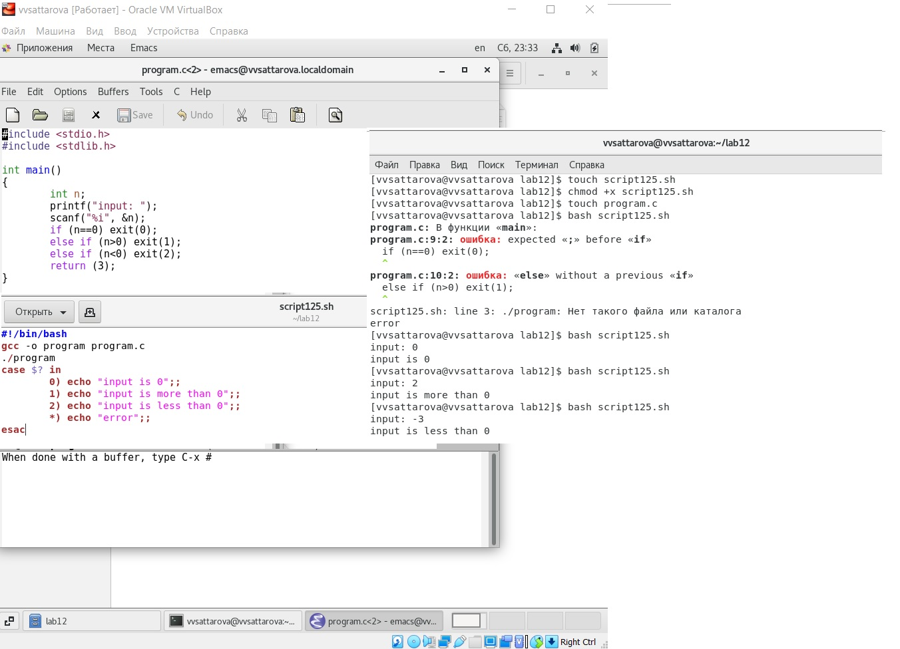
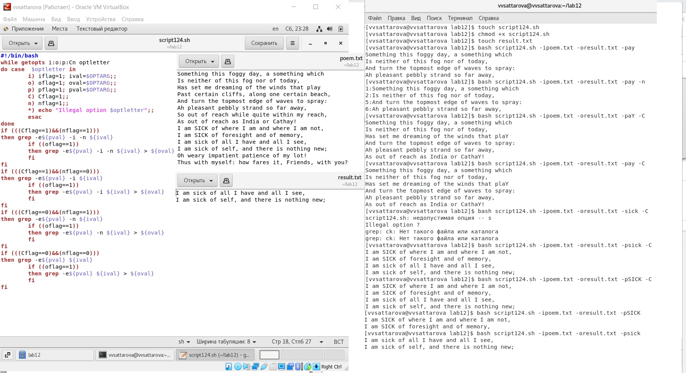
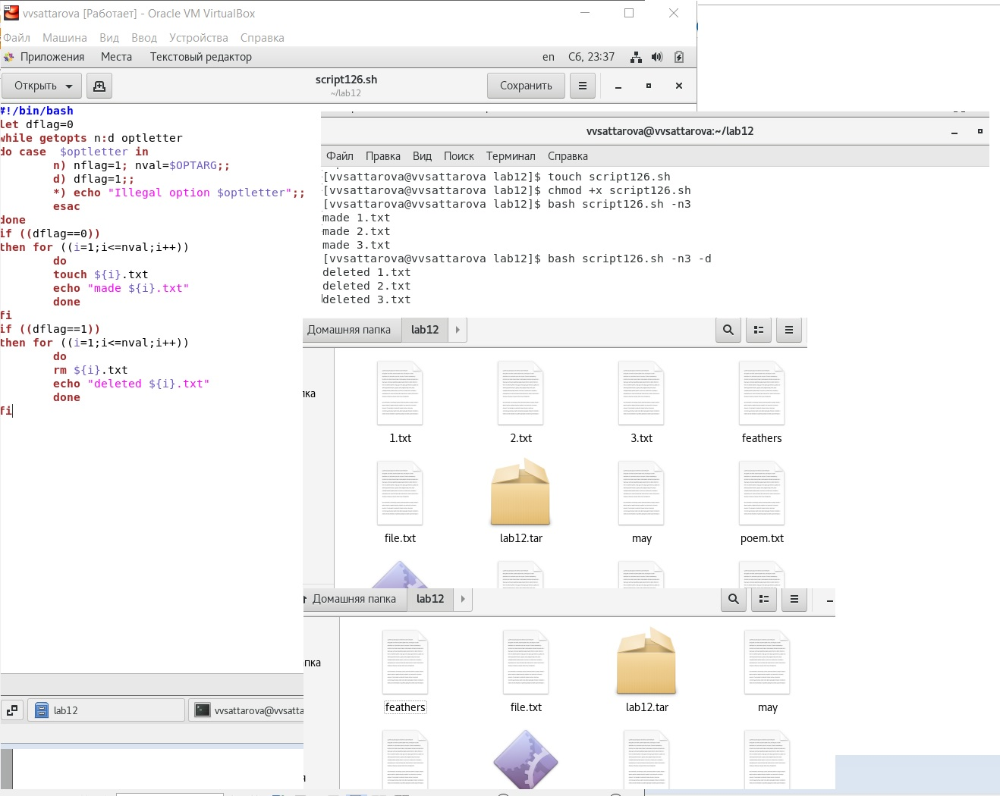
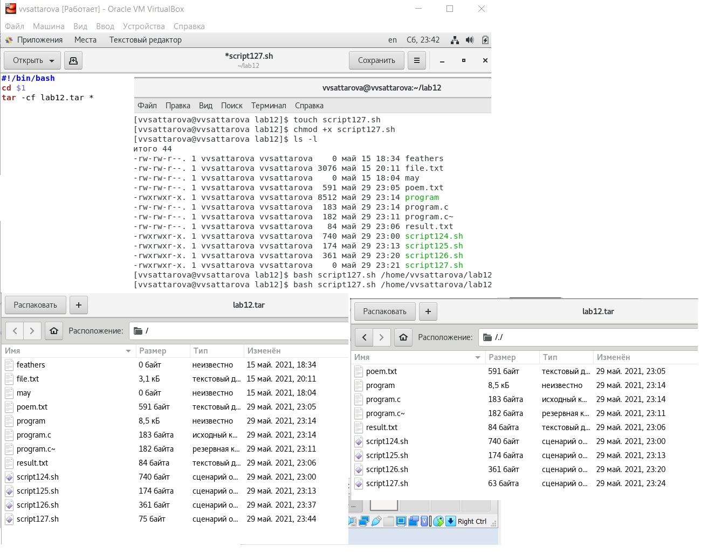

---
# Front matter
lang: ru-RU
title: "Лабораторная работа №12"
subtitle: "Операционные системы"
author: "Саттарова Вита Викторовна"

# Formatting
toc-title: "Содержание"
toc: true # Table of contents
toc_depth: 2
lof: true # Список рисунков
lot: false # List of tables
fontsize: 12pt
linestretch: 1.5
papersize: a4paper
documentclass: scrreprt
polyglossia-lang: russian
polyglossia-otherlangs: english
mainfont: PT Serif
romanfont: PT Serif
sansfont: PT Sans
monofont: PT Mono
mainfontoptions: Ligatures=TeX
romanfontoptions: Ligatures=TeX
sansfontoptions: Ligatures=TeX,Scale=MatchLowercase
monofontoptions: Scale=MatchLowercase
indent: true
pdf-engine: lualatex
header-includes:
  - \linepenalty=10 # the penalty added to the badness of each line within a paragraph (no associated penalty node) Increasing the value makes tex try to have fewer lines in the paragraph.
  - \interlinepenalty=0 # value of the penalty (node) added after each line of a paragraph.
  - \hyphenpenalty=50 # the penalty for line breaking at an automatically inserted hyphen
  - \exhyphenpenalty=50 # the penalty for line breaking at an explicit hyphen
  - \binoppenalty=700 # the penalty for breaking a line at a binary operator
  - \relpenalty=500 # the penalty for breaking a line at a relation
  - \clubpenalty=150 # extra penalty for breaking after first line of a paragraph
  - \widowpenalty=150 # extra penalty for breaking before last line of a paragraph
  - \displaywidowpenalty=50 # extra penalty for breaking before last line before a display math
  - \brokenpenalty=100 # extra penalty for page breaking after a hyphenated line
  - \predisplaypenalty=10000 # penalty for breaking before a display
  - \postdisplaypenalty=0 # penalty for breaking after a display
  - \floatingpenalty = 20000 # penalty for splitting an insertion (can only be split footnote in standard LaTeX)
  - \raggedbottom # or \flushbottom
  - \usepackage{float} # keep figures where there are in the text
  - \floatplacement{figure}{H} # keep figures where there are in the text
---

# Цели и задачи

## Цель

Изучить основы программирования в оболочке ОС UNIX. Научится писать более сложные командные файлы с использованием логических управляющих конструкций и циклов.

## Задачи

1.	Изучить различные основные команды для написания командных файлов оболочки bash.
2.	Приобрести навыки написания более сложных командных файлов с использованием логических управляющих конструкций и циклов оболочки bash.

# Объект и предмет исследования

## Объект исследования

Программирование в оболочке ОС UNIX/Linux.

## Предмет исследования

Изучение различных основные команды для написания командных файлов оболочки bash, написание более сложных командных файлов с использованием логических управляющих конструкций и циклов командных файлов оболочки bash.

# Условные обозначения и термины

Условные обозначения и термины отсутствуют

# Теоретические вводные данные

## shell

*Командный процессор (командная оболочка, интерпретатор команд shell)* — это программа, позволяющая пользователю взаимодействовать с операционной системой компьютера. В операционных системах типа UNIX/Linux наиболее часто
используются следующие реализации командных оболочек:
- оболочка Борна (Bourne shell или sh) — стандартная командная оболочка UNIX/Linux, содержащая базовый, но при этом полный набор функций;
- С-оболочка (или csh) — надстройка на оболочкой Борна, использующая Сподобный синтаксис команд с возможностью сохранения истории выполнения команд;
- оболочка Корна (или ksh) — напоминает оболочку С, но операторы управления программой совместимы с операторами оболочки Борна;
- BASH — сокращение от Bourne Again Shell (опять оболочка Борна), в основе своей совмещает свойства оболочек С и Корна (разработка компании Free Software Foundation).
POSIX (Portable Operating System Interface for Computer Environments) — набор стандартов описания интерфейсов взаимодействия операционной системы и прикладных программ.
Стандарты POSIX разработаны комитетом IEEE (Institute of Electrical and Electronics Engineers) для обеспечения совместимости различных UNIX/Linux подобных операционных систем и переносимости прикладных программ на уровне исходного кода. POSIX-совместимые оболочки разработаны на базе оболочки Корна.
Рассмотрим основные элементы программирования в оболочке bash. 
В других оболочках большинство команд будет совпадать.

## Переменные в языке программирования bash
Пользователь имеет возможность присвоить переменной значение некоторой строки символов.

``` bash
mark=/usr/andy/bin
```

Значение, присвоенное некоторой переменной, может быть впоследствии использовано.

``` bash
$имя_переменной 
${имя_переменной} 
```

Для создания массива используется команда set с флагом -A. 
За флагом следует имя переменной, а затем список значений, разделённых пробелами. 

``` bash
set -A states Delaware Michigan "New Jersey"
```

Далее можно сделать добавление в массив.

``` bash
states[49]=Alaska.
```

Индексация массивов начинается с нулевого элемента.

## Использование арифметических вычислений. Операторы let и read

Оболочка bash поддерживает встроенные арифметические функции. 
Команда let является показателем того, что последующие аргументы представляют собой выражение, подлежащее вычислению. 
Команда let берет два операнда и присваивает их переменной (для идентификации переменной ей не нужен знак доллара).

``` bash
let sum=x+7
```

Команда let также расширяет другие выражения let, если они заключены в двойные круглые скобки. 

Целые числа можно записывать как последовательность цифр или в любом базовом формате типа radix\#number, где radix (основание системы счисления) — любое число не более 26.

Можно присваивать результаты условных выражений переменным, также как и использовать результаты арифметических вычислений в качестве условий.

``` bash
$ let x=5
$ while
 (( x-=1 ))
 do
 something
 done
```

Если использовать typeset -i для объявления и присвоения переменной, то при последующем её применении она станет целой.
Команда read позволяет читать значения переменных со стандартного ввода:

``` bash
echo "Please enter Month and Day of Birth ?"
read mon day trash
```

В переменные mon и day будут считаны соответствующие значения, введённые с клавиатуры, а переменная trash нужна для того, чтобы отобрать всю избыточно введённую информацию и игнорировать её.
Изъять переменную из программы можно с помощью команды unset.
Имена некоторых переменных имеют для командного процессора специальный смысл (Например, РАТН). 

Значение всех переменных можно просмотреть с помощью команды set.

## Метасимволы и их экранирование

При перечислении имён файлов текущего каталога можно использовать следующие символы:
- * — соответствует произвольной, в том числе и пустой строке;
- ? — соответствует любому одинарному символу;
- [c1-c1] — соответствует любому символу, лексикографически находящемуся между символами c1 и с2.
- echo * — выведет имена всех файлов текущего каталога, что представляет собой простейший аналог команды ls;
- ls *.c — выведет все файлы с последними двумя символами, совпадающими с .c.
– echo prog.? — выведет все файлы, состоящие из пяти или шести символов, первыми пятью символами которых являются prog..
- [a-z]* — соответствует произвольному имени файла в текущем каталоге, начинающемуся с любой строчной буквы латинского алфавита.
Такие символы, как ' < > * ? | \ " &, являются метасимволами и имеют
для командного процессора специальный смысл. Снятие специального смысла с метасимвола называется экранированием метасимвола. Экранирование может быть осуществлено с помощью предшествующего метасимволу символа \, который, в свою очередь, является метасимволом.
Для экранирования группы метасимволов нужно заключить её в одинарные кавычки. 

``` bash
echo \* 
# выведет на экран символ *
```

``` bash
echo ab’*\|*’cd 
# выведет на экран строку ab*\|*cd
```

## Командные файлы и функции
Последовательность команд может быть помещена в текстовый файл. 
Такой файл называется командным. 
Далее этот файл можно выполнить по команде: bash командный_файл [аргументы].
Чтобы не вводить каждый раз последовательности символов bash, необходимо изменить код защиты этого командного файла, обеспечив доступ к этому файлу по выполнению. 
Теперь можно вызывать свой командный файл на выполнение, просто вводя его имя с терминала так, как-будто он является выполняемой программой. 

Группу команд можно объединить в функцию. Для этого существует ключевое слово function, после которого следует имя функции и список команд, заключённых в фигурные скобки. 
Удалить функцию можно с помощью команды unset c флагом -f.
Команда typeset имеет четыре опции для работы с функциями:
- -f — перечисляет определённые на текущий момент функции;
- -ft — при последующем вызове функции инициирует её трассировку;
- -fx — экспортирует все перечисленные функции в любые дочерние программы оболочек;
- -fu — обозначает указанные функции как автоматически загружаемые. 

## Передача параметров в командные файлы и специальные переменные
При вызове командного файла на выполнение параметры ему могут быть переданы точно таким же образом, как и выполняемой программе.
Символ $ является метасимволом командного процессора. 
Он используется, в частности, для ссылки на параметры, точнее, для получения их значений в командном файле. 
В командный файл можно передать до девяти параметров. 

При использовании где-либо в командном файле комбинации символов $i, где 0 < i < 10, вместо неё будет осуществлена
подстановка значения параметра с порядковым номером i, т.е. аргумента командного файла с порядковым номером i. 
Использование комбинации символов $0 приводит к подстановке вместо неё имени данного командного файла. 

Команда grep производит контекстный поиск в тексте, поступающем со стандартного ввода, для нахождения в этом тексте строк, содержащих последовательности символов, переданные ей в качестве аргументов, и выводит результаты своей работы на стандартный вывод. 
Команда shift позволяет удалять первый параметр и сдвигает все остальные на места предыдущих.
При использовании в командном файле комбинации символов $# вместо неё будет осуществлена подстановка числа параметров, указанных в командной строке при вызове данного командного файла на выполнение.

## Использование команды getopts
Весьма необходимой при программировании является команда getopts, которая осуществляет синтаксический анализ командной строки, выделяя флаги, и используется для объявления переменных. 
Синтаксис команды следующий: getopts option-string variable [arg ... ].

Флаги — это опции командной строки, обычно помеченные знаком минус. 
Иногда флаги имеют аргументы, связанные с ними. Программы интерпретируют флаги, соответствующим образом изменяя своё поведение.
Строка опций option-string — это список возможных букв и чисел соответствующего флага. 
Если ожидается, что некоторый флаг будет сопровождаться некоторым аргументом, то за символом, обозначающим этот флаг, должно следовать двоеточие. Соответствующей переменной присваивается буква данной опции. 
Если команда getopts может распознать аргумент, то она возвращает истину. 
Принято включать getopts в цикл while и анализировать введённые данные с помощью оператора case.

Функция getopts включает две специальные переменные среды — OPTARG и OPTIND. Если ожидается дополнительное значение, то OPTARG устанавливается в значение этого аргумента. 
OPTIND является числовым индексом на упомянутый аргумент.
Функция getopts также понимает переменные типа массив, следовательно, можно использовать её в функции не только для синтаксического анализа аргументов функций, но и для анализа введённых пользователем данных.

## Управление последовательностью действий в командных файлах
Часто бывает необходимо обеспечить проведение каких-либо действий циклически и управление дальнейшими действиями в зависимости от результатов проверки некоторого условия. 
Для решения подобных задач язык программирования bash предоставляет возможность использовать такие управляющие конструкции,
как for, case, if и while. С точки зрения командного процессора эти управляющие конструкции являются обычными командами и могут использоваться как при создании командных файлов, так и при работе в интерактивном режиме. 
Команды ОС UNIX возвращают код завершения, значение которого может быть использовано для принятия решения о дальнейших действиях. 
Команда test, например, создана специально для использования в командных файлах. Единственная функция этой команды заключается в выработке кода завершения. 

### Оператор цикла for
В обобщённой форме оператор цикла for выглядит следующим образом:

``` bash
for имя in список-значений
do список-команд
done
```

При каждом следующем выполнении оператора цикла for переменная имя принимает следующее значение из списка значений, задаваемых списком список-значений. 
Вообще говоря, список-значений является необязательным. При его отсутствии оператор цикла for выполняется для всех позиционных параметров или, иначе говоря, аргументов.
Выполнение оператора цикла for завершается, когда список-значений будет исчерпан. 
Последовательность команд (операторов), задаваемая списком список-команд, состоит из одной или более команд оболочки, отделённых друг от друга с помощью символов newline или ;.

### Оператор выбора case
Оператор выбора case реализует возможность ветвления на произвольное число ветвей. 
В обобщённой форме оператор выбора case выглядит следующим образом:

``` bash
case имя in
шаблон1) список-команд;;
шаблон2) список-команд;;
...
esac
```


Выполнение оператора выбора case сводится к тому, что выполняется последовательность команд (операторов), задаваемая списком список-команд, в строке, для которой значение переменной имя совпадает с шаблоном. 
Поскольку метасимвол * соответствует произвольной, в том числе и пустой, последовательности символов, то его можно использовать в качестве шаблона в последней строке перед служебным словом esac. 
В этом случае реализуются все действия, которые необходимо произвести, если значение переменной имя не совпадает ни с одним из шаблонов, заданных в предшествующих строках.

### Условный оператор if
В обобщённой форме условный оператор if выглядит следующим образом:

``` bash
if список-команд
then список-команд
{elif список-команд
then список-команд}
[else список-команд]
fi
```

Выполнение условного оператора if сводится к тому, что сначала выполняется последовательность команд (операторов), которую задаёт список-команд в строке, содержащей служебное слово if. 
Затем, если последняя выполненная команда из этой последовательности команд возвращает нулевой код завершения (истина), то будет выполнена последовательность команд (операторов), которую задаёт список-команд в строке, содержащей служебное слово then. Фраза elif проверяется в том случае, когда предыдущая проверка была ложной. Строка, содержащая служебное слово else, является необязательной. Если она присутствует, то последовательность команд (операторов), которую задаёт список-команд в строке, содержащей служебное слово else, будет выполнена только при условии, что последняя выполненная команда из последовательности команд (операторов), которую задаёт список-команд в строке, содержащей служебное слово if или elif, возвращает ненулевой код завершения (ложь).

### Операторы цикла while и until
В обобщённой форме оператор цикла while выглядит следующим образом:

``` bash
while список-команд
do список-команд
done
```

Выполнение оператора цикла while сводится к тому, что сначала выполняется последовательность команд (операторов), которую задаёт список-команд в строке, содержащей служебное слово while, а затем, если последняя выполненная команда из этой последовательности команд возвращает нулевой код завершения (истина), выполняется последовательность команд (операторов), которую задаёт списоккоманд в строке, содержащей служебное слово do, после чего осуществляется безусловный переход на начало оператора цикла while. 
Выход из цикла будет осуществлён тогда, когда последняя выполненная команда из последовательности команд (операторов), которую задаёт список-команд в строке, содержащей служебное слово while, возвратит ненулевой код завершения (ложь).

При замене в операторе цикла while служебного слова while на until условие, при выполнении которого осуществляется выход из цикла, меняется на противоположное. В остальном оператор цикла while и оператор цикла until идентичны.
В обобщённой форме оператор цикла until выглядит следующим образом:

``` bash

until список-команд
do список-команд
done
```

### Прерывание циклов
Два несложных способа позволяют вам прерывать циклы в оболочке bash. 
Команда break завершает выполнение цикла, а команда continue завершает данную итерацию блока операторов.
Команда break полезна для завершения цикла while в ситуациях, когда условие перестаёт быть правильным. 
Пример бесконечного цикла while с прерыванием в момент, когда файл перестаёт существовать:

Команда continue используется в ситуациях, когда больше нет необходимости выполнять блок операторов, но вы можете захотеть продолжить проверять данный блок на других условных выражениях. 

# Техническое оснащение и выбранные методы проведения работы

## Техническое оснащение

Персональный компьютер, интернет, виртуальная машина.

## Методы

Анализ предложенной информации, выполнение указанных заданий, получение дополнительной информации из интернета.

# Выполнение лабораторной работы

1. Используя команды getopts grep, написала командный файл, который анализирует командную строку с ключами:
- -iinputfile — прочитать данные из указанного файла;
- -ooutputfile — вывести данные в указанный файл;
- -pшаблон — указать шаблон для поиска;
- -C — различать большие и малые буквы;
- -n — выдавать номера строк.
а затем ищет в указанном файле нужные строки, определяемые ключом -p. (рис. -@fig:001) 

{ #fig:001 width=100% }

1. Написала на языке Си программу, которая вводит число и определяет, является ли оно больше нуля, меньше нуля или равно нулю. Затем программа завершается с помощью функции exit(n), передавая информацию в о коде завершения в оболочку. Командный файл должен вызывать эту программу и, проанализировав с помощью команды $?, выдать сообщение о том, какое число было введено. (рис. -@fig:002)

{ #fig:002 width=100% }

1. Написала командный файл, создающий указанное число файлов, пронумерованных последовательно от 1 до N (например 1.tmp, 2.tmp, 3.tmp,4.tmp и т.д.). Число файлов, которые необходимо создать, передаётся в аргументы командной строки. Этот же командный файл умеет удалять все созданные им файлы (если они существуют). (рис. -@fig:003) 

{ #fig:003 width=100% }

1. Написала командный файл, который с помощью команды tar запаковывает в архив все файлы в указанной директории. Модифицировала его так, чтобы запаковывались только те файлы, которые были изменены менее недели тому назад (использовала команду find) (Нет на скриншоте но суть такая: tar -cf lab12.tar $(find -type f -mtime -7)).  (рис. -@fig:004) 

{ #fig:004 width=100% }

Подробное пояснение хода работы можно увидеть на видео.

# Полученные результаты

Изучена информация, касающаяся основных команды для написания командных файлов оболочки bash. Приобретены навыки написания более сложных командных файлов с использованием логических управляющих конструкций и циклов оболочки bash.

# Анализ результатов

Работу получилось выполнить по инструкции, проблем с использованием команд и созданием командных файлов не возникло. Были созданы командные файлы, которые запускались и выполняли необходимую последовательность команд.

# Заключение и выводы

В ходе работы я изучила основы программирования в оболочке ОС UNIX и научилась писать более сложные командные файлы с использованием логических управляющих конструкций и циклов.

# Контрольные вопросы

1. Каково предназначение команды getopts?
2. Какое отношение метасимволы имеют к генерации имён файлов?
3. Какие операторы управления действиями вы знаете?
4. Какие операторы используются для прерывания цикла?
5. Для чего нужны команды false и true?
6. Что означает строка if test -f man$s/$i.$s, встреченная в командном файле?
7. Объясните различия между конструкциями while и until.

# Ответы на контрольные вопросы

1. Команда getopts является встроенной командой командной оболочки bash, предназначенной для разбора параметров сценариев. Она обрабатывает исключительно однобуквенные параметры как с аргументами, так и без них и этого вполне достаточно для передачи сценариям любых входных данных.

2. При генерации имен используют метасимволы:

* произвольная (возможно пустая) последовательность символов;

? один произвольный символ;

[...] любой из символов, указанных в скобках перечислением и/или с указанием диапазона;

cat f* выдаст все файлы каталога, начинающиеся с "f";

cat *f* выдаст все файлы, содержащие "f";

cat program.? выдаст файлы данного каталога с однобуквенными расширениями, скажем "program.c" и "program.o", но не выдаст "program.com";

cat [a-d]* выдаст файлы, которые начинаются с "a", "b", "c", "d". Аналогичный эффект дадут и команды "cat [abcd]*" и "cat [bdac]*".

3. Операторы && и || являются управляющими операторами. Если в командной строке стоит command1 && command2, то command2 выполняется в том, и только в том случае, если статус выхода из команды command1 равен нулю, что говорит об успешном ее завершении. Аналогично, если командная строка имеет вид command1 || command2, то команда command2 выполняется тогда, и только тогда, когда статус выхода из команды command1 отличен от нуля.

4. Оператор break завершает выполнение ближайшего включающего цикла или условного оператора, в котором он отображается.

5. Команда true всегда возвращает ноль в качестве выходного статуса для индикации успеха. Команда false всегда возвращает не-ноль в качестве выходного статуса для индикации неудачи. Во всех управляющих конструкциях в качестве логического значения используется код возврата из программы, указанной в качестве условия. Код возврата 0 – истина, любое другое значение – ложь. Программа true – всегда завершается с кодом 0, false – всегда завершается с кодом 1.

6. Введенная строка означает условие существования файла man$s/$i.$s

7. Цикл While выполняется до тех пор, пока указанное в нем условие истинно. Когда указанное условие становится ложным - цикл завершается. Цикл Until выполняется до тех пор, пока указанное в нем условие ложно.
