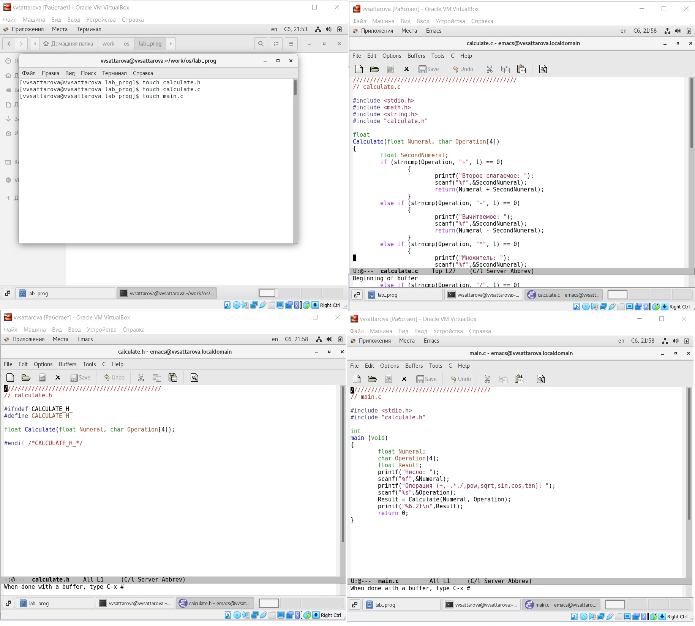
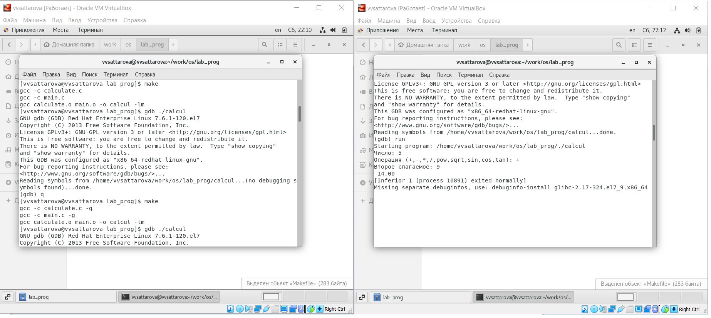

---
## Front matter
lang: ru-RU
title: Лабораторная работа №14 "Средства, применяемые при разработке программного обеспечения в ОС типа UNIX/Linux" 
author: |
	Саттарова Вита Викторовна\inst{1}
institute: |
	\inst{1}РУДН, Москва, Россия
date: 2021, Май

## Formatting
toc: false
slide_level: 2
theme: metropolis
mainfont: PT Serif
romanfont: PT Serif
sansfont: PT Sans
monofont: PT Mono
header-includes: 
 - \metroset{progressbar=frametitle,sectionpage=progressbar,numbering=fraction}
 - '\makeatletter'
 - '\beamer@ignorenonframefalse'
 - '\makeatother'
aspectratio: 43
section-titles: true
---

# Лабораторная работа №14 "Средства, применяемые при разработке программного обеспечения в ОС типа UNIX/Linux" 

## Прагматика

Работа выполнена для того, чтобы познакомиться с возможностями ОС UNIX/Linux, касающихся разработки, анализа, тестирования и отладки приложений, чтобы использовать полученные знания для дальнейшей работы.

## Цели

Приобрести простейшие навыки разработки, анализа, тестирования и отладки приложений в ОС типа UNIX/Linux на примере создания на языке программирования С калькулятора с простейшими функциями.

## Задачи

-	Изучить теорию относительно разработки, анализа, тестирования и отладки приложений в ОС UNIX/Linux.
-	Написать свою программу калькулятор.
-	Рассмотреть на практике возможности анализа, тестирования и отладки приложений  в ОС UNIX/Linux.

## Работа (1)

{ #fig:001 width=100% }

## Работа (2)

{ #fig:002 width=100% }

## Результаты

Изучена информация, касающаяся разработки, анализа, тестирования и отладки приложений в ОС UNIX/Linux. Написана собственная программа калькулятор. Были рассмотрены на практике возможности анализа, тестирования и отладки приложений  в ОС UNIX/Linux. Работу получилось выполнить по инструкции, проблем с использованием команд по алгоритму, а также работы с файлами С не возникло. Был реализован калькулятор, затем он был запущен в Debugger. Также необходимо было поработать с утилитой splint.

## Заключение

В ходе работы я gриобрела простейшие навыки разработки, анализа, тестирования и отладки приложений в ОС типа UNIX/Linux на примере создания на языке программирования С калькулятора с простейшими функциями.