---
# Front matter
lang: ru-RU
title: "Лабораторная работа №14"
subtitle: "Операционные системы"
author: "Саттарова Вита Викторовна"

# Formatting
toc-title: "Содержание"
toc: true # Table of contents
toc_depth: 2
lof: true # Список рисунков
lot: false # List of tables
fontsize: 12pt
linestretch: 1.5
papersize: a4paper
documentclass: scrreprt
polyglossia-lang: russian
polyglossia-otherlangs: english
mainfont: PT Serif
romanfont: PT Serif
sansfont: PT Sans
monofont: PT Mono
mainfontoptions: Ligatures=TeX
romanfontoptions: Ligatures=TeX
sansfontoptions: Ligatures=TeX,Scale=MatchLowercase
monofontoptions: Scale=MatchLowercase
indent: true
pdf-engine: lualatex
header-includes:
  - \linepenalty=10 # the penalty added to the badness of each line within a paragraph (no associated penalty node) Increasing the value makes tex try to have fewer lines in the paragraph.
  - \interlinepenalty=0 # value of the penalty (node) added after each line of a paragraph.
  - \hyphenpenalty=50 # the penalty for line breaking at an automatically inserted hyphen
  - \exhyphenpenalty=50 # the penalty for line breaking at an explicit hyphen
  - \binoppenalty=700 # the penalty for breaking a line at a binary operator
  - \relpenalty=500 # the penalty for breaking a line at a relation
  - \clubpenalty=150 # extra penalty for breaking after first line of a paragraph
  - \widowpenalty=150 # extra penalty for breaking before last line of a paragraph
  - \displaywidowpenalty=50 # extra penalty for breaking before last line before a display math
  - \brokenpenalty=100 # extra penalty for page breaking after a hyphenated line
  - \predisplaypenalty=10000 # penalty for breaking before a display
  - \postdisplaypenalty=0 # penalty for breaking after a display
  - \floatingpenalty = 20000 # penalty for splitting an insertion (can only be split footnote in standard LaTeX)
  - \raggedbottom # or \flushbottom
  - \usepackage{float} # keep figures where there are in the text
  - \floatplacement{figure}{H} # keep figures where there are in the text
---

# Цели и задачи

## Цель

Приобрести простейшие навыки разработки, анализа, тестирования и отладки приложений в ОС типа UNIX/Linux на примере создания на языке программирования С калькулятора с простейшими функциями.

## Задачи

1.	Изучить теорию относительно разработки, анализа, тестирования и отладки приложений в ОС UNIX/Linux.
2.	Написать свою программу калькулятор.
3.	Рассмотреть на практике возможности анализа, тестирования и отладки приложений  в ОС UNIX/Linux.

# Объект и предмет исследования

## Объект исследования

Разработка, анализ, тестирование и отладка приложений в ОС UNIX/Linux.

## Предмет исследования

Изучение основной информации, связанной с разработкой, анализом, тестированием и отладкой приложений, реализация калькулятора, простейшие анализ, тестирование и отладка созданной программы.

# Условные обозначения и термины

Условные обозначения и термины отсутствуют

# Теоретические вводные данные

## Этапы разработки приложений
Процесс разработки программного обеспечения обычно разделяется на следующие этапы:
- планирование, включающее сбор и анализ требований к функционалу и другим характеристикам разрабатываемого приложения;
- проектирование, включающее в себя разработку базовых алгоритмов и спецификаций, определение языка программирования;
- непосредственная разработка приложения:
- кодирование — по сути создание исходного текста программы (возможно в нескольких вариантах);
- анализ разработанного кода;
- сборка, компиляция и разработка исполняемого модуля;
- тестирование и отладка, сохранение произведённых изменений;
- документирование.
Для создания исходного текста программы разработчик может воспользоваться любым удобным для него редактором текста: vi, vim, mceditor, emacs, geany и др.
После завершения написания исходного кода программы (возможно состоящей из нескольких файлов), необходимо её скомпилировать и получить исполняемый модуль.

## Компиляция исходного текста и построение исполняемого файла
Стандартным средством для компиляции программ в ОС типа UNIX является GCC (GNU Compiler Collection). Это набор компиляторов для разного рода языков
программирования (С, C++, Java, Фортран и др.). Работа с GCC производится при помощи одноимённой управляющей программы gcc, которая интерпретирует аргументы командной строки, определяет и осуществляет запуск нужного компилятора для входного файла.
Файлы с расширением (суффиксом) .c воспринимаются gcc как программы на языке С, файлы с расширением .cc или .C — как файлы на языке C++, а файлы c
расширением .o считаются объектными. Для компиляции файла main.c, содержащего написанную на языке С простейшую программу достаточно в командной строке ввести: gcc -c main.c.
Таким образом, gcc по расширению (суффиксу) .c распознает тип файла для компиляции и формирует объектный модуль — файл с расширением .o.
Если требуется получить исполняемый файл с определённым именем (например, hello), то требуется воспользоваться опцией -o и в качестве параметра задать
имя создаваемого файла: gcc -o hello main.c.

Для сборки разрабатываемого приложения и собственно компиляции полезно воспользоваться утилитой make. Она позволяет автоматизировать процесс преобразования файлов программы из одной формы в другую, отслеживает взаимосвязи между файлами. 
Для работы с утилитой make необходимо в корне рабочего каталога с Вашим проектом создать файл с названием makefile или Makefile, в котором будут описаны правила обработки файлов Вашего программного комплекса.
Сначала задаётся список целей, разделённых пробелами, за которым идёт двоеточие и список зависимостей. Затем в следующих строках указываются команды.
Строки с командами обязательно должны начинаться с табуляции.
В качестве цели в Makefile может выступать имя файла или название какого-то действия. Зависимость задаёт исходные параметры (условия) для достижения указанной цели. Зависимость также может быть названием какого-то действия. 

## Тестирование и отладка
Во время работы над кодом программы программист неизбежно сталкивается с появлением ошибок в ней. Использование отладчика для поиска и устранения ошибок в программе существенно облегчает жизнь программиста. В комплект программ GNU для ОС типа UNIX входит отладчик GDB (GNU Debugger). Для использования GDB необходимо скомпилировать анализируемый код программы таким образом, чтобы отладочная информация содержалась в результирующем бинарном файле. Для этого следует воспользоваться опцией -g компилятора gcc. После этого для начала работы с gdb необходимо в командной строке ввести одноимённую команду, указав в качестве аргумента анализируемый бинарный файл. Затем можно использовать по мере необходимости различные команды gdb.

## Анализ исходного текста программы
Ещё одним средством проверки исходных кодов программ, написанных на языке C, является утилита splint. Эта утилита анализирует программный код, проверяет корректность задания аргументов использованных в программе функций и типов возвращаемых значений, обнаруживает синтаксические и семантические ошибки. В отличие от компилятора C анализатор splint генерирует комментарии с описанием разбора кода программы и осуществляет общий контроль, обнаруживая такие ошибки, как одинаковые объекты, определённые в разных файлах, или объекты, чьи значения не используются в работе программы, переменные с некорректно заданными значениями и типами и многое другое.

# Техническое оснащение и выбранные методы проведения работы

## Техническое оснащение

Персональный компьютер, интернет, виртуальная машина.

## Методы

Анализ предложенной информации, выполнение указанных заданий, получение дополнительной информации из интернета.

# Выполнение лабораторной работы

1. В домашнем каталоге создала подкаталог ~/work/os/lab_prog. (рис. -@fig:001) 

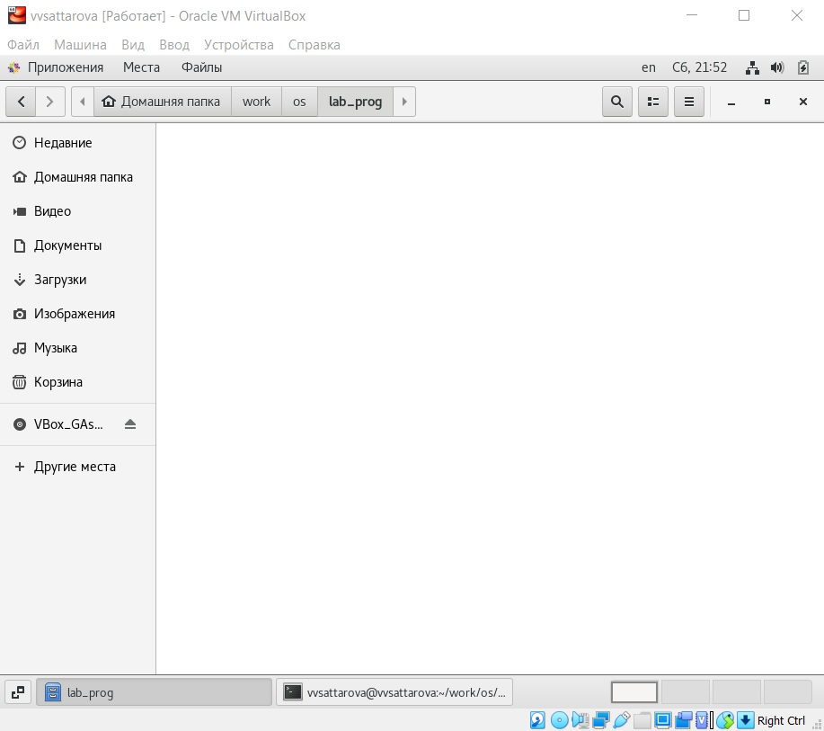{ #fig:001 width=100% }

2. Создала в нём файлы: calculate.h, calculate.c, main.c для калькулятора. Это будет примитивнейший калькулятор, способный складывать, вычитать, умножать и делить, возводить число в степень, брать квадратный корень, вычислять sin, cos, tan. При запуске он будет запрашивать первое число, операцию, второе число. После этого программа выведет результат и остановится.

``` C
////////////////////////////////////
// calculate.c
#include <stdio.h>
#include <math.h>
#include <string.h>
#include "calculate.h"

float Calculate(float Numeral, char Operation[4])
{
  float SecondNumeral;
  if(strncmp(Operation, "+", 1) == 0)
    {
      printf("Второе слагаемое: ");
      scanf("%f",&SecondNumeral);
      return(Numeral + SecondNumeral);
    }
  else if(strncmp(Operation, "-", 1) == 0)
    {
      printf("Вычитаемое: ");
      scanf("%f",&SecondNumeral);
      return(Numeral - SecondNumeral);
    }
  else if(strncmp(Operation, "*", 1) == 0)
    {
      printf("Множитель: ");
      scanf("%f",&SecondNumeral);
      return(Numeral * SecondNumeral);
    }
  else if(strncmp(Operation, "/", 1) == 0)
    {
      printf("Делитель: ");
      scanf("%f",&SecondNumeral);
      if(SecondNumeral == 0)
        {
          printf("Ошибка: деление на ноль! ");
          return(HUGE_VAL);
        }
      else
        return(Numeral / SecondNumeral);
    }
  else if(strncmp(Operation, "pow", 3) == 0)
    {
      printf("Степень: ");
      scanf("%f",&SecondNumeral);
      return(pow(Numeral, SecondNumeral));
    }
  else if(strncmp(Operation, "sqrt", 4) == 0)
    return(sqrt(Numeral));
  else if(strncmp(Operation, "sin", 3) == 0)76 Лабораторная работа № 11. Средства, применяемые при разработке программного…
    return(sin(Numeral));
  else if(strncmp(Operation, "cos", 3) == 0)
    return(cos(Numeral));
  else if(strncmp(Operation, "tan", 3) == 0)
    return(tan(Numeral));
  else
    {
      printf("Неправильно введено действие ");
      return(HUGE_VAL);
    }
}
``` 

``` C
///////////////////////////////////////
// calculate.h
#ifndef CALCULATE_H_
#define CALCULATE_H_
float Calculate(float Numeral, char Operation[4]);
#endif /*CALCULATE_H_*/
```

``` C
////////////////////////////////////////
// main.c
#include <stdio.h>
#include "calculate.h"
int
main (void)
{
float Numeral;
char Operation[4];
float Result;
printf("Число: ");
scanf("%f",&Numeral);
printf("Операция (+,-,*,/,pow,sqrt,sin,cos,tan): ");
scanf("%s",&Operation);
Result = Calculate(Numeral, Operation);
printf("%6.2f\n",Result);
return 0;
}
```

(рис. -@fig:002)

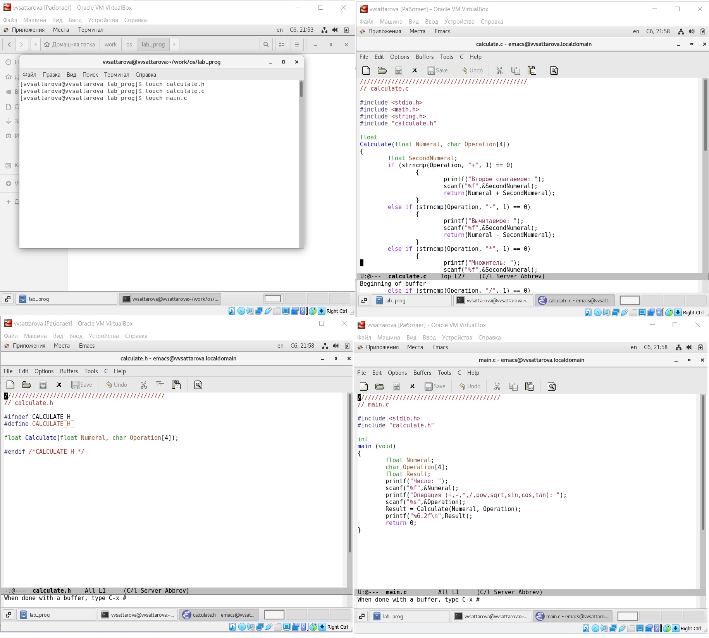{ #fig:002 width=100% }

3. Выполнила компиляцию программы посредством gcc:

gcc -c calculate.c
gcc -c main.c
gcc calculate.o main.o -o calcul -lm. 

(рис. -@fig:003) 

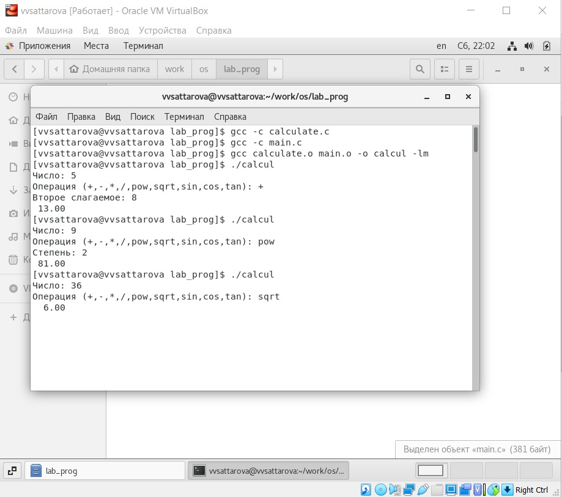{ #fig:003 width=100% }

4. У меня не возникло необходимости исправлять синтаксические ошибки.

5. Создала Makefile со следующим содержанием.

``` Makefile
#
# Makefile
#
CC = gcc # Компилятор
CFLAGS = # ключи для С файлов
LIBS = -lm
calcul: calculate.o main.o           #  создание исполняемого файла из объектных
    gcc calculate.o main.o -o calcul $(LIBS)
calculate.o: calculate.c calculate.h # создание объектного файла калькулятора
    gcc -c calculate.c $(CFLAGS)
main.o: main.c calculate.h           # создание основного объектного файла 
    gcc -c main.c $(CFLAGS)
clean:
    -rm calcul *.o *~                # удаление объектных файлов
# End Makefile
```

(рис. -@fig:004) 

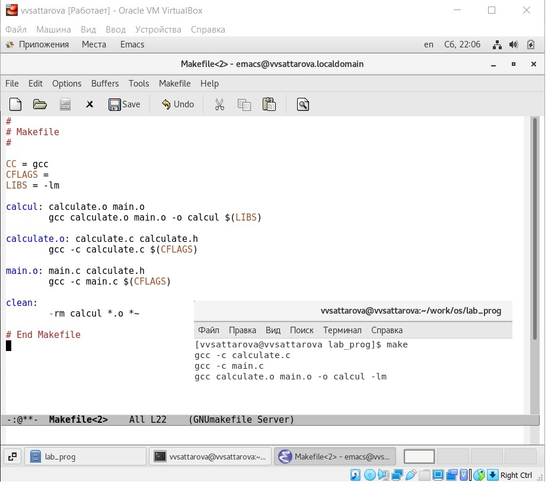{ #fig:004 width=100% }

6. С помощью gdb выполнила отладку программы calcul (перед использованием gdb исправила Makefile, добавив ключ для отладки файлов).
- Запустила отладчик GDB, загрузив в него программу для отладки: gdb ./calcul
- Для запуска программы внутри отладчика ввела команду run: run.  (рис. -@fig:005) 

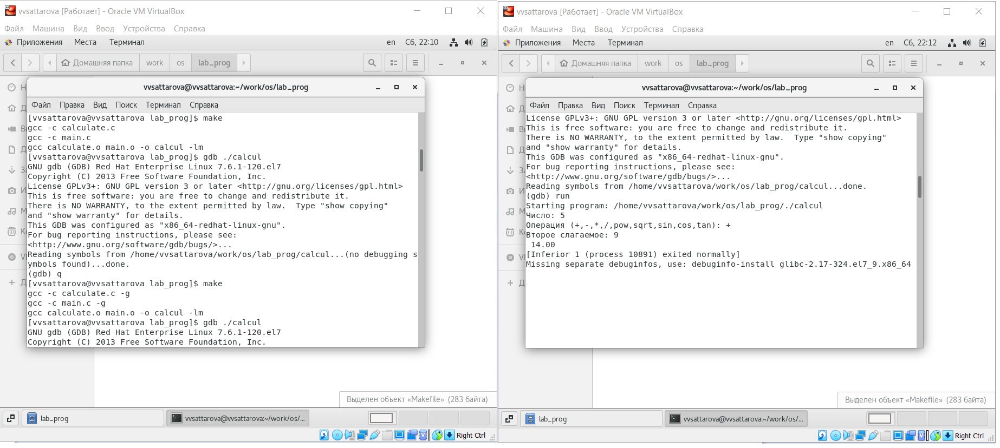{ #fig:005 width=100% }

7. Для постраничного (по 9 строк) просмотра исходного код использовала команду list. (рис. -@fig:006) 

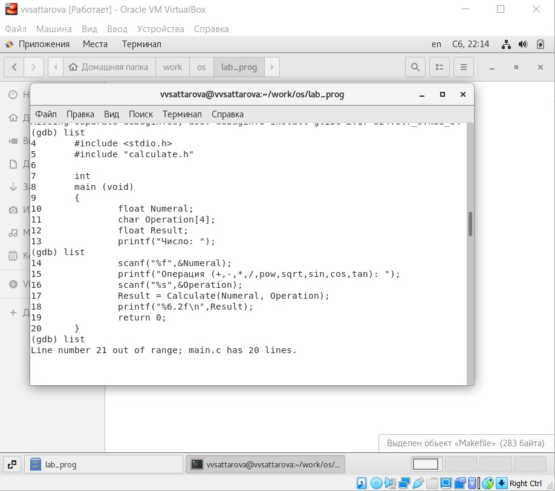{ #fig:006 width=100% }

8. Для просмотра строк с 12 по 15 основного файла использовала list с параметрами: list 12,15. (рис. -@fig:007)

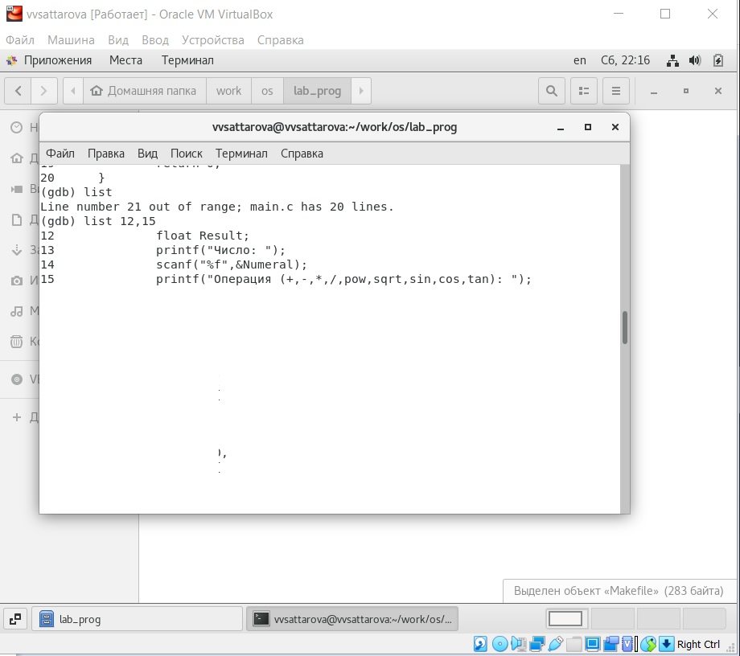{ #fig:007 width=100% }

9. Для просмотра определённых строк не основного файла использовала list с параметрами: list calculate.c:20,29. (рис. -@fig:008) 

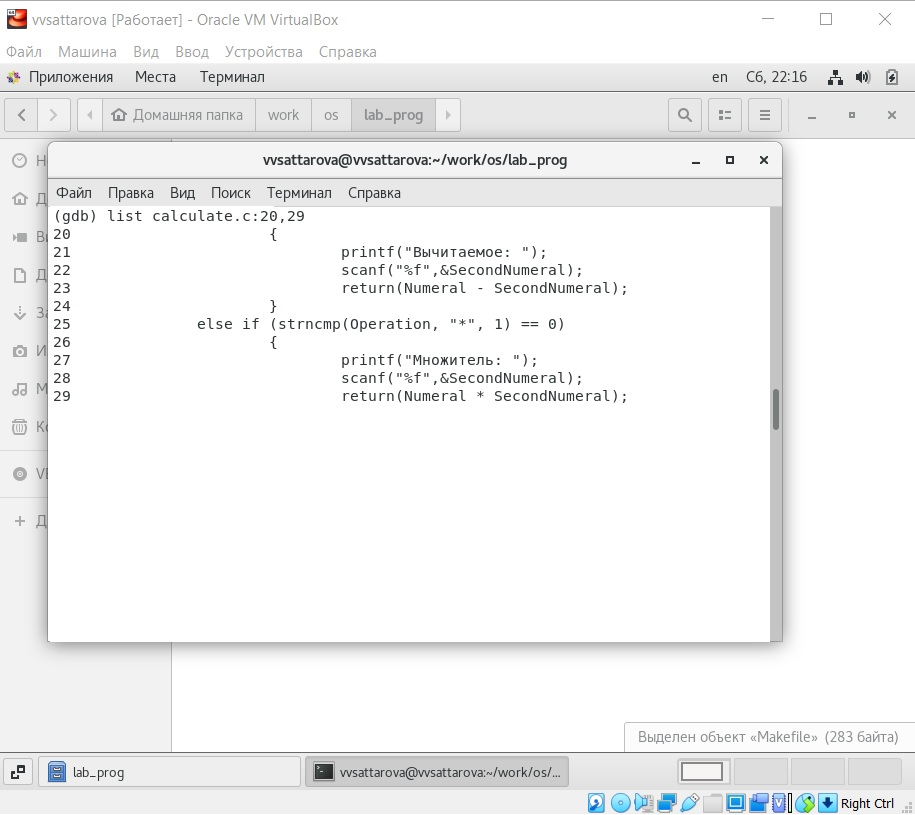{ #fig:008 width=100% }

10. Установила точку останова в файле calculate.c на строке номер 21: list calculate.c:20,27; break 21. Вывела информацию об имеющихся в проекте точка останова: info breakpoints.  (рис. -@fig:009) 

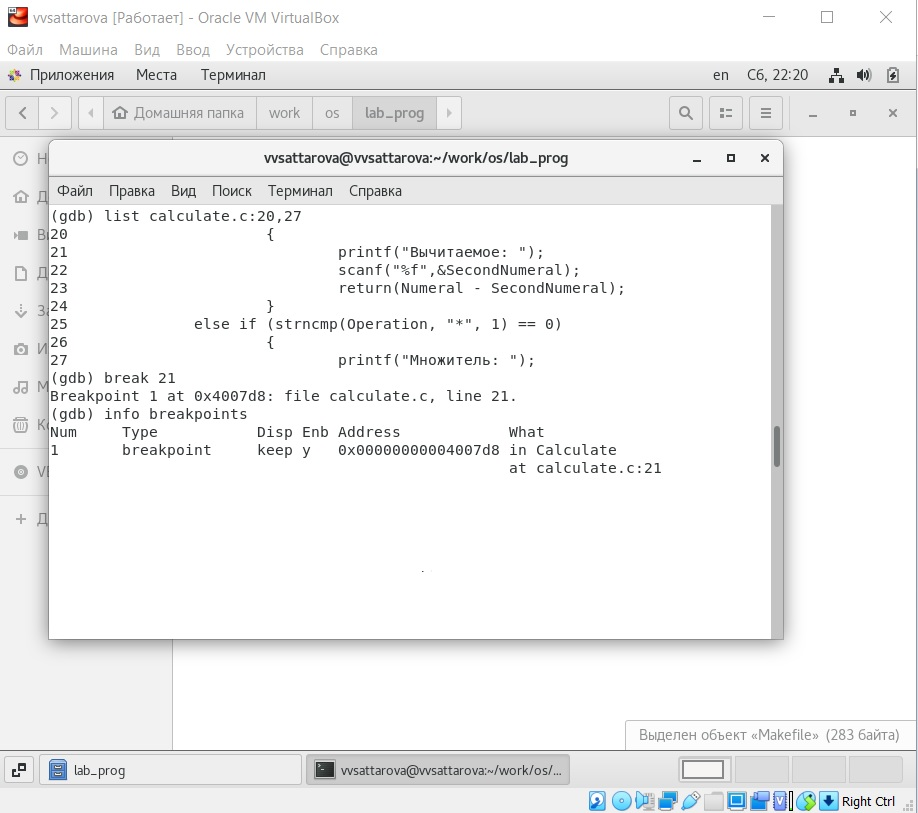{ #fig:009 width=100% }

11. Запустила программу внутри отладчика и убедилась, что программа остановится в момент прохождения точки останова: run, 5-
backtrace. (рис. -@fig:010) 

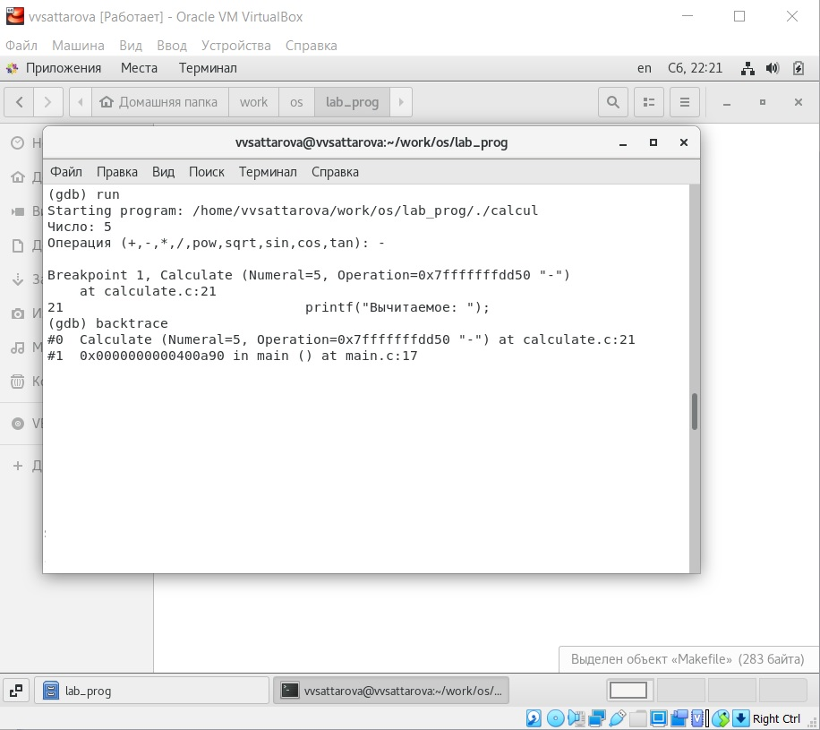{ #fig:010 width=100% }

12. Посмотрела, чему равно на этом этапе значение переменной Numeral, введя: print Numeral (рис. -@fig:011).

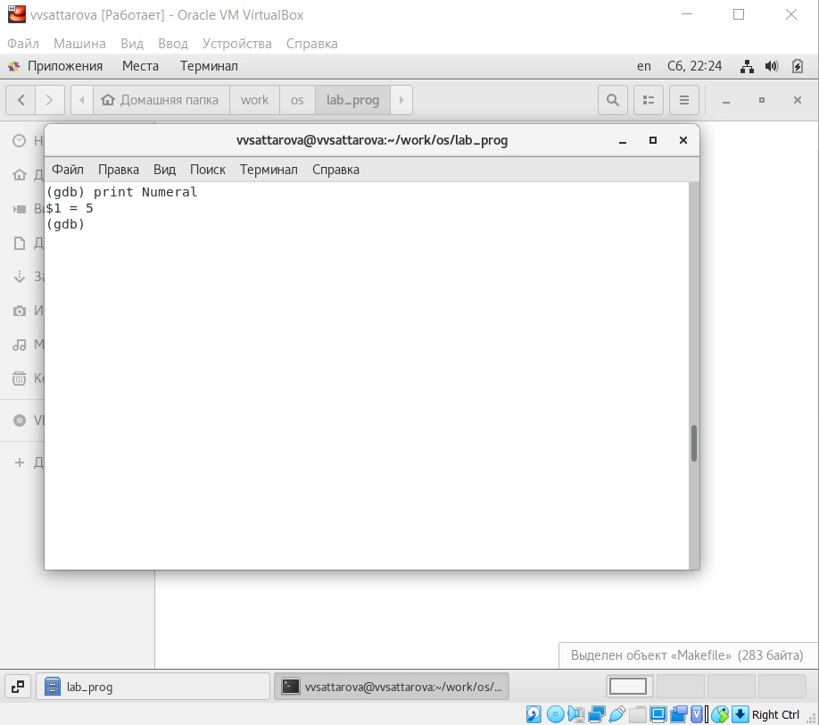{ #fig:011 width=100% }

13. Сравнила с результатом вывода на экран после использования команды: display Numeral. (рис. -@fig:012)

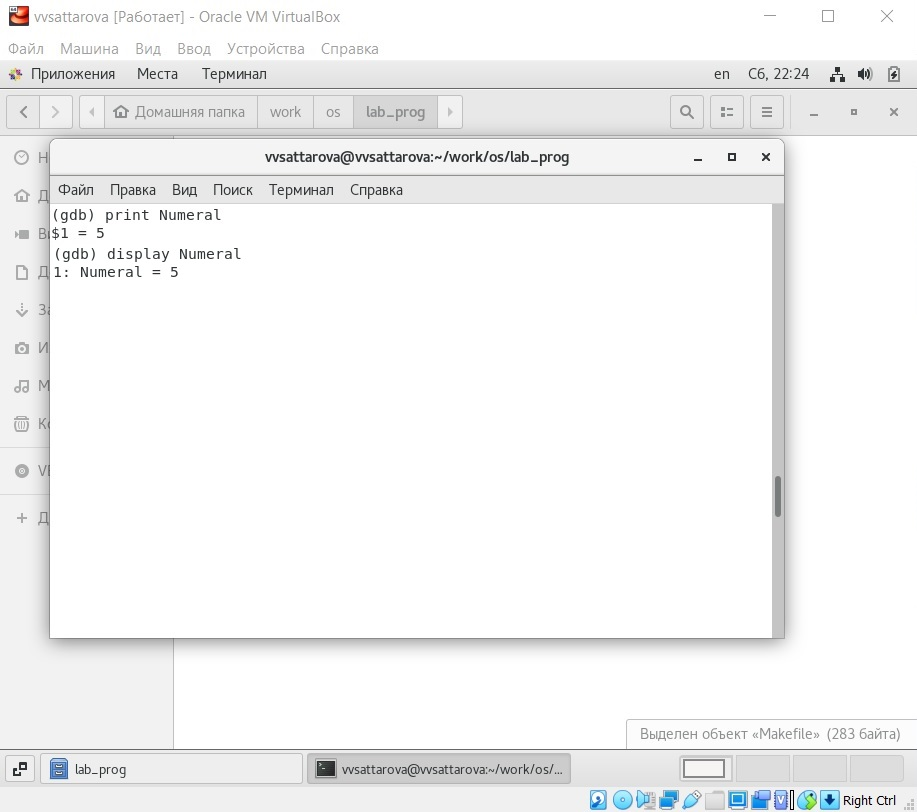{ #fig:012 width=100% }

14. Убрала точки останова: info breakpoints, delete 1.  (рис. -@fig:013)

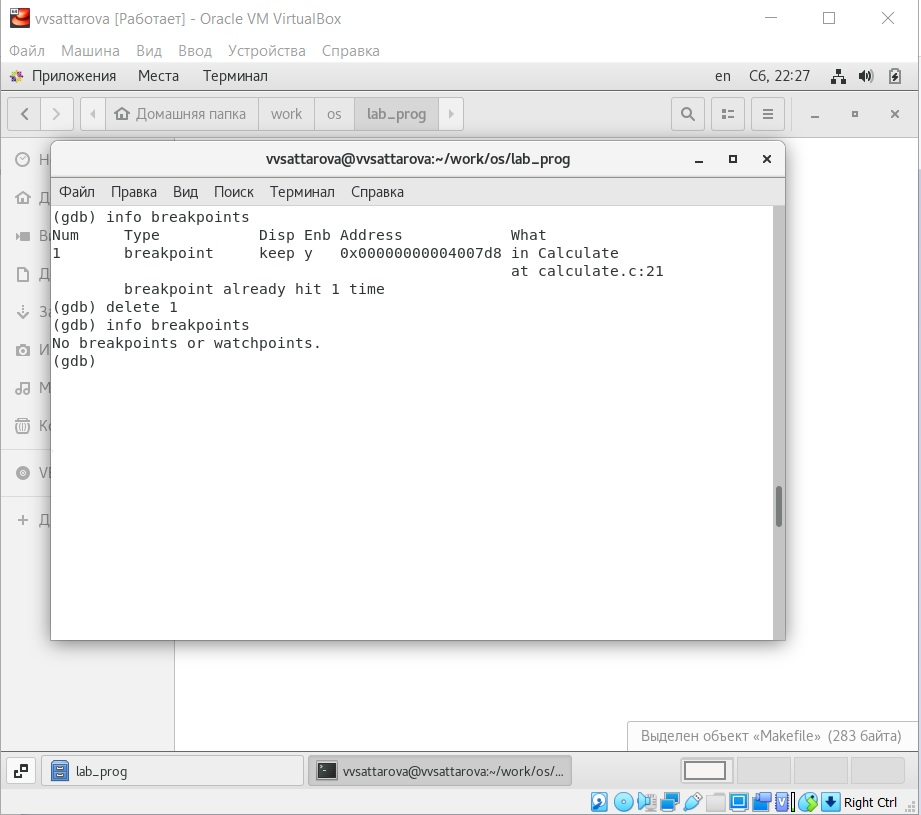{ #fig:013 width=100% }

15. С помощью утилиты splint попробовала проанализировать коды файлов calculate.c и main.c.   (рис. -@fig:014)

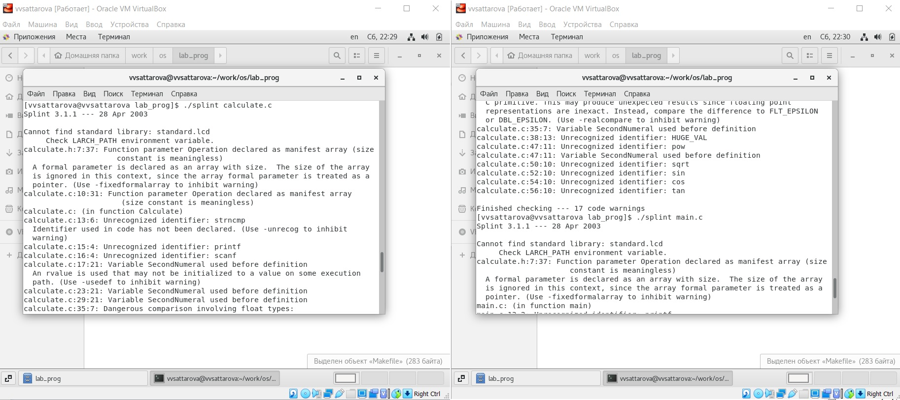{ #fig:014 width=100% }

Подробное пояснение хода работы можно увидеть на видео.

# Полученные результаты

Изучена информация, касающаяся разработки, анализа, тестирования и отладки приложений в ОС UNIX/Linux. Написана собственная программа калькулятор. Были рассмотрены на практике возможности анализа, тестирования и отладки приложений  в ОС UNIX/Linux.

# Анализ результатов

Работу получилось выполнить по инструкции, проблем с использованием команд по алгоритму, а также работы с файлами С не возникло. Был реализован калькулятор, затем он был запущен в Debugger. Также необходимо было поработать с утилитой splint.

# Заключение и выводы

В ходе работы я gриобрела простейшие навыки разработки, анализа, тестирования и отладки приложений в ОС типа UNIX/Linux на примере создания на языке программирования С калькулятора с простейшими функциями.

# Контрольные вопросы

1. Как получить информацию о возможностях программ gcc, make, gdb и др.?
2. Назовите и дайте краткую характеристику основным этапам разработки приложений в UNIX.
3. Что такое суффикс в контексте языка программирования? Приведите примеры использования.
4. Каково основное назначение компилятора языка С в UNIX?
5. Для чего предназначена утилита make?
6. Приведите пример структуры Makefile. Дайте характеристику основным элементам этого файла.
7. Назовите основное свойство, присущее всем программам отладки. Что необходимо сделать, чтобы его можно было использовать?
8. Назовите и дайте основную характеристику основным командам отладчика gdb.
9. Опишите по шагам схему отладки программы, которую Вы использовали при выполнении лабораторной работы.
10. Прокомментируйте реакцию компилятора на синтаксические ошибки в программе при его первом запуске.
11. Назовите основные средства, повышающие понимание исходного кода программы.
12. Каковы основные задачи, решаемые программой splint?

# Ответы на контрольные вопросы

1. Прочитать man-файл.
2. Процесс разработки программного обеспечения обычно разделяется на следующие этапы: 
- планирование, включающее сбор и анализ требований к функционалу и другим характеристикам разрабатываемого приложения; 
- проектирование, включающее в себя разработку базовых алгоритмов и спецификаций, определение языка программирования; 
- непосредственная разработка приложения: 
- кодирование — по сути создание исходного текста программы (возможно в нескольких вариантах); 
- анализ разработанного кода; 
- сборка, компиляция и разработка исполняемого модуля; 
- тестирование и отладка, сохранение произведённых изменений; 
- документирование.
3. Суффикс – это расширение файла. Позволяет определить тип файла, т.е., что с ним можно делать. Например, файлы с расширением (суффиксом) .c воспринимаются gcc как программы на языке С, файлы с расширением .cc или .C — как файлы на языке C++, а файлы c расширением .o считаются объектными.
4. Компиляция файлов с исходным кодом в объектные модули и получение исполняемых файлов.
5. Make позволяет автоматизировать процесс преобразования файлов программы из одной формы в другую, отслеживает взаимосвязи между файлами.
6. Общий синтаксис Makefile имеет вид:
target1 [target2...]:[:] [dependment1...]
[(tab)commands] [#commentary]
[(tab)commands] [#commentary]
Сначала задаётся список целей, разделённых пробелами, за которым идёт двоеточие и список зависимостей. Затем в следующих строках указываются команды. Строки с командами обязательно должны начинаться с табуляции. В качестве цели в Makefile может выступать имя файла или название какого-то действия. Зависимость задаёт исходные параметры (условия) для достижения указанной цели. Зависимость также может быть названием какого-то действия. Команды — собственно действия, которые необходимо выполнить для достижения цели. После # пишутся комментарии, они не обрабатываются.
7. Программы отладки позволяют найти и устранить ошибки в программе. Чтобы использовать их, необходимо скомпилировать анализируемый код программы таким образом, чтобы отладочная информация содержалась в результирующем бинарном файле.
8. Основные команды:
Backtrace -  вывод на экран пути к текущей точке останова (по сути вывод названий всех функций) 
break - установить точку останова (в качестве параметра может быть указан номер строки или название функции) 
clear - удалить все точки останова в функции 
continue - продолжить выполнение программы 
delete - удалить точку останова 
display - добавить выражение в список выражений, значения которых отображаются при достижении точки останова программы 
finish - выполнить программу до момента выхода из функции 
info breakpoints - вывести на экран список используемых точек останова 
info watchpoints - вывести на экран список используемых контрольных выражений 
list - вывести на экран исходный код (в качестве параметра может быть указано название файла и через двоеточие номера начальной и конечной строк) 
next - выполнить программу пошагово, но без выполнения вызываемых в программе функций 
print - вывести значение указываемого в качестве параметра выражения 
run - запуск программы на выполнение 
set - установить новое значение переменной 
step - пошаговое выполнение программы 
watch - установить контрольное выражение, при изменении значения которого программа будет остановлена.
9. Запуск отладчика
Запуск программы в отладчике 
Просмотр исходного кода основного и не основного файлов 
Установка точек останова и просмотр информации о них
Запуск программы с установленными точками останова.
Просмотр стека вызываемых функций при достижении точки останова
Просмотр значения переменной в момент достижения точки останова
Удаление точек останова
10. Компилятор выводит найденные им ошибки с комментариями. Это такие ошибки, которые могут повлиять на работу программы.
11. Само по себе грамотное написание кода (с переносами и отступами в нужных местах) уже повышает его понимание. Также этой цели служат комментарии.
12. Эта утилита анализирует программный код, проверяет корректность задания аргументов использованных в программе функций и типов возвращаемых значений, обнаруживает синтаксические и семантические ошибки. В отличие от компилятора C анализатор splint генерирует комментарии с описанием разбора кода программы и осуществляет общий контроль, обнаруживая та- кие ошибки, как одинаковые объекты, определённые в разных файлах, или объекты, чьи значения не используются в работе программы, переменные с некорректно за- данными значениями и типами и многое другое.

