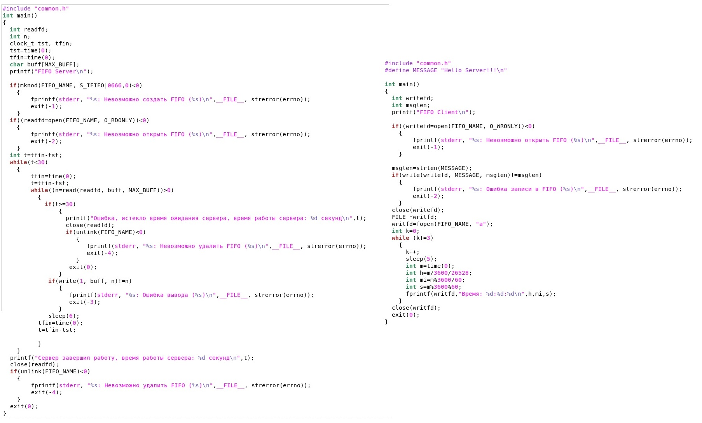
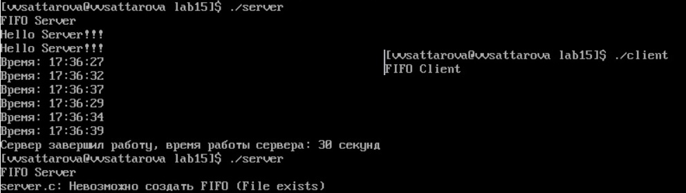

---
## Front matter
lang: ru-RU
title: Лабораторная работа №15 "Именованные каналы" 
author: |
	Саттарова Вита Викторовна\inst{1}
institute: |
	\inst{1}РУДН, Москва, Россия
date: 2021, Май

## Formatting
toc: false
slide_level: 2
theme: metropolis
mainfont: PT Serif
romanfont: PT Serif
sansfont: PT Sans
monofont: PT Mono
header-includes: 
 - \metroset{progressbar=frametitle,sectionpage=progressbar,numbering=fraction}
 - '\makeatletter'
 - '\beamer@ignorenonframefalse'
 - '\makeatother'
aspectratio: 43
section-titles: true
---

# Лабораторная работа №15 "Именованные каналы" 

## Прагматика

Работа выполнена для того, чтобы познакомиться с именованными каналами и их применением на примере системы клиент-сервер, чтобы использовать полученные знания для дальнейшей работы.

## Цели

Приобретение практических навыков работы с именованными каналами.

## Задачи

-	Изучить теорию относительно именованных каналов.
-	Написать свои программы клиента и сервера и изучить именованные каналы на примере системы клиент-сервер.

## Работа (1)

{ #fig:001 width=100% }

## Работа (2)

{ #fig:002 width=100% }

## Результаты

Изучена информация, касающаяся именованных каналов. Реализована работа канала на примере системы клиент-сервер. Работу получилось выполнить по инструкции, проблем с файлами С не возникло, однако возникли проблемы с запуском программ, ошибок при запуске не было, программы были написаны верно, однако программы корректно при запуске не работали, спустя некоторое время проблему удалось решить, код при этом не изменился. Была реализована работа системы клиент-сервер, при запуске программ из разных терминалов.

## Заключение

В ходе работы я приобрела практические навыки работы с именованными каналами.