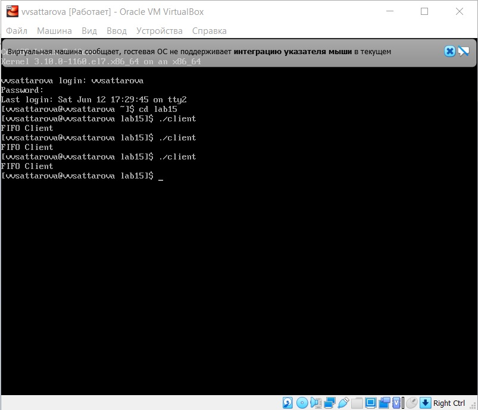

---
# Front matter
lang: ru-RU
title: "Лабораторная работа №15"
subtitle: "Операционные системы"
author: "Саттарова Вита Викторовна"

# Formatting
toc-title: "Содержание"
toc: true # Table of contents
toc_depth: 2
lof: true # Список рисунков
lot: false # List of tables
fontsize: 12pt
linestretch: 1.5
papersize: a4paper
documentclass: scrreprt
polyglossia-lang: russian
polyglossia-otherlangs: english
mainfont: PT Serif
romanfont: PT Serif
sansfont: PT Sans
monofont: PT Mono
mainfontoptions: Ligatures=TeX
romanfontoptions: Ligatures=TeX
sansfontoptions: Ligatures=TeX,Scale=MatchLowercase
monofontoptions: Scale=MatchLowercase
indent: true
pdf-engine: lualatex
header-includes:
  - \linepenalty=10 # the penalty added to the badness of each line within a paragraph (no associated penalty node) Increasing the value makes tex try to have fewer lines in the paragraph.
  - \interlinepenalty=0 # value of the penalty (node) added after each line of a paragraph.
  - \hyphenpenalty=50 # the penalty for line breaking at an automatically inserted hyphen
  - \exhyphenpenalty=50 # the penalty for line breaking at an explicit hyphen
  - \binoppenalty=700 # the penalty for breaking a line at a binary operator
  - \relpenalty=500 # the penalty for breaking a line at a relation
  - \clubpenalty=150 # extra penalty for breaking after first line of a paragraph
  - \widowpenalty=150 # extra penalty for breaking before last line of a paragraph
  - \displaywidowpenalty=50 # extra penalty for breaking before last line before a display math
  - \brokenpenalty=100 # extra penalty for page breaking after a hyphenated line
  - \predisplaypenalty=10000 # penalty for breaking before a display
  - \postdisplaypenalty=0 # penalty for breaking after a display
  - \floatingpenalty = 20000 # penalty for splitting an insertion (can only be split footnote in standard LaTeX)
  - \raggedbottom # or \flushbottom
  - \usepackage{float} # keep figures where there are in the text
  - \floatplacement{figure}{H} # keep figures where there are in the text
---

# Цели и задачи

## Цель

Приобретение практических навыков работы с именованными каналами.

## Задачи

1.	Изучить теорию относительно именованных каналов.
2.	Написать свои программы клиента и сервера и изучить именованные каналы на примере системы клиент-сервер.

# Объект и предмет исследования

## Объект исследования

Именованные каналы.

## Предмет исследования

Изучение основной информации, связанной с именнованными каналами, а также их применение на примере системы клиент-сервер.

# Условные обозначения и термины

Условные обозначения и термины отсутствуют

# Теоретические вводные данные

Одним из видов взаимодействия между процессами в операционных системах является обмен сообщениями. Под сообщением понимается последовательность байтов, передаваемая от одного процесса другому.
В операционных системах типа UNIX есть 3 вида межпроцессорных взаимодействий: общеюниксные (именованные каналы, сигналы), System V Interface Definition (SVID — разделяемая память, очередь сообщений, семафоры) и BSD (сокеты).
Для передачи данных между неродственными процессами можно использовать механизм именованных каналов (named pipes). Данные передаются по принципу FIFO (First In First Out) (первым записан — первым прочитан), поэтому они называются также FIFO pipes или просто FIFO. Именованные каналы отличаются от неименованных наличием идентификатора канала, который представлен как специальный файл (соответственно имя именованного канала — это имя файла). Поскольку файл находится на локальной файловой системе, данное IPC используется внутри одной системы.
Файлы именованных каналов создаются функцией mkfifo(3).

``` C
#include <sys/types.h>
#include <sys/stat.h>
int mkfifo(const char *pathname, mode_t mode);
```

Первый параметр — имя файла, идентифицирующего канал, второй параметр — маска прав доступа к файлу.
После создания файла канала процессы, участвующие в обмене данными, должны открыть этот файл либо для записи, либо для чтения. При закрытии файла сам канал продолжает существовать. Для того чтобы закрыть сам канал, нужно удалить его файл, например с помощью вызова unlink(2).

Каналы представляют собой простое и удобное средство передачи данных, которое, однако, подходит не во всех ситуациях. Например, с помощью каналов довольно трудно организовать обмен асинхронными сообщениями между процессами.

# Техническое оснащение и выбранные методы проведения работы

## Техническое оснащение

Персональный компьютер, интернет, виртуальная машина.

## Методы

Анализ предложенной информации, выполнение указанных заданий, получение дополнительной информации из интернета.

# Выполнение лабораторной работы

1. Прочитала текст лабораторной работы, пояснила примеры программ в тексте лабораторной работы, в папке для работы создала файлы и изменила права доступа.

{ #fig:001 width=100% }

2. Взяв примеры в тексте лабораторной работы за образец, написала аналогичные программы, внеся следующие изменения:
    - Работает не 1 клиент, а несколько (например, два).
    - Клиенты передают текущее время с некоторой периодичностью (например, раз в пять секунд). Используйте функцию sleep() для приостановки работы клиента.
    - Сервер работает не бесконечно, а прекращает работу через некоторое время (например, 30 сек). Используйте функцию clock() для определения времени работы сервера. В случае, если сервер завершит работу, не закрыв канал, то при следующем запуске сервера он работать не будет. (рис. -@fig:002) (рис. -@fig:003) (рис. -@fig:004) (рис. -@fig:005)

{ #fig:002 width=100% }

{ #fig:003 width=100% }

{ #fig:004 width=100% }

{ #fig:005 width=100% }

3. Выполнила компиляцию програм. (рис. -@fig:006) 

{ #fig:006 width=100% }

4. Запустила сервер. (рис. -@fig:007)

{ #fig:007 width=100% }

5. Запустила первого клиента. (рис. -@fig:008) 

{ #fig:008 width=100% }

6. Запустила второго клиента. (рис. -@fig:009) 

{ #fig:009 width=100% }

Подробное пояснение хода работы можно увидеть на двух видео: часть 1 - написание файлов, часть 2 - запуск программ.

# Полученные результаты

Изучена информация, касающаяся именованных каналов. Реализована работа канала на примере системы клиент-сервер. 

# Анализ результатов

Работу получилось выполнить по инструкции, проблем с файлами С не возникло, однако возникли проблемы с запуском программ, ошибок при запуске не было, программы были написаны верно, однако программы корректно при запуске не работали, спустя некоторое время проблему удалось решить, код при этом не изменился. Была реализована работа системы клиент-сервер, при запуске программ из разных терминалов.

# Заключение и выводы

В ходе работы я приобрела практические навыки работы с именованными каналами.

# Контрольные вопросы

1. В чем ключевое отличие именованных каналов от неименованных? 
2. Возможно ли создание неименованного канала из командной строки?
3. Возможно ли создание именованного канала из командной строки? 
4. Опишите функцию языка С, создающую неименованный канал. 
5. Опишите функцию языка С, создающую именованный канал. 
6. Что будет в случае прочтения из fifo меньшего числа байтов, чем находится в канале? Большего числа байтов?
7. Аналогично, что будет в случае записи в fifo меньшего числа байтов, чем позволяет буфер? Большего числа байтов?
8. Могут ли два и более процессов читать или записывать в канал? 
9. Опишите функцию write (тип возвращаемого значения, аргументы и логику работы). Что означает 1 (единица) в вызове этой функции в программе server.c (строка 42)?
10. Опишите функцию strerror.

# Ответы на контрольные вопросы

1. Именованные каналы отличаются от неименованных наличием идентификатора канала, который представлен как специальный файл (соответственно имя именованного канала — это имя файла).
2. Создание неименованного канала из командной строки  возможно только с созданием временного именованного.
3. Возможно.
4. Создание неименованного канала выполняется по двум файловым дескрипторам, один из которых доступен только для чтения, а второй — только для записи. Единственный параметр-массив включает два файловых дескриптора — fd[0] для чтения и fd[1] для записи.

```C
#include <unistd.h>
int pipe(int fds[2]);
```

5. Файлы именованных каналов создаются функцией mkfifo(3). 

```C
#include<sys/types.h>
#include<sys/stat.h>
int mkfifo(const char *pathname, mode_t mode);
```

Первый параметр — имя файла, идентифицирующего канал, второй параметр — маска прав доступа к файлу.
Для создания файла FIFO можно использовать более общую функцию mknod(2), предназначенную для создания специальных файлов различных типов.

```C
#include<sys/types.h>
#include<sys/stat.h>
#include <fcntl.h>
#include <unistd.h>
int mknod(const char *pathname, mode_t mode, dev_t dev); 
```

Вместо mkfifo(FIFO_NAME, 0600) пишем mknod(FIFO_NAME, S_IFIFO | 0600, 0).
6. При прочтении меньшего числа байтов будут считаны не все байты, а запрашиваемое количество. Указатель изменит свою позицию на следующий за последним прочитанным байт, и следующее чтение начнётся с этого места. При считывании большего будут считаны все байты из канала.
7. Меньшее число просто будет записано, заполнив буфер не полностью, большее записано не будет, пока не освободится нужное количество места.
8. Да, и при этом записываемые данные перемешиваться не будут.
9. Функция имеет следующий синтаксис: int write (handle, buffer, count). Функция write записывает count байт из  буфера  buffer  в файл, связанный с handle. Операции write начинаются с текущей позиции  указателя  на файл (указатель ассоциирован с заданным файлом). Если файл открыт для добавления, операции выполняются в конец файла. После осуществления операций записи указатель на  файл (если он есть) увеличивается на количество действительно записанных байтов. Возвращаемое значение типа int – кол-во записанных байтов или -1 при ошибке. Единица на месте указателя на файл означает вывод в консоль.
10. Интерпретирует номер ошибки, передаваемый в функцию в качестве аргумента — errornum, в понятное для человека текстовое сообщение (строку). Ошибки эти возникают при вызове функций стандартных Си-библиотек. Возвращаемое значение - указатель на строку, содержащую сообщение об ошибке.
